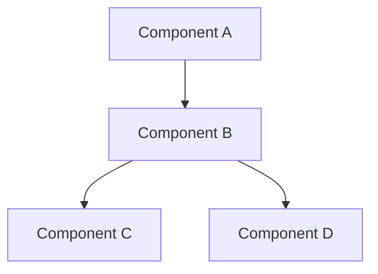

# Contributing to Mobile System Design

First off, thank you for considering contributing to this project! Every contribution helps make this resource better for the mobile engineering community.

## Table of Contents

- [Code of Conduct](#code-of-conduct)
- [How Can I Contribute?](#how-can-i-contribute)
- [Getting Started](#getting-started)
- [Style Guide](#style-guide)
- [Pull Request Process](#pull-request-process)
- [Content Guidelines](#content-guidelines)
- [Mermaid Diagrams](#mermaid-diagrams)

## Code of Conduct

This project and everyone participating in it is governed by our [Code of Conduct](CODE_OF_CONDUCT.md). By participating, you are expected to uphold this code.

## How Can I Contribute?

### 📝 Adding a New Case Study

We welcome case studies for popular mobile applications. A good case study should include:

1. **Requirements** - Functional and non-functional requirements
2. **High-Level Design** - Architecture diagram using Mermaid
3. **Data Models** - Core entities with code examples
4. **API Design** - RESTful endpoints with request/response schemas
5. **Client Architecture** - Component diagram and data flow
6. **Caching Strategy** - Multi-layer caching approach
7. **Offline Support** - How the app works without connectivity
8. **Performance** - Optimization techniques and metrics
9. **Security** - Authentication, encryption, data protection
10. **Testing Strategy** - Unit, integration, and UI testing approach
11. **Platform Considerations** - iOS, Android, Flutter, React Native specifics

### 🐛 Fixing Errors

Found a mistake? Please open an issue or submit a PR with the fix. Common fixes include:

- Typos and grammatical errors
- Incorrect code examples
- Broken Mermaid diagrams
- Outdated information
- Missing or incorrect links

### 💡 Suggesting Improvements

Have an idea for improvement? Open an issue with the `enhancement` label and describe:

- What you'd like to see improved
- Why the change would be valuable
- Any examples or references

### 🌐 Translations

We welcome translations to other languages. Please:

1. Create a new file with the language suffix (e.g., `README_DE.md` for German)
2. Translate all content accurately
3. Keep code examples in English
4. Update links to point to translated versions where available

## Getting Started

1. **Fork** the repository
2. **Clone** your fork locally
3. **Create a branch** for your contribution:
   ```bash
   git checkout -b feature/add-netflix-case-study
   ```
4. **Make your changes** following the style guide
5. **Commit** with a descriptive message:
   ```bash
   git commit -m "feat: add Netflix case study with streaming architecture"
   ```
6. **Push** to your fork and create a Pull Request

## Style Guide

### Writing Style

- Write in clear, concise English
- Use active voice where possible
- Target an audience of senior mobile engineers
- Include code examples in Swift (iOS), Kotlin (Android), Dart (Flutter), or TypeScript (React Native)
- Keep paragraphs short and scannable
- Use tables for comparisons
- Use bullet points for lists

### Markdown Formatting

- Use `#` for main headings, `##` for sections, `###` for subsections
- Use fenced code blocks with language identifiers
- Use Mermaid for diagrams (ensure they render on GitHub)
- Keep line length reasonable (no hard wrap required)
- Use relative links for internal references

### Code Examples

```swift
// Good: Clear, self-documenting, with types
func loadFeed(cursor: String?, limit: Int = 20) async throws -> FeedResponse {
    let endpoint = "/api/v1/feed"
    let params = ["cursor": cursor, "limit": "\(limit)"]
    return try await networkService.get(endpoint, parameters: params)
}

// Bad: Unclear, missing types, no error handling
func load() {
    api.get("/feed") { result in
        self.data = result
    }
}
```

### Commit Messages

Follow [Conventional Commits](https://www.conventionalcommits.org/):

- `feat: add new case study for Netflix`
- `fix: correct WebSocket reconnection example`
- `docs: improve caching fundamentals explanation`
- `refactor: reorganize architecture comparison table`
- `style: fix Mermaid diagram formatting`

## Pull Request Process

1. Ensure your PR has a clear title and description
2. Link any related issues
3. Make sure all Mermaid diagrams render correctly
4. Verify all links work
5. Follow the existing file structure and naming conventions
6. Keep PRs focused — one case study or topic per PR

### PR Title Format

```
feat: add [topic/case-study] with [brief description]
fix: correct [what was wrong] in [where]
docs: improve [section] documentation
```

## Content Guidelines

### Case Study Structure

Every case study should follow this template:

```markdown
# [App Name] - Mobile System Design

## Overview
Brief description of the app and what makes it interesting from a system design perspective.

## Requirements
### Functional Requirements
### Non-Functional Requirements

## High-Level Architecture
[Mermaid diagram]

## Data Models
[Code examples with Swift/Kotlin/TypeScript]

## API Design
[REST endpoints with schemas]

## Client Architecture
[Detailed component breakdown]

## Caching Strategy
[Multi-layer cache design]

## Offline Support
[Sync strategy and conflict resolution]

## Performance Optimization
[Platform-specific optimizations]

## Security Considerations
[Auth, encryption, data protection]

## Testing Strategy
[Testing pyramid and examples]

## Platform-Specific Considerations
### iOS
### Android
### Flutter
### React Native
```

### Diagram Requirements

All diagrams must:
- Use valid Mermaid syntax
- Render correctly on GitHub
- Be readable in both light and dark mode
- Include meaningful labels
- Not be overly complex (break into multiple diagrams if needed)

## Mermaid Diagrams

### Supported Diagram Types

We use these Mermaid diagram types:

- `graph TB` / `graph LR` — Flow charts
- `sequenceDiagram` — Sequence diagrams
- `classDiagram` — Class relationships
- `stateDiagram-v2` — State machines
- `erDiagram` — Entity relationships

### Testing Diagrams

Before submitting, verify your Mermaid diagrams render correctly:

1. Use the [Mermaid Live Editor](https://mermaid.live/)
2. Check rendering on GitHub's preview
3. Ensure no syntax errors

### Example



---

Thank you for contributing! Your efforts help make mobile system design knowledge more accessible to everyone. 🙏
