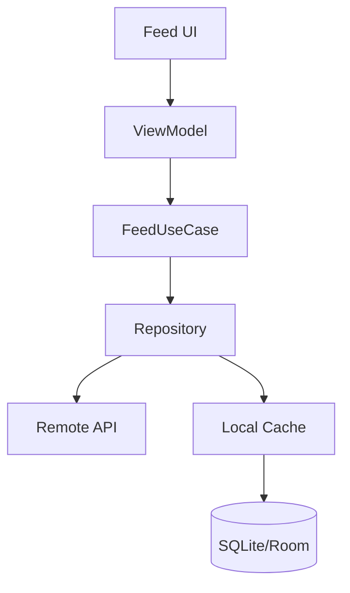

<div align="center">

```
╔═════════════════════════════════════════════════════════════════════════════════╗
║  __  __       _     _ _        ____            _                                ║
║ |  \/  | ___ | |__ (_) | ___  / ___| _   _ ___| |_ ___ _ __ ___                 ║
║ | |\/| |/ _ \| '_ \| | |/ _ \ \___ \| | | / __| __/ _ \ '_ ` _ \                ║
║ | |  | | (_) | |_) | | |  __/  ___) | |_| \__ \ ||  __/ | | | | |               ║
║ |_|  |_|\___/|_.__/|_|_|\___| |____/ \__, |___/\__\___|_| |_| |_|               ║
║                                      |___/                                      ║
║  ____            _                                                              ║
║ |  _ \  ___  ___(_) __ _ _ __                                                   ║
║ | | | |/ _ \/ __| |/ _` | '_ \                                                  ║
║ | |_| |  __/\__ \ | (_| | | | |                                                 ║
║ |____/ \___||___/_|\__, |_| |_|                                                 ║
║                    |___/                                                        ║
╚═════════════════════════════════════════════════════════════════════════════════╝
```

# Mobile System Design

**A comprehensive guide to designing scalable mobile applications**

[](https://github.com/muhittincamdali/mobile-system-design)
[](https://github.com/muhittincamdali/mobile-system-design)
[](https://github.com/muhittincamdali/mobile-system-design)


[](LICENSE)
[](http://makeapullrequest.com)

[Case Studies](#-case-studies) •
[Patterns](#-architecture-patterns) •
[Interview Guide](#-interview-guide) •
[Resources](#-resources)

</div>

---

## 📖 Overview

Mobile system design is crucial for building apps that scale. This repository provides case studies, architecture patterns, and interview preparation materials for mobile developers.

## 📑 Table of Contents

- [Overview](#-overview)
- [Framework](#-design-framework)
- [Case Studies](#-case-studies)
- [Architecture Patterns](#-architecture-patterns)
- [Common Components](#-common-components)
- [Interview Guide](#-interview-guide)
- [Resources](#-resources)
- [Contributing](#-contributing)

## 🎯 Design Framework

### Step-by-Step Approach

```
┌─────────────────────────────────────────────────────────────────┐
│  1. REQUIREMENTS          │  Functional & Non-Functional       │
├───────────────────────────┼─────────────────────────────────────│
│  2. HIGH-LEVEL DESIGN     │  Components & Data Flow            │
├───────────────────────────┼─────────────────────────────────────│
│  3. DEEP DIVE             │  Key Components in Detail          │
├───────────────────────────┼─────────────────────────────────────│
│  4. TRADE-OFFS            │  Decisions & Alternatives          │
├───────────────────────────┼─────────────────────────────────────│
│  5. SCALE                 │  How to Handle Growth              │
└─────────────────────────────────────────────────────────────────┘
```

## 📱 Case Studies

### **1. Social Media Feed**

Design Instagram/Twitter-like infinite scrolling feed.



**Key Challenges**:
- Infinite scroll pagination
- Image loading & caching
- Offline support
- Real-time updates

---

### **2. Chat Application**

Design WhatsApp/Messenger-like messaging app.

**Architecture**:
```
┌─────────────┐     ┌─────────────┐     ┌─────────────┐
│   Chat UI   │────▶│  ViewModel  │────▶│  ChatRepo   │
└─────────────┘     └─────────────┘     └─────────────┘
                                              │
                    ┌─────────────────────────┼─────────────────────────┐
                    ▼                         ▼                         ▼
            ┌─────────────┐          ┌─────────────┐          ┌─────────────┐
            │  WebSocket  │          │  Local DB   │          │  REST API   │
            └─────────────┘          └─────────────┘          └─────────────┘
```

**Key Challenges**:
- Real-time messaging (WebSocket)
- Message delivery status
- Offline queue
- End-to-end encryption

---

### **3. E-Commerce App**

Design Amazon/Shopify-like shopping experience.

**Key Components**:
| Component | Responsibility |
|-----------|---------------|
| Product Catalog | Browsing, search, filters |
| Cart | Add/remove items, persistence |
| Checkout | Payment, address, validation |
| Orders | History, tracking |

---

### **4. Video Streaming**

Design Netflix/YouTube-like video player.

**Considerations**:
- Adaptive bitrate streaming
- Background playback
- Download for offline
- Playback resume

---

### **5. Maps & Navigation**

Design Google Maps-like navigation app.

**Key Challenges**:
- Real-time location updates
- Route calculation
- Offline maps
- Battery optimization

---

## 🏗️ Architecture Patterns

### Offline-First Architecture

```
┌─────────────────────────────────────────────────────────────┐
│                         UI Layer                            │
└─────────────────────────────┬───────────────────────────────┘
                              │
┌─────────────────────────────▼───────────────────────────────┐
│                      Domain Layer                           │
│                     (Use Cases)                             │
└─────────────────────────────┬───────────────────────────────┘
                              │
┌─────────────────────────────▼───────────────────────────────┐
│                      Data Layer                             │
├─────────────────────────────┬───────────────────────────────┤
│      Local (Source of Truth)│         Remote (Sync)         │
│      ┌───────────────┐      │      ┌───────────────┐        │
│      │   Database    │◀─────┼─────▶│      API      │        │
│      └───────────────┘      │      └───────────────┘        │
└─────────────────────────────┴───────────────────────────────┘
```

### Modular Architecture

```
┌─────────────────────────────────────────────────────────────┐
│                        App Module                           │
├─────────────┬─────────────┬─────────────┬───────────────────┤
│   Feature   │   Feature   │   Feature   │     Feature       │
│    Auth     │    Home     │   Profile   │     Settings      │
├─────────────┴─────────────┴─────────────┴───────────────────┤
│                        Core Module                          │
│              (Networking, Database, Utils)                  │
└─────────────────────────────────────────────────────────────┘
```

## 🔧 Common Components

### Image Loading

| Aspect | Solution |
|--------|----------|
| Caching | Memory + Disk cache |
| Format | WebP for efficiency |
| Loading | Progressive/placeholder |
| Memory | Downsampling |

### Networking

| Aspect | Solution |
|--------|----------|
| Retry | Exponential backoff |
| Caching | HTTP cache headers |
| Auth | Token refresh interceptor |
| Offline | Request queue |

### Data Persistence

| Use Case | Solution |
|----------|----------|
| Simple K/V | UserDefaults / SharedPrefs |
| Structured | Core Data / Room |
| Secure | Keychain / EncryptedSharedPrefs |
| Files | FileManager / Internal Storage |

## 🎤 Interview Guide

### What Interviewers Look For

- ✅ Clear requirement gathering
- ✅ Structured approach
- ✅ Trade-off discussions
- ✅ Scalability awareness
- ✅ Real-world experience

### Common Questions

1. Design a photo sharing app
2. Design an offline-first news app
3. Design a ride-sharing app
4. Design a music streaming service
5. Design a fitness tracking app

### Tips

- Ask clarifying questions
- State assumptions explicitly
- Draw diagrams
- Discuss alternatives
- Consider edge cases

## 📚 Resources

### Books
- Designing Data-Intensive Applications
- Clean Architecture
- Building Mobile Apps at Scale

### Articles
- [iOS System Design](https://developer.apple.com/documentation/)
- [Android Architecture](https://developer.android.com/topic/architecture)

## 🤝 Contributing

Contributions welcome! See [CONTRIBUTING.md](CONTRIBUTING.md).

## 📄 License

MIT License - see [LICENSE](LICENSE) file.

## 👤 Author

**Muhittin Camdali**
- GitHub: [@muhittincamdali](https://github.com/muhittincamdali)

---

<div align="center">

### ⭐ Star History

[](https://star-history.com/#muhittincamdali/mobile-system-design&Date)

**Found this useful? Please ⭐ star this repository!**

</div>
