<](LICENSE)
[](CONTRIBUTING.md)
[](https://github.com/muhittincamdali/mobile-system-design)
[](https://github.com/muhittincamdali/mobile-system-design)

**A comprehensive guide to designing large-scale mobile applications.**

*Instagram • Uber • WhatsApp • Spotify • Twitter • YouTube • Airbnb • TikTok*

[Case Studies](#-case-studies) · [Fundamentals](#-fundamentals) · [Contributing](CONTRIBUTING.md) · [Türkçe](README_TR.md)

</div>

---

## 📖 Table of Contents

- [Introduction](#-introduction)
- [Why Mobile System Design?](#-why-mobile-system-design)
- [How to Use This Guide](#-how-to-use-this-guide)
- [The Mobile System Design Framework](#-the-mobile-system-design-framework)
- [Case Studies](#-case-studies)
  - [Instagram](#instagram)
  - [Uber](#uber)
  - [WhatsApp](#whatsapp)
  - [Spotify](#spotify)
  - [Twitter](#twitter)
  - [YouTube](#youtube)
  - [Airbnb](#airbnb)
  - [TikTok](#tiktok)
- [Fundamentals](#-fundamentals)
  - [Networking](#networking)
  - [Caching](#caching)
  - [Persistence](#persistence)
  - [Security](#security)
  - [Performance](#performance)
  - [Architecture](#architecture)
- [Mobile Platform Comparison](#-mobile-platform-comparison)
- [Interview Preparation](#-interview-preparation)
- [Common Patterns](#-common-patterns)
- [Resources](#-resources)
- [Contributing](#-contributing)

---

## 🌟 Introduction

Mobile system design is a discipline that focuses on building scalable, performant, and maintainable mobile applications. Unlike traditional backend system design, mobile system design must account for unreliable network conditions, limited device resources, platform-specific constraints, and the unique challenges of building software that runs on billions of diverse devices worldwide.

This repository is a curated collection of real-world case studies and fundamental concepts that every mobile engineer should understand. Each case study dissects a well-known application and explores how it might be designed from the ground up, covering everything from high-level architecture to low-level implementation details.

### What You'll Learn

- **Architecture Patterns**: MVC, MVVM, MVI, VIPER, Clean Architecture, and when to use each
- **Networking Strategies**: REST, GraphQL, WebSocket, gRPC, and offline-first approaches
- **Data Management**: Caching hierarchies, persistence layers, and sync strategies
- **Performance Optimization**: Startup time, rendering performance, memory management, and battery efficiency
- **Security Best Practices**: Authentication, encryption, certificate pinning, and secure storage
- **Platform-Specific Considerations**: iOS (Swift/UIKit/SwiftUI), Android (Kotlin/Jetpack Compose), Flutter, React Native
- **Testing Strategies**: Unit testing, integration testing, UI testing, and snapshot testing

### Who Is This For?

- **Senior Mobile Engineers** preparing for system design interviews
- **Tech Leads** making architectural decisions for mobile teams
- **Backend Engineers** transitioning to mobile development
- **Students** looking to understand how real-world mobile apps work at scale
- **Hiring Managers** looking for structured interview material

---

## 🤔 Why Mobile System Design?

Mobile development has evolved far beyond building simple CRUD apps. Modern mobile applications are expected to:

1. **Handle millions of concurrent users** with real-time features
2. **Work reliably offline** and sync seamlessly when connectivity returns
3. **Deliver sub-second response times** even on low-end devices
4. **Manage complex state** across multiple screens and background processes
5. **Protect user data** with enterprise-grade security
6. **Support accessibility** for users with disabilities
7. **Scale development** across teams of hundreds of engineers

Understanding mobile system design helps you make better architectural decisions, communicate effectively with cross-functional teams, and build applications that delight users at scale.

### Mobile vs. Backend System Design

| Aspect | Backend System Design | Mobile System Design |
|--------|----------------------|---------------------|
| **Scale** | Horizontal scaling (add servers) | Single device, limited resources |
| **Network** | Reliable, low-latency | Unreliable, high-latency, intermittent |
| **Storage** | Virtually unlimited | Limited device storage |
| **State** | Stateless services | Complex UI state management |
| **Updates** | Deploy anytime | App Store review, user adoption |
| **Security** | Server-side controls | Client-side is untrusted |
| **Testing** | Automated CI/CD | Device fragmentation |
| **Battery** | Not a concern | Critical constraint |
| **Concurrency** | Threads/processes | Main thread + background |
| **Failures** | Retry with backoff | Graceful degradation, offline mode |

---

## 📚 How to Use This Guide

### For Interview Preparation

1. Start with the [Mobile System Design Framework](#-the-mobile-system-design-framework) to understand the structured approach
2. Study 2-3 case studies in depth (Instagram, Uber, and WhatsApp cover most patterns)
3. Review the fundamentals that are weakest for you
4. Practice whiteboarding designs within 45 minutes

### For Learning

1. Read through the fundamentals first to build a strong foundation
2. Then explore case studies that interest you
3. Try designing a system before reading the solution
4. Implement simplified versions of the architectures

### For Reference

Use the table of contents to jump directly to the topic you need. Each section is self-contained and can be read independently.

---

## 🧩 The Mobile System Design Framework

When approaching any mobile system design problem, follow this structured framework:

### Step 1: Clarify Requirements (5 minutes)

Before diving into design, clarify the scope:

#### Functional Requirements
- What are the core features?
- What are the user flows?
- What platforms need to be supported?
- What is the expected user base?

#### Non-Functional Requirements
- **Performance**: What are the latency requirements?
- **Reliability**: What happens when the network is down?
- **Scalability**: How many concurrent users?
- **Security**: What data needs protection?
- **Accessibility**: What accessibility standards?

```
Example: "Design Instagram's photo feed"

Functional:
- Display a scrollable feed of photos/videos
- Support like, comment, share actions
- Show stories at the top
- Pull-to-refresh for new content
- Infinite scroll pagination

Non-Functional:
- Feed loads within 1 second
- Works offline (cached content)
- Supports 1B+ monthly active users
- Images load progressively
- Minimal battery drain during scrolling
```

### Step 2: High-Level Architecture (10 minutes)

Define the major components and their interactions:

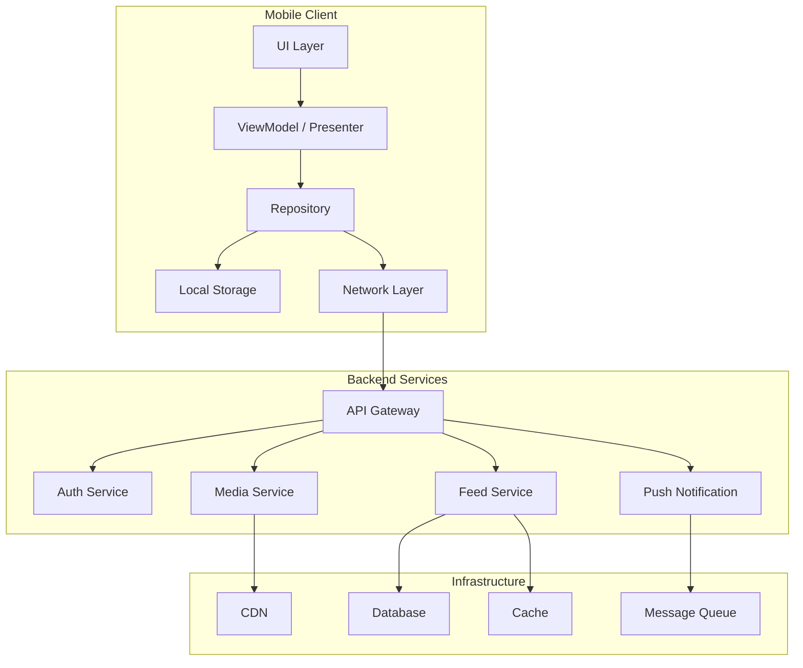

### Step 3: Data Models (5 minutes)

Define the core data structures:

```swift
// Example: Feed Item
struct FeedItem: Codable, Identifiable {
    let id: String
    let authorId: String
    let authorName: String
    let authorAvatarURL: URL
    let mediaURLs: [URL]
    let mediaType: MediaType
    let caption: String
    let likeCount: Int
    let commentCount: Int
    let isLiked: Bool
    let isBookmarked: Bool
    let createdAt: Date
    let location: Location?
}

enum MediaType: String, Codable {
    case photo
    case video
    case carousel
}

struct Location: Codable {
    let name: String
    let latitude: Double
    let longitude: Double
}
```

### Step 4: API Design (5 minutes)

Define the client-server contract:

```
GET /api/v1/feed
  Query: cursor, limit, type
  Response: { items: [FeedItem], nextCursor: String?, hasMore: Bool }

POST /api/v1/feed/{id}/like
  Response: { likeCount: Int, isLiked: Bool }

GET /api/v1/feed/{id}/comments
  Query: cursor, limit
  Response: { comments: [Comment], nextCursor: String?, hasMore: Bool }
```

### Step 5: Deep Dives (20 minutes)

Pick 2-3 areas for deep exploration based on the specific problem:

- **Networking**: Protocol choice, pagination, error handling
- **Caching**: Multi-layer cache, invalidation strategy
- **Offline Support**: Sync strategy, conflict resolution
- **Performance**: Image loading, list rendering, memory management
- **Security**: Authentication, data encryption, API security

### Step 6: Platform Considerations (5 minutes)

Discuss platform-specific implementation details:

- **iOS**: SwiftUI vs UIKit, Combine vs async/await, Core Data vs SwiftData
- **Android**: Jetpack Compose vs XML, Coroutines vs RxJava, Room
- **Cross-platform**: Flutter (Riverpod, Bloc), React Native (Redux, MobX)

---

## 📱 Case Studies

### Instagram

**[📖 Full Case Study →](case-studies/instagram.md)**

Design a photo and video sharing platform with feed, stories, reels, direct messaging, and explore features.

#### Key Challenges
- **Image Pipeline**: Download, decode, resize, cache, and display millions of images efficiently
- **Feed Ranking**: Mix of chronological and algorithmic content
- **Stories**: Ephemeral content with preloading and smooth transitions
- **Reels**: Short-form video with infinite scroll
- **Offline Mode**: Browse cached content without connectivity

#### Architecture Overview

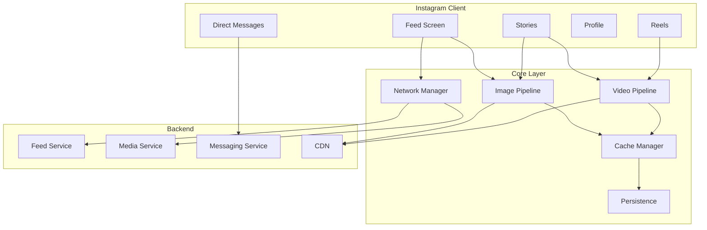

#### Key Metrics
| Metric | Target |
|--------|--------|
| Feed load time | < 1 second |
| Image display time | < 300ms (cached), < 2s (network) |
| Story transition | < 100ms |
| Offline browsing | Last 50 feed items |
| Memory usage | < 200MB peak |
| Battery impact | < 5% per hour of browsing |

---

### Uber

**[📖 Full Case Study →](case-studies/uber.md)**

Design a ride-sharing platform with real-time location tracking, ride matching, navigation, payments, and driver/rider interfaces.

#### Key Challenges
- **Real-Time Location**: Continuous GPS tracking with battery optimization
- **Ride Matching**: Finding the optimal driver-rider pair
- **Maps & Navigation**: Turn-by-turn directions with live traffic
- **Push Notifications**: Time-critical ride updates
- **Payments**: Secure payment processing with multiple methods

#### Architecture Overview

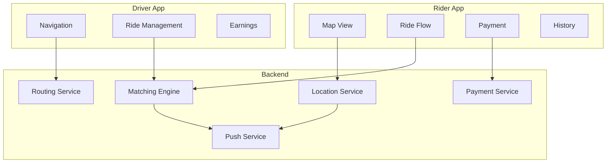

#### Key Metrics
| Metric | Target |
|--------|--------|
| Location update frequency | Every 4 seconds |
| Ride match time | < 30 seconds |
| Map rendering | 60 FPS |
| ETA accuracy | ±2 minutes |
| Payment processing | < 3 seconds |
| Battery drain | < 10% per hour (rider), < 15% (driver) |

---

### WhatsApp

**[📖 Full Case Study →](case-studies/whatsapp.md)**

Design a real-time messaging platform with end-to-end encryption, media sharing, voice/video calls, group chats, and status updates.

#### Key Challenges
- **Real-Time Messaging**: Instant message delivery with read receipts
- **End-to-End Encryption**: Signal Protocol implementation
- **Media Handling**: Compress, upload, download, and cache media
- **Presence System**: Online/offline/typing indicators
- **Group Chat**: Multi-participant conversations with admin controls

#### Architecture Overview

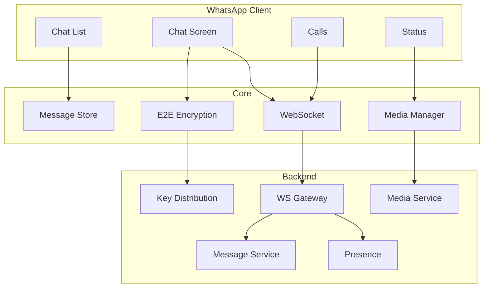

#### Key Metrics
| Metric | Target |
|--------|--------|
| Message delivery | < 500ms (online) |
| Encryption overhead | < 10ms per message |
| Media upload | Progressive with resume |
| Offline queue | Unlimited messages |
| Group size | Up to 1024 members |
| Call setup | < 3 seconds |

---

### Spotify

**[📖 Full Case Study →](case-studies/spotify.md)**

Design an audio streaming platform with music playback, offline downloads, playlists, social features, and personalized recommendations.

#### Key Challenges
- **Audio Streaming**: Adaptive bitrate streaming with gapless playback
- **Offline Mode**: Download management with storage optimization
- **Playlist Sync**: Real-time sync across devices
- **Recommendations**: Personalized content discovery
- **Background Playback**: Reliable audio during app backgrounding

#### Architecture Overview

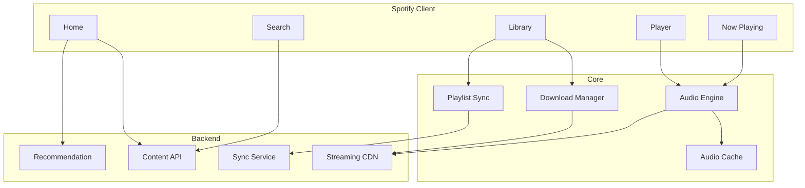

#### Key Metrics
| Metric | Target |
|--------|--------|
| Playback start | < 500ms |
| Audio buffer | 10-30 seconds ahead |
| Gapless transition | < 50ms gap |
| Download speed | Faster than real-time |
| Offline library | Up to 10,000 songs |
| Background battery | < 3% per hour |

---

### Twitter

**[📖 Full Case Study →](case-studies/twitter.md)**

Design a micro-blogging platform with timeline feed, real-time updates, media sharing, search, trending topics, and notifications.

#### Key Challenges
- **Timeline Feed**: Mix of followed accounts and algorithmic recommendations
- **Real-Time Updates**: Live tweet counts, new tweet indicators
- **Media Upload**: Image and video processing pipeline
- **Search**: Full-text search with autocomplete
- **Trending**: Real-time trend detection and display

#### Architecture Overview

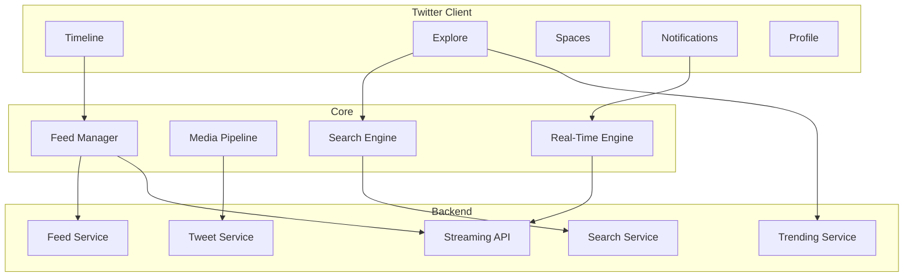

#### Key Metrics
| Metric | Target |
|--------|--------|
| Timeline load | < 1 second |
| Tweet post | < 2 seconds |
| Real-time update | < 1 second |
| Search results | < 500ms |
| Media upload | < 10 seconds (image) |
| Infinite scroll | Seamless at 60 FPS |

---

### YouTube

**[📖 Full Case Study →](case-studies/youtube.md)**

Design a video streaming platform with adaptive bitrate playback, comments, recommendations, subscriptions, and creator tools.

#### Key Challenges
- **Video Streaming**: Adaptive bitrate with smooth playback
- **Video Player**: Custom controls, PiP, casting
- **Comments**: Threaded discussions with real-time updates
- **Recommendations**: Personalized video suggestions
- **Downloads**: Offline video with DRM protection

#### Architecture Overview

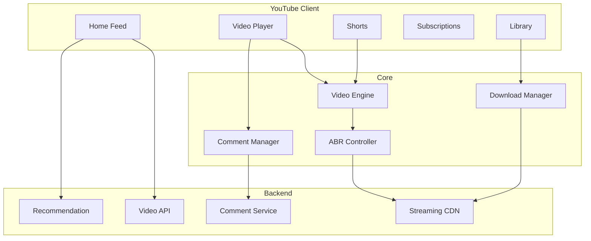

#### Key Metrics
| Metric | Target |
|--------|--------|
| Video start time | < 2 seconds |
| Rebuffer rate | < 1% |
| Quality switch | Seamless, < 500ms |
| Comment load | < 1 second |
| Recommendation refresh | < 500ms |
| PiP transition | < 200ms |

---

### Airbnb

**[📖 Full Case Study →](case-studies/airbnb.md)**

Design a marketplace platform with search, booking, payments, maps integration, reviews, and host-guest messaging.

#### Key Challenges
- **Search**: Location-based search with filters and map view
- **Booking Flow**: Multi-step checkout with payment processing
- **Maps**: Interactive map with listing markers and clustering
- **Reviews**: Two-sided review system with fraud detection
- **Messaging**: Host-guest communication with rich media

#### Architecture Overview

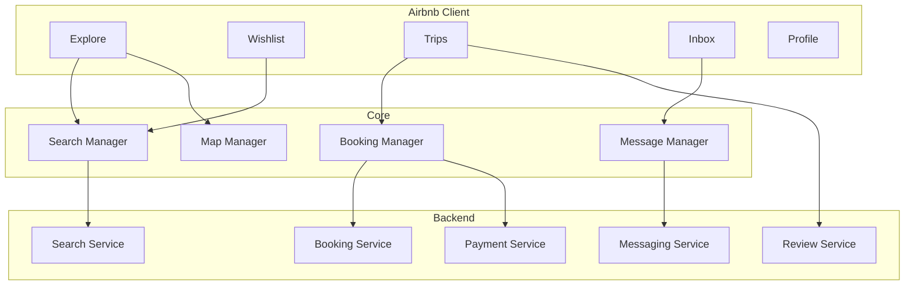

#### Key Metrics
| Metric | Target |
|--------|--------|
| Search results | < 1 second |
| Map rendering | 60 FPS with 100+ markers |
| Booking flow | < 3 steps to confirm |
| Payment processing | < 5 seconds |
| Image gallery | Smooth carousel at 60 FPS |
| Message delivery | < 2 seconds |

---

### TikTok

**[📖 Full Case Study →](case-studies/tiktok.md)**

Design a short-form video platform with infinite scroll feed, video effects, content creation, and recommendation engine.

#### Key Challenges
- **Video Feed**: Instant playback with preloading and prefetching
- **Effects Pipeline**: Real-time camera effects and AR filters
- **Content Delivery**: Optimized video delivery at global scale
- **Recommendations**: Engagement-driven content ranking
- **Creation Tools**: Video recording, editing, and effects

#### Architecture Overview

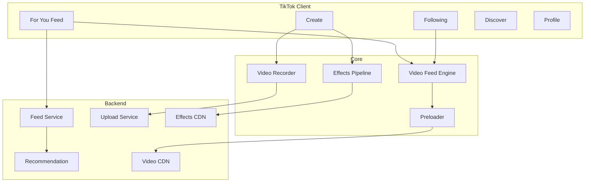

#### Key Metrics
| Metric | Target |
|--------|--------|
| First video play | < 500ms |
| Swipe transition | < 100ms |
| Preload buffer | Next 3 videos |
| Effect rendering | 30+ FPS real-time |
| Upload time | < 30 seconds |
| Feed refresh | < 500ms |

---

## 📐 Fundamentals

### Networking

**[📖 Full Guide →](fundamentals/networking.md)**

Understanding networking protocols, strategies, and best practices for mobile applications.

#### Protocol Comparison

| Protocol | Use Case | Pros | Cons |
|----------|----------|------|------|
| **REST** | General CRUD | Simple, cacheable, stateless | Over/under-fetching |
| **GraphQL** | Complex data needs | Flexible queries, typed schema | Complexity, caching harder |
| **WebSocket** | Real-time | Bidirectional, low latency | Connection management |
| **gRPC** | Service-to-service | Efficient, typed, streaming | Browser support, complexity |
| **SSE** | Server push | Simple, HTTP-based | Unidirectional only |

#### Offline-First Architecture

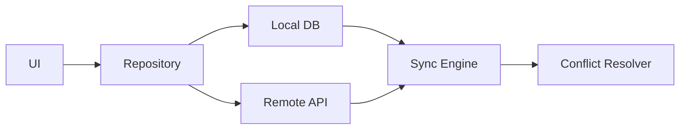

**Key Principles:**
1. Always read from local storage first
2. Write to local, then sync to server
3. Handle conflicts with clear resolution strategies
4. Queue operations when offline
5. Sync incrementally, not full refresh

#### Request Retry Strategy

```swift
enum RetryPolicy {
    case none
    case fixed(interval: TimeInterval, maxAttempts: Int)
    case exponentialBackoff(base: TimeInterval, maxDelay: TimeInterval, maxAttempts: Int)
    case jitter(base: TimeInterval, maxDelay: TimeInterval, maxAttempts: Int)
}

func executeWithRetry<T>(
    policy: RetryPolicy,
    operation: () async throws -> T
) async throws -> T {
    var attempts = 0
    var delay: TimeInterval = 0

    while true {
        do {
            return try await operation()
        } catch {
            attempts += 1
            guard shouldRetry(policy: policy, attempt: attempts) else {
                throw error
            }
            delay = calculateDelay(policy: policy, attempt: attempts)
            try await Task.sleep(nanoseconds: UInt64(delay * 1_000_000_000))
        }
    }
}
```

---

### Caching

**[📖 Full Guide →](fundamentals/caching.md)**

Multi-layer caching strategies for optimal performance.

#### Cache Hierarchy

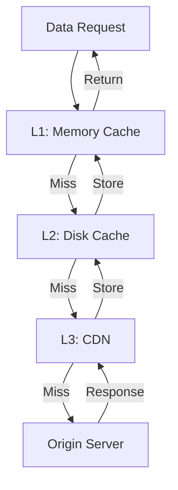

#### Cache Strategies

| Strategy | Description | Best For |
|----------|-------------|----------|
| **Cache-First** | Check cache, fallback to network | Static content, images |
| **Network-First** | Check network, fallback to cache | Fresh data, feeds |
| **Cache-Only** | Only return cached data | Offline mode |
| **Network-Only** | Always fetch from network | Real-time data |
| **Stale-While-Revalidate** | Return cache, update in background | Balanced freshness |

#### Image Caching Pipeline

```swift
class ImagePipeline {
    private let memoryCache: NSCache<NSString, UIImage>
    private let diskCache: DiskCache
    private let downloader: ImageDownloader
    private let processingQueue: DispatchQueue

    func loadImage(url: URL, size: CGSize) async -> UIImage? {
        let key = cacheKey(url: url, size: size)

        // L1: Memory cache
        if let image = memoryCache.object(forKey: key as NSString) {
            return image
        }

        // L2: Disk cache
        if let data = diskCache.data(forKey: key),
           let image = await processImage(data: data, targetSize: size) {
            memoryCache.setObject(image, forKey: key as NSString)
            return image
        }

        // L3: Network
        guard let data = try? await downloader.download(url: url) else {
            return nil
        }

        diskCache.store(data: data, forKey: key)
        let image = await processImage(data: data, targetSize: size)
        if let image {
            memoryCache.setObject(image, forKey: key as NSString)
        }
        return image
    }

    private func processImage(data: Data, targetSize: CGSize) async -> UIImage? {
        await withCheckedContinuation { continuation in
            processingQueue.async {
                let image = UIImage(data: data)?
                    .downsampled(to: targetSize)
                continuation.resume(returning: image)
            }
        }
    }
}
```

---

### Persistence

**[📖 Full Guide →](fundamentals/persistence.md)**

Data storage solutions for mobile applications.

#### Storage Options Comparison

| Solution | Platform | Best For | Limitations |
|----------|----------|----------|-------------|
| **UserDefaults / SharedPrefs** | iOS / Android | Small key-value data | No complex queries |
| **Keychain / Keystore** | iOS / Android | Sensitive data | Size limits |
| **SQLite** | Cross-platform | Structured data, complex queries | Manual schema management |
| **Core Data** | iOS | Object graph management | Learning curve, iOS only |
| **SwiftData** | iOS 17+ | Modern Swift persistence | iOS 17+ only |
| **Room** | Android | SQLite abstraction | Android only |
| **Realm** | Cross-platform | Real-time sync, easy API | Binary size |
| **File System** | Cross-platform | Large files, media | No querying |

#### Data Sync Strategy

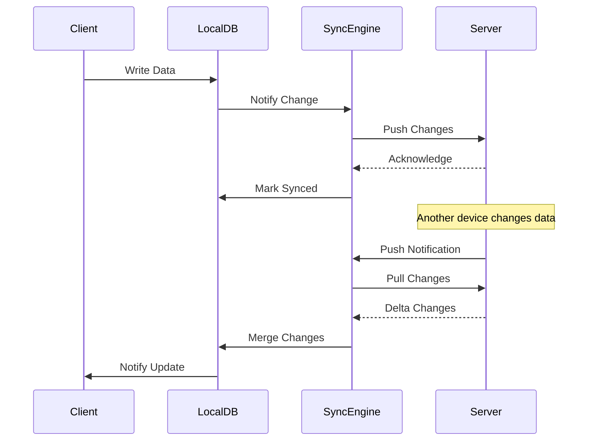

---

### Security

**[📖 Full Guide →](fundamentals/security.md)**

Protecting user data and securing mobile applications.

#### Authentication Flow

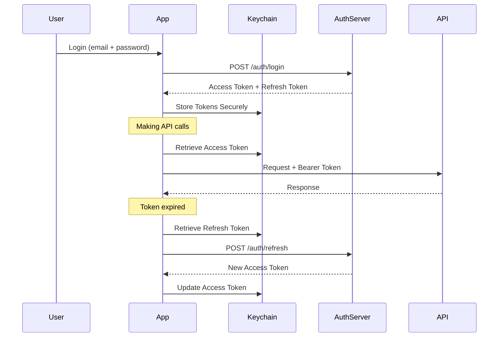

#### Security Checklist

- [ ] Store tokens in Keychain (iOS) / EncryptedSharedPreferences (Android)
- [ ] Implement certificate pinning for API calls
- [ ] Enable App Transport Security (ATS) on iOS
- [ ] Use Network Security Config on Android
- [ ] Encrypt sensitive data at rest
- [ ] Implement biometric authentication where appropriate
- [ ] Obfuscate network traffic
- [ ] Use secure random number generation
- [ ] Implement jailbreak/root detection
- [ ] Enable data protection (iOS) / file encryption (Android)
- [ ] Sanitize all user inputs
- [ ] Implement rate limiting on sensitive endpoints
- [ ] Use HTTPS for all network communication
- [ ] Implement proper session management
- [ ] Clear sensitive data on logout

---

### Performance

**[📖 Full Guide →](fundamentals/performance.md)**

Optimizing mobile application performance across all dimensions.

#### Performance Budget

| Metric | Good | Needs Work | Poor |
|--------|------|------------|------|
| **Cold Start** | < 1s | 1-3s | > 3s |
| **Screen Transition** | < 300ms | 300-500ms | > 500ms |
| **Frame Rate** | 60 FPS | 45-59 FPS | < 45 FPS |
| **Memory** | < 100MB | 100-200MB | > 200MB |
| **Battery (active)** | < 5%/hr | 5-10%/hr | > 10%/hr |
| **App Size** | < 50MB | 50-100MB | > 100MB |
| **Network Payload** | < 100KB | 100-500KB | > 500KB |

#### Startup Optimization

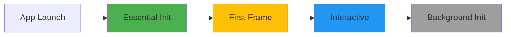

**Optimization Techniques:**
1. **Defer non-essential initialization** to after first frame
2. **Lazy load** modules and dependencies
3. **Reduce binary size** through tree shaking and asset optimization
4. **Use cached data** for initial render
5. **Parallelize** independent initialization tasks
6. **Remove unused** frameworks and libraries
7. **Optimize** main thread work

#### List Rendering Performance

```swift
// iOS - Efficient list with cell reuse and prefetching
class FeedViewController: UIViewController {
    private lazy var collectionView: UICollectionView = {
        let layout = createCompositionalLayout()
        let cv = UICollectionView(frame: .zero, collectionViewLayout: layout)
        cv.prefetchDataSource = self
        cv.isPrefetchingEnabled = true
        return cv
    }()

    private let imagePrefetcher = ImagePrefetcher()
}

extension FeedViewController: UICollectionViewDataSourcePrefetching {
    func collectionView(
        _ collectionView: UICollectionView,
        prefetchItemsAt indexPaths: [IndexPath]
    ) {
        let urls = indexPaths.compactMap { feedItems[$0.item].imageURL }
        imagePrefetcher.startPrefetching(urls: urls)
    }

    func collectionView(
        _ collectionView: UICollectionView,
        cancelPrefetchingForItemsAt indexPaths: [IndexPath]
    ) {
        let urls = indexPaths.compactMap { feedItems[$0.item].imageURL }
        imagePrefetcher.cancelPrefetching(urls: urls)
    }
}
```

---

### Architecture

**[📖 Full Guide →](fundamentals/architecture.md)**

Choosing the right architecture pattern for your mobile application.

#### Architecture Comparison

| Pattern | Complexity | Testability | Scalability | Learning Curve |
|---------|-----------|-------------|-------------|----------------|
| **MVC** | Low | Low | Low | Easy |
| **MVP** | Medium | High | Medium | Medium |
| **MVVM** | Medium | High | High | Medium |
| **MVI** | High | Very High | High | Hard |
| **VIPER** | Very High | Very High | Very High | Very Hard |
| **Clean Arch** | High | Very High | Very High | Hard |
| **TCA** | High | Very High | High | Hard |

#### MVVM Architecture

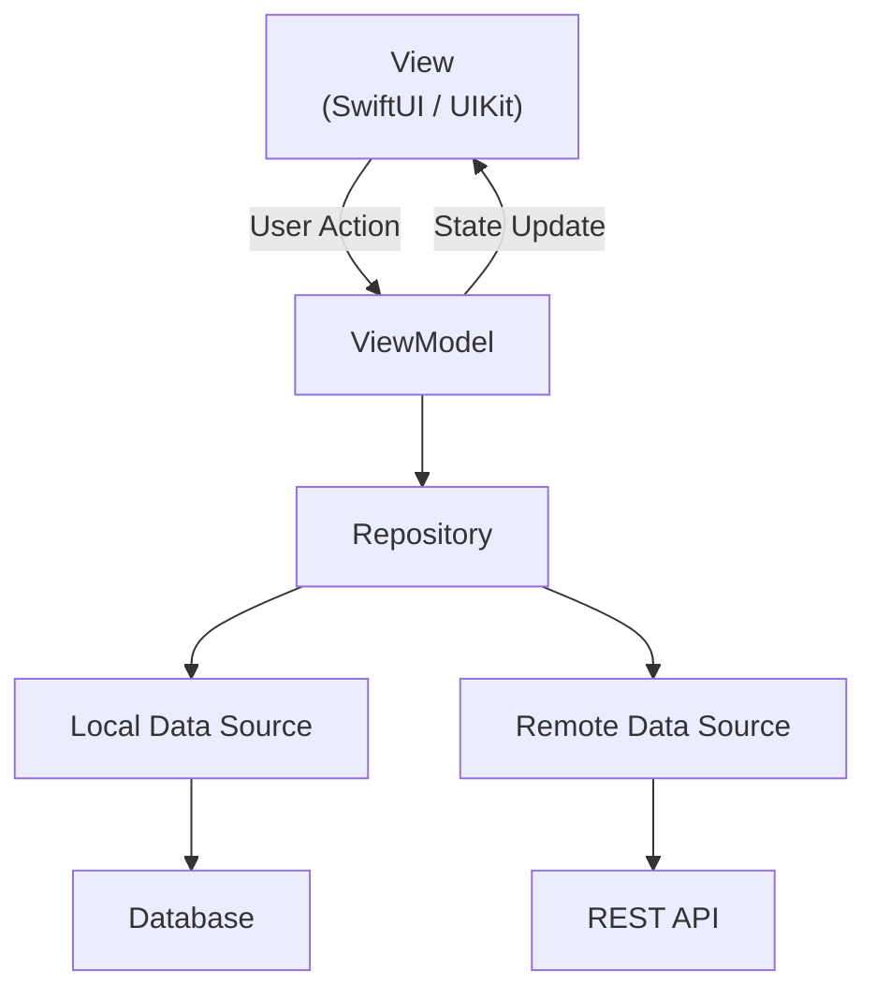

#### Clean Architecture

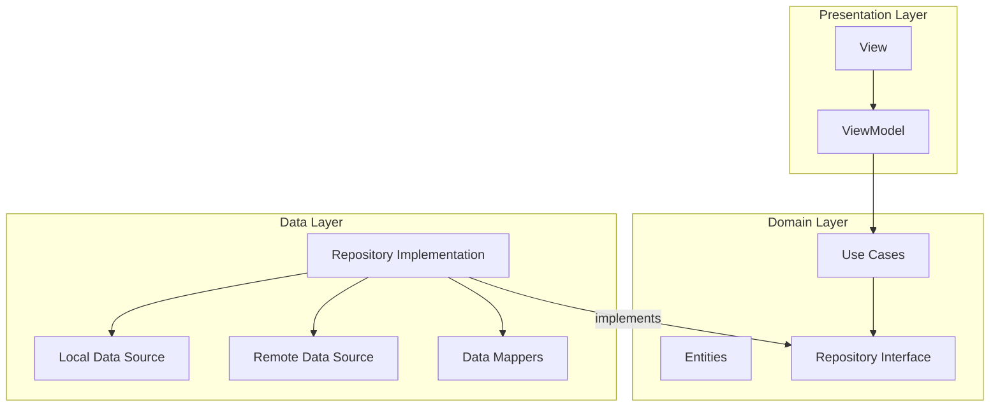

#### Choosing the Right Architecture

```
Small app (< 10 screens):
  → MVVM with simple Repository pattern
  → Focus on simplicity and speed of development

Medium app (10-50 screens):
  → MVVM + Clean Architecture (Domain layer)
  → Introduce Use Cases for complex business logic
  → Feature-based module organization

Large app (50+ screens, multiple teams):
  → Clean Architecture with modularization
  → Feature modules with clear boundaries
  → Shared core modules for common functionality
  → Consider micro-features architecture
```

---

## 🔄 Mobile Platform Comparison

### iOS Development Stack

| Component | Option 1 | Option 2 | Recommendation |
|-----------|----------|----------|----------------|
| **UI** | SwiftUI | UIKit | SwiftUI for new projects |
| **Networking** | URLSession | Alamofire | URLSession + async/await |
| **Images** | Kingfisher | SDWebImage | Kingfisher |
| **Persistence** | SwiftData | Core Data | SwiftData (iOS 17+) |
| **Reactive** | Combine | AsyncSequence | Combine + async/await |
| **DI** | Swinject | Factory | Factory |
| **Navigation** | NavigationStack | Coordinator | NavigationStack (SwiftUI) |
| **Testing** | XCTest | Quick/Nimble | Swift Testing (Xcode 16+) |

### Android Development Stack

| Component | Option 1 | Option 2 | Recommendation |
|-----------|----------|----------|----------------|
| **UI** | Jetpack Compose | XML Views | Compose for new projects |
| **Networking** | Retrofit | Ktor | Retrofit |
| **Images** | Coil | Glide | Coil (Compose native) |
| **Persistence** | Room | SQLDelight | Room |
| **Reactive** | Coroutines/Flow | RxJava | Coroutines + Flow |
| **DI** | Hilt | Koin | Hilt |
| **Navigation** | Navigation Compose | Custom | Navigation Compose |
| **Testing** | JUnit + Espresso | Robolectric | JUnit5 + Compose Testing |

### Flutter Development Stack

| Component | Option 1 | Option 2 | Recommendation |
|-----------|----------|----------|----------------|
| **State** | Riverpod | Bloc | Riverpod |
| **Networking** | Dio | http | Dio |
| **Images** | cached_network_image | flutter_image | cached_network_image |
| **Persistence** | Drift | Hive | Drift (complex), Hive (simple) |
| **DI** | Riverpod | get_it | Riverpod |
| **Navigation** | go_router | auto_route | go_router |
| **Testing** | flutter_test | integration_test | Both |

### React Native Development Stack

| Component | Option 1 | Option 2 | Recommendation |
|-----------|----------|----------|----------------|
| **State** | Zustand | Redux Toolkit | Zustand |
| **Networking** | Axios | fetch + TanStack Query | TanStack Query |
| **Images** | FastImage | Expo Image | FastImage |
| **Persistence** | WatermelonDB | MMKV | WatermelonDB (complex), MMKV (simple) |
| **Navigation** | React Navigation | Expo Router | Expo Router |
| **Testing** | Jest + RNTL | Detox | Both |

---

## 🎯 Interview Preparation

### Common Mobile System Design Interview Questions

#### Feed-Based Applications
1. Design Instagram's photo feed
2. Design Twitter's timeline
3. Design a news feed (Facebook-style)
4. Design TikTok's video feed
5. Design YouTube's home screen

#### Real-Time Applications
6. Design WhatsApp messaging
7. Design Uber's rider/driver experience
8. Design a live streaming app (Twitch)
9. Design a collaborative editing app (Google Docs)
10. Design a real-time sports score app

#### E-Commerce / Marketplace
11. Design Airbnb's search and booking
12. Design Amazon's product pages
13. Design a food delivery app (DoorDash)
14. Design an auction app (eBay)
15. Design a marketplace app (Etsy)

#### Media Applications
16. Design Spotify's music player
17. Design a podcast app
18. Design a photo editing app
19. Design a video calling app (Zoom)
20. Design a camera app with filters

### Interview Tips

#### Time Management (45-minute interview)

| Phase | Time | Activities |
|-------|------|------------|
| Clarification | 5 min | Ask questions, define scope |
| High-Level Design | 10 min | Components, architecture diagram |
| Data Models | 5 min | Key entities and relationships |
| API Design | 5 min | Endpoints, request/response |
| Deep Dives | 15 min | 2-3 key areas in detail |
| Platform Specifics | 5 min | iOS/Android considerations |

#### What Interviewers Look For

1. **Structured Thinking**: Follow a clear framework, don't jump to solutions
2. **Trade-off Analysis**: Explain why you chose one approach over another
3. **Scalability Awareness**: Consider how the system handles growth
4. **Platform Knowledge**: Show understanding of platform-specific patterns
5. **Communication**: Explain your thought process clearly
6. **Depth + Breadth**: Cover the full system but go deep on key areas

#### Common Mistakes to Avoid

- ❌ Jumping straight into implementation details
- ❌ Ignoring offline support and error handling
- ❌ Over-engineering for a simple problem
- ❌ Not considering battery and performance impact
- ❌ Forgetting about accessibility
- ❌ Not asking clarifying questions
- ❌ Treating it like a backend system design question
- ❌ Ignoring platform-specific constraints

---

## 🔁 Common Patterns

### Pagination Patterns

#### Cursor-Based Pagination (Recommended)

```swift
struct PaginatedResponse<T: Codable>: Codable {
    let items: [T]
    let nextCursor: String?
    let hasMore: Bool
}

class PaginatedDataSource<T: Codable> {
    private var items: [T] = []
    private var nextCursor: String?
    private var hasMore = true
    private var isLoading = false

    func loadNextPage() async throws -> [T] {
        guard hasMore, !isLoading else { return items }
        isLoading = true
        defer { isLoading = false }

        let response: PaginatedResponse<T> = try await api.fetch(
            endpoint: endpoint,
            cursor: nextCursor,
            limit: 20
        )

        items.append(contentsOf: response.items)
        nextCursor = response.nextCursor
        hasMore = response.hasMore

        return items
    }

    func refresh() async throws -> [T] {
        items = []
        nextCursor = nil
        hasMore = true
        return try await loadNextPage()
    }
}
```

#### Offset-Based Pagination

```swift
struct OffsetResponse<T: Codable>: Codable {
    let items: [T]
    let total: Int
    let offset: Int
    let limit: Int
}
```

### Image Loading Pattern

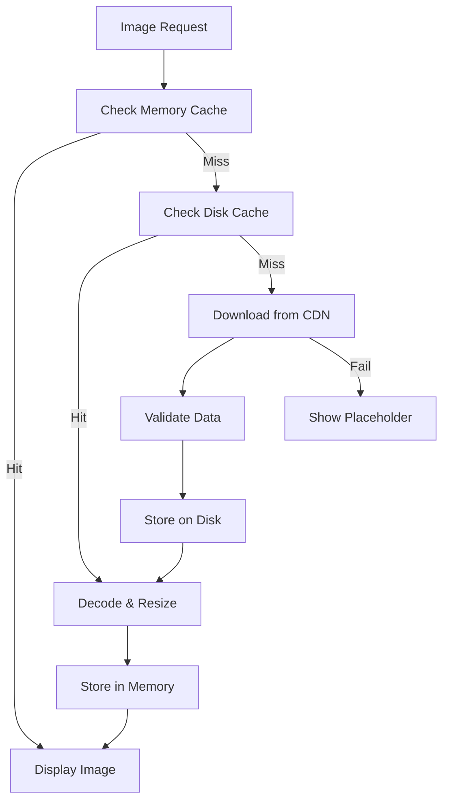

### Dependency Injection Pattern

```swift
// Protocol-based DI
protocol NetworkServiceProtocol {
    func fetch<T: Decodable>(endpoint: String) async throws -> T
}

protocol CacheServiceProtocol {
    func get<T: Decodable>(key: String) -> T?
    func set<T: Encodable>(key: String, value: T)
}

class FeedRepository {
    private let networkService: NetworkServiceProtocol
    private let cacheService: CacheServiceProtocol

    init(
        networkService: NetworkServiceProtocol,
        cacheService: CacheServiceProtocol
    ) {
        self.networkService = networkService
        self.cacheService = cacheService
    }

    func getFeed(cursor: String?) async throws -> PaginatedResponse<FeedItem> {
        if let cached: PaginatedResponse<FeedItem> = cacheService.get(key: "feed") {
            // Return cached immediately, refresh in background
            Task {
                let fresh = try await fetchFromNetwork(cursor: cursor)
                cacheService.set(key: "feed", value: fresh)
            }
            return cached
        }
        return try await fetchFromNetwork(cursor: cursor)
    }

    private func fetchFromNetwork(
        cursor: String?
    ) async throws -> PaginatedResponse<FeedItem> {
        let endpoint = "/feed?cursor=\(cursor ?? "")&limit=20"
        return try await networkService.fetch(endpoint: endpoint)
    }
}
```

### Coordinator Pattern (Navigation)

```swift
protocol Coordinator: AnyObject {
    var childCoordinators: [Coordinator] { get set }
    var navigationController: UINavigationController { get }
    func start()
}

class AppCoordinator: Coordinator {
    var childCoordinators: [Coordinator] = []
    let navigationController: UINavigationController

    init(navigationController: UINavigationController) {
        self.navigationController = navigationController
    }

    func start() {
        if isLoggedIn {
            showMainFlow()
        } else {
            showAuthFlow()
        }
    }

    private func showAuthFlow() {
        let authCoordinator = AuthCoordinator(
            navigationController: navigationController
        )
        authCoordinator.delegate = self
        childCoordinators.append(authCoordinator)
        authCoordinator.start()
    }

    private func showMainFlow() {
        let tabCoordinator = TabBarCoordinator(
            navigationController: navigationController
        )
        childCoordinators.append(tabCoordinator)
        tabCoordinator.start()
    }
}
```

### Error Handling Pattern

```swift
enum AppError: Error, LocalizedError {
    case network(NetworkError)
    case storage(StorageError)
    case auth(AuthError)
    case unknown(Error)

    var errorDescription: String? {
        switch self {
        case .network(let error): return error.localizedDescription
        case .storage(let error): return error.localizedDescription
        case .auth(let error): return error.localizedDescription
        case .unknown(let error): return error.localizedDescription
        }
    }

    var isRetryable: Bool {
        switch self {
        case .network(let error): return error.isRetryable
        case .auth: return false
        case .storage, .unknown: return false
        }
    }
}

enum NetworkError: Error {
    case noConnection
    case timeout
    case serverError(statusCode: Int)
    case decodingError
    case unauthorized

    var isRetryable: Bool {
        switch self {
        case .noConnection, .timeout, .serverError: return true
        case .decodingError, .unauthorized: return false
        }
    }
}
```

### State Management Pattern

```swift
// Unidirectional Data Flow
@MainActor
class FeedViewModel: ObservableObject {
    enum State {
        case idle
        case loading
        case loaded([FeedItem])
        case error(AppError)
    }

    enum Action {
        case loadFeed
        case refresh
        case loadMore
        case like(itemId: String)
        case bookmark(itemId: String)
    }

    @Published private(set) var state: State = .idle
    @Published private(set) var isRefreshing = false

    private let repository: FeedRepository

    init(repository: FeedRepository) {
        self.repository = repository
    }

    func send(_ action: Action) {
        switch action {
        case .loadFeed:
            loadFeed()
        case .refresh:
            refresh()
        case .loadMore:
            loadMore()
        case .like(let itemId):
            toggleLike(itemId: itemId)
        case .bookmark(let itemId):
            toggleBookmark(itemId: itemId)
        }
    }

    private func loadFeed() {
        state = .loading
        Task {
            do {
                let response = try await repository.getFeed(cursor: nil)
                state = .loaded(response.items)
            } catch {
                state = .error(AppError.network(.serverError(statusCode: 500)))
            }
        }
    }

    private func refresh() {
        isRefreshing = true
        Task {
            do {
                let response = try await repository.getFeed(cursor: nil)
                state = .loaded(response.items)
            } catch {
                // Keep existing data on refresh failure
            }
            isRefreshing = false
        }
    }

    private func loadMore() {
        // Implementation for infinite scroll
    }

    private func toggleLike(itemId: String) {
        // Optimistic update
        guard case .loaded(var items) = state,
              let index = items.firstIndex(where: { $0.id == itemId }) else { return }

        items[index] = items[index].toggled(\.isLiked)
        state = .loaded(items)

        Task {
            do {
                try await repository.toggleLike(itemId: itemId)
            } catch {
                // Revert on failure
                items[index] = items[index].toggled(\.isLiked)
                state = .loaded(items)
            }
        }
    }

    private func toggleBookmark(itemId: String) {
        // Similar to toggleLike
    }
}
```

### Analytics Pattern

```swift
protocol AnalyticsProvider {
    func track(event: AnalyticsEvent)
    func setUserProperty(key: String, value: String)
    func setUserId(_ userId: String?)
}

struct AnalyticsEvent {
    let name: String
    let parameters: [String: Any]
    let timestamp: Date

    init(name: String, parameters: [String: Any] = [:]) {
        self.name = name
        self.parameters = parameters
        self.timestamp = Date()
    }
}

class AnalyticsService {
    private var providers: [AnalyticsProvider] = []
    private let queue = DispatchQueue(label: "analytics", qos: .utility)
    private var buffer: [AnalyticsEvent] = []
    private let bufferSize = 10

    func addProvider(_ provider: AnalyticsProvider) {
        providers.append(provider)
    }

    func track(_ event: AnalyticsEvent) {
        queue.async { [weak self] in
            self?.buffer.append(event)
            if self?.buffer.count ?? 0 >= self?.bufferSize ?? 10 {
                self?.flush()
            }
        }
    }

    private func flush() {
        let events = buffer
        buffer.removeAll()
        for event in events {
            providers.forEach { $0.track(event: event) }
        }
    }
}

// Usage
extension AnalyticsEvent {
    static func feedViewed(source: String) -> AnalyticsEvent {
        AnalyticsEvent(name: "feed_viewed", parameters: ["source": source])
    }

    static func postLiked(postId: String) -> AnalyticsEvent {
        AnalyticsEvent(name: "post_liked", parameters: ["post_id": postId])
    }

    static func searchPerformed(query: String, resultCount: Int) -> AnalyticsEvent {
        AnalyticsEvent(name: "search_performed", parameters: [
            "query": query,
            "result_count": resultCount
        ])
    }
}
```

### Feature Flag Pattern

```swift
protocol FeatureFlagProvider {
    func isEnabled(_ flag: FeatureFlag) -> Bool
    func value<T>(for flag: FeatureFlag) -> T?
    func refresh() async
}

enum FeatureFlag: String, CaseIterable {
    case newFeedAlgorithm = "new_feed_algorithm"
    case darkModeV2 = "dark_mode_v2"
    case videoAutoplay = "video_autoplay"
    case reelsTab = "reels_tab"
    case aiRecommendations = "ai_recommendations"
}

class FeatureFlagService: FeatureFlagProvider {
    private var flags: [String: Any] = [:]
    private let defaults: [String: Any]
    private let networkService: NetworkServiceProtocol

    init(networkService: NetworkServiceProtocol, defaults: [String: Any] = [:]) {
        self.networkService = networkService
        self.defaults = defaults
        self.flags = defaults
    }

    func isEnabled(_ flag: FeatureFlag) -> Bool {
        return flags[flag.rawValue] as? Bool ?? false
    }

    func value<T>(for flag: FeatureFlag) -> T? {
        return flags[flag.rawValue] as? T
    }

    func refresh() async {
        do {
            let remote: [String: Any] = try await networkService.fetch(
                endpoint: "/config/flags"
            )
            flags = defaults.merging(remote) { _, new in new }
        } catch {
            // Keep existing flags on failure
        }
    }
}
```

### Deep Linking Pattern

```swift
enum DeepLink {
    case profile(userId: String)
    case post(postId: String)
    case feed
    case search(query: String?)
    case settings
    case external(URL)

    init?(url: URL) {
        guard let components = URLComponents(url: url, resolvingAgainstBaseURL: true),
              let host = components.host else { return nil }

        let path = components.path
        let queryItems = components.queryItems ?? []

        switch host {
        case "profile":
            guard let userId = queryItems.first(where: { $0.name == "id" })?.value else {
                return nil
            }
            self = .profile(userId: userId)
        case "post":
            let postId = String(path.dropFirst()) // Remove leading /
            self = .post(postId: postId)
        case "feed":
            self = .feed
        case "search":
            let query = queryItems.first(where: { $0.name == "q" })?.value
            self = .search(query: query)
        case "settings":
            self = .settings
        default:
            self = .external(url)
        }
    }
}

class DeepLinkRouter {
    private weak var coordinator: AppCoordinator?

    init(coordinator: AppCoordinator) {
        self.coordinator = coordinator
    }

    func handle(_ deepLink: DeepLink) {
        switch deepLink {
        case .profile(let userId):
            coordinator?.showProfile(userId: userId)
        case .post(let postId):
            coordinator?.showPost(postId: postId)
        case .feed:
            coordinator?.showFeed()
        case .search(let query):
            coordinator?.showSearch(query: query)
        case .settings:
            coordinator?.showSettings()
        case .external(let url):
            coordinator?.openExternalURL(url)
        }
    }
}
```

---

## 📚 Resources

### Books
- *Designing Data-Intensive Applications* by Martin Kleppmann
- *Clean Architecture* by Robert C. Martin
- *iOS Programming: The Big Nerd Ranch Guide*
- *Android Programming: The Big Nerd Ranch Guide*
- *Advanced iOS App Architecture* by raywenderlich.com
- *Kotlin Coroutines: Deep Dive* by Marcin Moskala

### Online Resources
- [Apple Human Interface Guidelines](https://developer.apple.com/design/human-interface-guidelines/)
- [Material Design Guidelines](https://material.io/design)
- [Swift.org Documentation](https://swift.org/documentation/)
- [Android Developer Guides](https://developer.android.com/guide)
- [Flutter Documentation](https://docs.flutter.dev/)
- [React Native Documentation](https://reactnative.dev/docs/getting-started)

### Blogs & Articles
- [Instagram Engineering Blog](https://engineering.fb.com/)
- [Uber Engineering Blog](https://www.uber.com/blog/engineering/)
- [Spotify Engineering Blog](https://engineering.atspotify.com/)
- [Airbnb Engineering Blog](https://medium.com/airbnb-engineering)
- [Twitter Engineering Blog](https://blog.twitter.com/engineering)

### Tools
- **Xcode Instruments** - iOS performance profiling
- **Android Studio Profiler** - Android performance profiling
- **Charles Proxy** - Network debugging
- **Proxyman** - Modern HTTP debugging proxy
- **Flipper** - Mobile development debugging platform
- **Firebase** - Analytics, crash reporting, remote config

---

## 🤝 Contributing

Contributions are welcome! Please read our [Contributing Guide](CONTRIBUTING.md) to get started.

### Ways to Contribute

- 📝 Add a new case study
- 🐛 Fix errors or improve explanations
- 🌐 Translate content
- 💡 Suggest new topics
- ⭐ Star the repo if you find it useful

---

## 📜 License

This project is licensed under the MIT License - see the [LICENSE](LICENSE) file for details.

---

## ⭐ Star History

If you find this repository useful, please consider giving it a star! It helps others discover the content.

---

<div align="center">

**Built with ❤️ for the mobile engineering community**

[⬆ Back to Top](#-mobile-system-design)

</div>
]]>