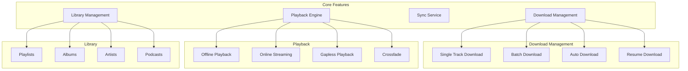
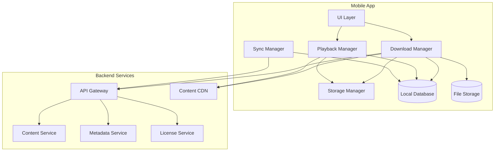
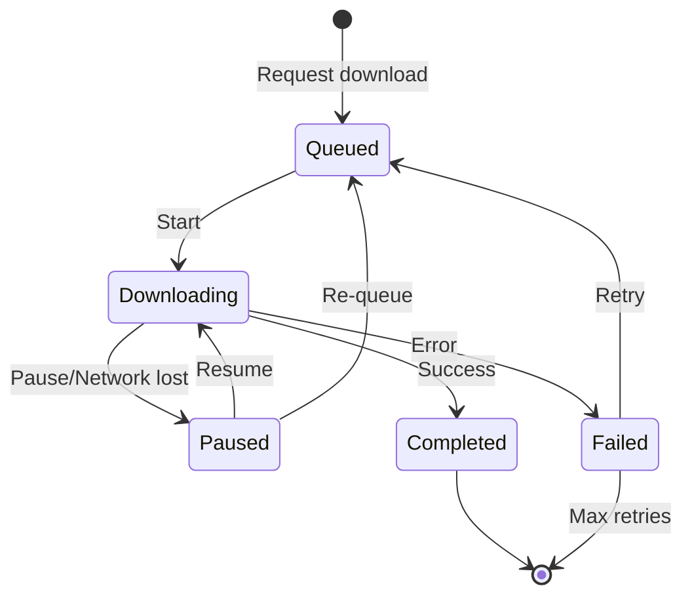
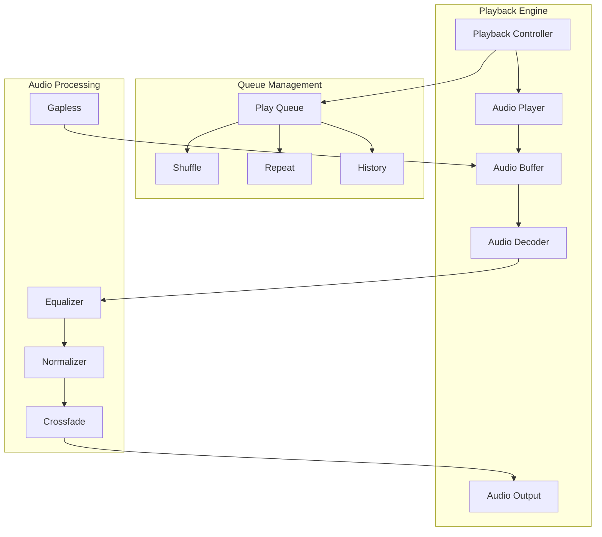
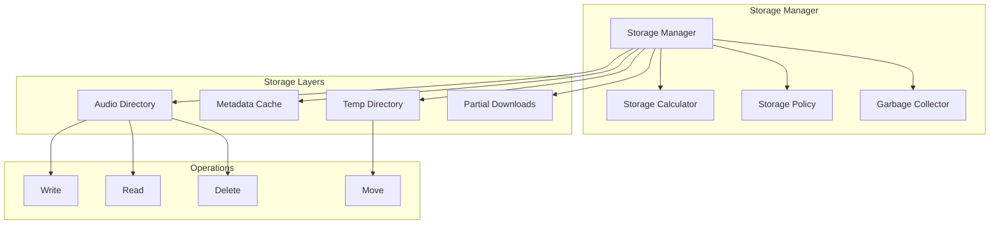
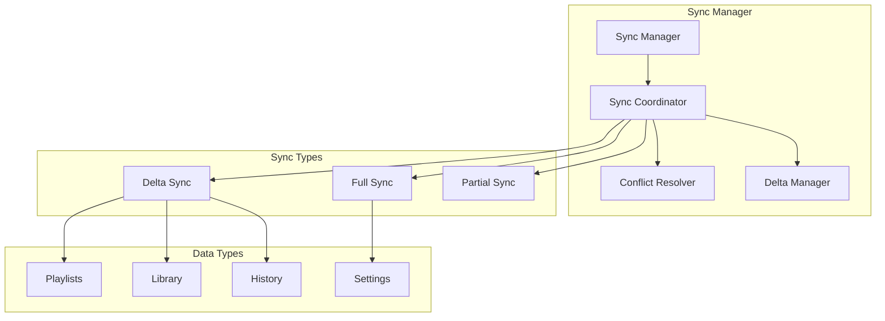

# Spotify Offline-First Music System Design

## Table of Contents

1. [Introduction](#introduction)
2. [System Requirements](#system-requirements)
3. [High-Level Architecture](#high-level-architecture)
4. [Download Management](#download-management)
5. [Audio Playback Engine](#audio-playback-engine)
6. [Storage Management](#storage-management)
7. [Sync Strategy](#sync-strategy)
8. [DRM and Security](#drm-and-security)
9. [Testing Approach](#testing-approach)
10. [Performance Optimization](#performance-optimization)

---

## Introduction

Designing an offline-first music streaming app like Spotify involves solving complex challenges around content delivery, storage management, audio playback, and synchronization. This case study explores the architecture decisions and implementation patterns for building a robust offline music experience.

### Core Challenges

| Challenge | Impact | Solution |
|-----------|--------|----------|
| Storage limits | User experience | Smart storage management |
| Download reliability | Content availability | Resumable downloads |
| Audio quality | Listening experience | Adaptive bitrate |
| Battery drain | Device longevity | Efficient playback |
| Sync conflicts | Data consistency | Conflict resolution |
| DRM compliance | Legal requirements | Secure storage |

### Scale Considerations

```
┌─────────────────────────────────────────────────────────────┐
│                    SCALE REQUIREMENTS                        │
├─────────────────────────────────────────────────────────────┤
│                                                             │
│  Content Library:                                           │
│  ├── 100M+ tracks available                                 │
│  ├── Average track: 4MB (320kbps)                          │
│  ├── 10M+ podcasts                                          │
│  └── New content: 60K+ tracks/day                          │
│                                                             │
│  User Behavior:                                             │
│  ├── Average downloads: 500 tracks/user                    │
│  ├── Offline listening: 30% of total plays                 │
│  ├── Sync frequency: Every 24 hours average                │
│  └── Storage used: 2-10GB per active user                  │
│                                                             │
│  Performance Targets:                                       │
│  ├── Download speed: Saturate bandwidth                    │
│  ├── Playback start: < 200ms                               │
│  ├── Gapless playback: 0ms gap                             │
│  └── Battery: < 3% per hour playback                       │
│                                                             │
└─────────────────────────────────────────────────────────────┘
```

---

## System Requirements

### Functional Requirements



### Non-Functional Requirements

| Category | Requirement | Target |
|----------|-------------|--------|
| Performance | Playback start time | < 200ms |
| Performance | Download throughput | > 90% of bandwidth |
| Performance | Memory footprint | < 100MB during playback |
| Reliability | Download success rate | > 99.5% |
| Reliability | Sync reliability | > 99.9% |
| Reliability | Crash rate | < 0.1% |
| Storage | Efficient encoding | < 4MB per track (320kbps) |
| Storage | Metadata overhead | < 1KB per track |
| Battery | Playback drain | < 3% per hour |
| Battery | Background sync | < 1% per sync |

---

## High-Level Architecture

### System Overview



### Layer Architecture

```
┌─────────────────────────────────────────────────────────────┐
│                    PRESENTATION LAYER                        │
├─────────────────────────────────────────────────────────────┤
│  LibraryVC  │  PlayerVC  │  DownloadsVC  │  SettingsVC     │
└─────────────────────────────────────────────────────────────┘
                              │
┌─────────────────────────────────────────────────────────────┐
│                    DOMAIN LAYER                              │
├─────────────────────────────────────────────────────────────┤
│  PlaybackUseCase    │  DownloadUseCase   │  SyncUseCase    │
│  LibraryUseCase     │  StorageUseCase    │  SearchUseCase  │
└─────────────────────────────────────────────────────────────┘
                              │
┌─────────────────────────────────────────────────────────────┐
│                    DATA LAYER                                │
├─────────────────────────────────────────────────────────────┤
│  TrackRepository    │  PlaylistRepository │  DownloadRepo  │
│  LocalDataSource    │  RemoteDataSource   │  CacheManager  │
└─────────────────────────────────────────────────────────────┘
                              │
┌─────────────────────────────────────────────────────────────┐
│                    INFRASTRUCTURE LAYER                      │
├─────────────────────────────────────────────────────────────┤
│  SQLite Database    │  File System        │  Network Client │
│  Audio Engine       │  DRM Manager        │  Crypto Module  │
└─────────────────────────────────────────────────────────────┘
```

---

## Download Management

### Download State Machine



### Download Manager Implementation

```swift
// iOS Download Manager
final class DownloadManager {
    static let shared = DownloadManager()
    
    private let queue = OperationQueue()
    private let database: DatabaseManager
    private let storageManager: StorageManager
    private let networkMonitor: NetworkMonitor
    
    private var activeDownloads: [String: DownloadTask] = [:]
    private var downloadQueue: [DownloadRequest] = []
    
    private let maxConcurrentDownloads = 3
    private let chunkSize = 1024 * 1024 // 1MB chunks
    
    var onProgressUpdate: ((String, Double) -> Void)?
    var onStatusChange: ((String, DownloadStatus) -> Void)?
    
    init(
        database: DatabaseManager = .shared,
        storageManager: StorageManager = .shared,
        networkMonitor: NetworkMonitor = .shared
    ) {
        self.database = database
        self.storageManager = storageManager
        self.networkMonitor = networkMonitor
        
        queue.maxConcurrentOperationCount = maxConcurrentDownloads
        setupNetworkObserver()
        restorePendingDownloads()
    }
    
    private func setupNetworkObserver() {
        networkMonitor.onStatusChange = { [weak self] status in
            switch status {
            case .connected:
                self?.resumeAllPaused()
            case .disconnected:
                self?.pauseAllActive()
            }
        }
    }
    
    // MARK: - Public API
    
    func downloadTrack(_ track: Track, quality: AudioQuality = .high) {
        guard !isDownloaded(trackId: track.id) else { return }
        
        let request = DownloadRequest(
            id: UUID().uuidString,
            trackId: track.id,
            url: track.downloadURL(for: quality),
            quality: quality,
            priority: .normal,
            createdAt: Date()
        )
        
        database.saveDownloadRequest(request)
        downloadQueue.append(request)
        onStatusChange?(track.id, .queued)
        
        processQueue()
    }
    
    func downloadPlaylist(_ playlist: Playlist, quality: AudioQuality = .high) {
        let tracks = playlist.tracks.filter { !isDownloaded(trackId: $0.id) }
        
        for (index, track) in tracks.enumerated() {
            let request = DownloadRequest(
                id: UUID().uuidString,
                trackId: track.id,
                url: track.downloadURL(for: quality),
                quality: quality,
                priority: .normal,
                createdAt: Date(),
                playlistId: playlist.id,
                position: index
            )
            
            database.saveDownloadRequest(request)
            downloadQueue.append(request)
            onStatusChange?(track.id, .queued)
        }
        
        processQueue()
    }
    
    func pauseDownload(trackId: String) {
        if let task = activeDownloads[trackId] {
            task.pause()
            onStatusChange?(trackId, .paused)
        }
    }
    
    func resumeDownload(trackId: String) {
        if let task = activeDownloads[trackId] {
            task.resume()
            onStatusChange?(trackId, .downloading)
        }
    }
    
    func cancelDownload(trackId: String) {
        if let task = activeDownloads[trackId] {
            task.cancel()
            activeDownloads.removeValue(forKey: trackId)
        }
        
        downloadQueue.removeAll { $0.trackId == trackId }
        database.deleteDownloadRequest(trackId: trackId)
        onStatusChange?(trackId, .notDownloaded)
    }
    
    func isDownloaded(trackId: String) -> Bool {
        return database.isTrackDownloaded(trackId: trackId)
    }
    
    // MARK: - Private Methods
    
    private func processQueue() {
        guard networkMonitor.isConnected else { return }
        
        while activeDownloads.count < maxConcurrentDownloads && !downloadQueue.isEmpty {
            let request = downloadQueue.removeFirst()
            startDownload(request)
        }
    }
    
    private func startDownload(_ request: DownloadRequest) {
        let task = DownloadTask(
            request: request,
            storageManager: storageManager,
            chunkSize: chunkSize
        )
        
        activeDownloads[request.trackId] = task
        
        task.onProgress = { [weak self] progress in
            self?.onProgressUpdate?(request.trackId, progress)
        }
        
        task.onComplete = { [weak self] result in
            self?.handleDownloadComplete(request: request, result: result)
        }
        
        onStatusChange?(request.trackId, .downloading)
        task.start()
    }
    
    private func handleDownloadComplete(request: DownloadRequest, result: Result<URL, Error>) {
        activeDownloads.removeValue(forKey: request.trackId)
        
        switch result {
        case .success(let fileURL):
            database.markTrackAsDownloaded(
                trackId: request.trackId,
                fileURL: fileURL,
                quality: request.quality
            )
            onStatusChange?(request.trackId, .completed)
            
        case .failure(let error):
            handleDownloadError(request: request, error: error)
        }
        
        processQueue()
    }
    
    private func handleDownloadError(request: DownloadRequest, error: Error) {
        var updatedRequest = request
        updatedRequest.retryCount += 1
        
        if updatedRequest.retryCount < 3 {
            let delay = pow(2.0, Double(updatedRequest.retryCount))
            DispatchQueue.main.asyncAfter(deadline: .now() + delay) { [weak self] in
                self?.downloadQueue.append(updatedRequest)
                self?.processQueue()
            }
            onStatusChange?(request.trackId, .retrying)
        } else {
            database.markDownloadFailed(trackId: request.trackId, error: error)
            onStatusChange?(request.trackId, .failed)
        }
    }
    
    private func pauseAllActive() {
        for (trackId, task) in activeDownloads {
            task.pause()
            onStatusChange?(trackId, .paused)
        }
    }
    
    private func resumeAllPaused() {
        for (trackId, task) in activeDownloads {
            task.resume()
            onStatusChange?(trackId, .downloading)
        }
        processQueue()
    }
    
    private func restorePendingDownloads() {
        let pending = database.getPendingDownloads()
        for download in pending {
            downloadQueue.append(download.toRequest())
        }
        processQueue()
    }
}

// Download Request
struct DownloadRequest {
    let id: String
    let trackId: String
    let url: URL
    let quality: AudioQuality
    var priority: DownloadPriority
    let createdAt: Date
    var playlistId: String?
    var position: Int?
    var retryCount: Int = 0
}

enum DownloadPriority: Int {
    case low = 0
    case normal = 1
    case high = 2
}

enum DownloadStatus {
    case notDownloaded
    case queued
    case downloading
    case paused
    case retrying
    case completed
    case failed
}

enum AudioQuality: String {
    case low = "96"      // 96 kbps
    case normal = "160"  // 160 kbps
    case high = "320"    // 320 kbps
    
    var bitrate: Int {
        switch self {
        case .low: return 96000
        case .normal: return 160000
        case .high: return 320000
        }
    }
}
```

### Download Task with Resume Support

```swift
// iOS Download Task
final class DownloadTask {
    private let request: DownloadRequest
    private let storageManager: StorageManager
    private let chunkSize: Int
    
    private var urlSession: URLSession!
    private var downloadTask: URLSessionDownloadTask?
    private var resumeData: Data?
    
    private(set) var progress: Double = 0
    private(set) var isPaused: Bool = false
    
    var onProgress: ((Double) -> Void)?
    var onComplete: ((Result<URL, Error>) -> Void)?
    
    init(request: DownloadRequest, storageManager: StorageManager, chunkSize: Int) {
        self.request = request
        self.storageManager = storageManager
        self.chunkSize = chunkSize
        
        let config = URLSessionConfiguration.background(
            withIdentifier: "download.\(request.id)"
        )
        config.isDiscretionary = false
        config.sessionSendsLaunchEvents = true
        
        urlSession = URLSession(
            configuration: config,
            delegate: DownloadTaskDelegate(task: self),
            delegateQueue: nil
        )
        
        // Check for existing partial download
        if let existingProgress = storageManager.getPartialDownload(trackId: request.trackId) {
            self.resumeData = existingProgress.resumeData
            self.progress = existingProgress.progress
        }
    }
    
    func start() {
        if let resumeData = resumeData {
            downloadTask = urlSession.downloadTask(withResumeData: resumeData)
        } else {
            downloadTask = urlSession.downloadTask(with: request.url)
        }
        
        downloadTask?.resume()
    }
    
    func pause() {
        isPaused = true
        downloadTask?.cancel(byProducingResumeData: { [weak self] data in
            if let data = data, let self = self {
                self.resumeData = data
                self.storageManager.savePartialDownload(
                    trackId: self.request.trackId,
                    resumeData: data,
                    progress: self.progress
                )
            }
        })
    }
    
    func resume() {
        isPaused = false
        start()
    }
    
    func cancel() {
        downloadTask?.cancel()
        storageManager.deletePartialDownload(trackId: request.trackId)
    }
    
    fileprivate func handleProgress(bytesWritten: Int64, totalBytes: Int64) {
        let newProgress = Double(bytesWritten) / Double(totalBytes)
        progress = newProgress
        onProgress?(progress)
    }
    
    fileprivate func handleCompletion(location: URL?, error: Error?) {
        if let error = error {
            if let nsError = error as NSError?,
               nsError.code == NSURLErrorCancelled,
               let resumeData = nsError.userInfo[NSURLSessionDownloadTaskResumeData] as? Data {
                self.resumeData = resumeData
                storageManager.savePartialDownload(
                    trackId: request.trackId,
                    resumeData: resumeData,
                    progress: progress
                )
            } else {
                onComplete?(.failure(error))
            }
            return
        }
        
        guard let location = location else {
            onComplete?(.failure(DownloadError.noFileLocation))
            return
        }
        
        do {
            let destinationURL = try storageManager.moveToTrackStorage(
                from: location,
                trackId: request.trackId,
                quality: request.quality
            )
            storageManager.deletePartialDownload(trackId: request.trackId)
            onComplete?(.success(destinationURL))
        } catch {
            onComplete?(.failure(error))
        }
    }
}

enum DownloadError: Error {
    case noFileLocation
    case insufficientStorage
    case invalidData
}
```

---

## Audio Playback Engine

### Playback Architecture



### Playback Controller

```swift
// iOS Playback Controller
final class PlaybackController: NSObject {
    static let shared = PlaybackController()
    
    private let audioEngine: AVAudioEngine
    private let playerNode: AVAudioPlayerNode
    private var audioFile: AVAudioFile?
    
    private let queue: PlayQueue
    private let gaplessBuffer: GaplessBuffer
    
    private(set) var currentTrack: Track?
    private(set) var isPlaying: Bool = false
    private(set) var currentTime: TimeInterval = 0
    private(set) var duration: TimeInterval = 0
    
    var onTrackChange: ((Track) -> Void)?
    var onPlaybackStateChange: ((Bool) -> Void)?
    var onProgressUpdate: ((TimeInterval, TimeInterval) -> Void)?
    
    private var progressTimer: Timer?
    private let storageManager: StorageManager
    
    override init() {
        audioEngine = AVAudioEngine()
        playerNode = AVAudioPlayerNode()
        queue = PlayQueue()
        gaplessBuffer = GaplessBuffer()
        storageManager = .shared
        
        super.init()
        
        setupAudioEngine()
        setupAudioSession()
        setupRemoteControl()
    }
    
    private func setupAudioEngine() {
        audioEngine.attach(playerNode)
        audioEngine.connect(playerNode, to: audioEngine.mainMixerNode, format: nil)
        
        do {
            try audioEngine.start()
        } catch {
            print("Failed to start audio engine: \(error)")
        }
    }
    
    private func setupAudioSession() {
        let session = AVAudioSession.sharedInstance()
        
        do {
            try session.setCategory(.playback, mode: .default, options: [])
            try session.setActive(true)
        } catch {
            print("Failed to setup audio session: \(error)")
        }
    }
    
    private func setupRemoteControl() {
        let commandCenter = MPRemoteCommandCenter.shared()
        
        commandCenter.playCommand.addTarget { [weak self] _ in
            self?.play()
            return .success
        }
        
        commandCenter.pauseCommand.addTarget { [weak self] _ in
            self?.pause()
            return .success
        }
        
        commandCenter.nextTrackCommand.addTarget { [weak self] _ in
            self?.next()
            return .success
        }
        
        commandCenter.previousTrackCommand.addTarget { [weak self] _ in
            self?.previous()
            return .success
        }
        
        commandCenter.changePlaybackPositionCommand.addTarget { [weak self] event in
            if let event = event as? MPChangePlaybackPositionCommandEvent {
                self?.seek(to: event.positionTime)
                return .success
            }
            return .commandFailed
        }
    }
    
    // MARK: - Playback Control
    
    func play(track: Track? = nil) {
        if let track = track {
            loadTrack(track)
        }
        
        guard currentTrack != nil else { return }
        
        playerNode.play()
        isPlaying = true
        onPlaybackStateChange?(true)
        startProgressTimer()
        updateNowPlaying()
    }
    
    func pause() {
        playerNode.pause()
        isPlaying = false
        onPlaybackStateChange?(false)
        stopProgressTimer()
        updateNowPlaying()
    }
    
    func stop() {
        playerNode.stop()
        isPlaying = false
        currentTime = 0
        onPlaybackStateChange?(false)
        stopProgressTimer()
    }
    
    func next() {
        guard let nextTrack = queue.next() else { return }
        loadTrack(nextTrack)
        play()
    }
    
    func previous() {
        if currentTime > 3 {
            seek(to: 0)
        } else if let previousTrack = queue.previous() {
            loadTrack(previousTrack)
            play()
        }
    }
    
    func seek(to time: TimeInterval) {
        guard let audioFile = audioFile else { return }
        
        let sampleRate = audioFile.processingFormat.sampleRate
        let newSampleTime = AVAudioFramePosition(time * sampleRate)
        let remainingFrames = AVAudioFrameCount(audioFile.length - newSampleTime)
        
        playerNode.stop()
        playerNode.scheduleSegment(
            audioFile,
            startingFrame: newSampleTime,
            frameCount: remainingFrames,
            at: nil
        )
        
        currentTime = time
        
        if isPlaying {
            playerNode.play()
        }
        
        updateNowPlaying()
    }
    
    // MARK: - Queue Management
    
    func setQueue(_ tracks: [Track], startIndex: Int = 0) {
        queue.setTracks(tracks)
        
        if let track = queue.track(at: startIndex) {
            queue.setCurrentIndex(startIndex)
            loadTrack(track)
        }
    }
    
    func addToQueue(_ track: Track) {
        queue.addTrack(track)
    }
    
    func toggleShuffle() {
        queue.shuffle = !queue.shuffle
    }
    
    func toggleRepeat() {
        queue.cycleRepeatMode()
    }
    
    // MARK: - Private Methods
    
    private func loadTrack(_ track: Track) {
        playerNode.stop()
        
        guard let fileURL = getTrackFileURL(track) else {
            // Track not downloaded, handle streaming
            return
        }
        
        do {
            audioFile = try AVAudioFile(forReading: fileURL)
            
            guard let audioFile = audioFile else { return }
            
            duration = Double(audioFile.length) / audioFile.processingFormat.sampleRate
            currentTime = 0
            currentTrack = track
            
            playerNode.scheduleFile(audioFile, at: nil) { [weak self] in
                DispatchQueue.main.async {
                    self?.handleTrackEnd()
                }
            }
            
            onTrackChange?(track)
            prepareNextTrack()
            
        } catch {
            print("Failed to load audio file: \(error)")
        }
    }
    
    private func getTrackFileURL(_ track: Track) -> URL? {
        return storageManager.getTrackFileURL(trackId: track.id)
    }
    
    private func prepareNextTrack() {
        guard let nextTrack = queue.peekNext() else { return }
        gaplessBuffer.prepare(track: nextTrack)
    }
    
    private func handleTrackEnd() {
        guard !isPlaying else { return }
        
        if queue.repeatMode == .one {
            seek(to: 0)
            play()
        } else {
            next()
        }
    }
    
    private func startProgressTimer() {
        progressTimer = Timer.scheduledTimer(withTimeInterval: 0.5, repeats: true) { [weak self] _ in
            self?.updateProgress()
        }
    }
    
    private func stopProgressTimer() {
        progressTimer?.invalidate()
        progressTimer = nil
    }
    
    private func updateProgress() {
        guard let nodeTime = playerNode.lastRenderTime,
              let playerTime = playerNode.playerTime(forNodeTime: nodeTime) else {
            return
        }
        
        currentTime = Double(playerTime.sampleTime) / playerTime.sampleRate
        onProgressUpdate?(currentTime, duration)
    }
    
    private func updateNowPlaying() {
        guard let track = currentTrack else { return }
        
        var nowPlayingInfo: [String: Any] = [
            MPMediaItemPropertyTitle: track.title,
            MPMediaItemPropertyArtist: track.artist,
            MPMediaItemPropertyPlaybackDuration: duration,
            MPNowPlayingInfoPropertyElapsedPlaybackTime: currentTime,
            MPNowPlayingInfoPropertyPlaybackRate: isPlaying ? 1.0 : 0.0
        ]
        
        if let artwork = track.artworkImage {
            nowPlayingInfo[MPMediaItemPropertyArtwork] = MPMediaItemArtwork(boundsSize: artwork.size) { _ in artwork }
        }
        
        MPNowPlayingInfoCenter.default().nowPlayingInfo = nowPlayingInfo
    }
}
```

### Play Queue Management

```swift
// iOS Play Queue
final class PlayQueue {
    private var originalTracks: [Track] = []
    private var tracks: [Track] = []
    private var currentIndex: Int = 0
    private var history: [Track] = []
    
    var shuffle: Bool = false {
        didSet {
            if shuffle {
                shuffleTracks()
            } else {
                restoreOriginalOrder()
            }
        }
    }
    
    var repeatMode: RepeatMode = .off
    
    enum RepeatMode {
        case off
        case all
        case one
    }
    
    var currentTrack: Track? {
        guard currentIndex >= 0 && currentIndex < tracks.count else { return nil }
        return tracks[currentIndex]
    }
    
    func setTracks(_ newTracks: [Track]) {
        originalTracks = newTracks
        tracks = shuffle ? newTracks.shuffled() : newTracks
        currentIndex = 0
        history.removeAll()
    }
    
    func addTrack(_ track: Track) {
        originalTracks.append(track)
        tracks.append(track)
    }
    
    func setCurrentIndex(_ index: Int) {
        currentIndex = index
    }
    
    func track(at index: Int) -> Track? {
        guard index >= 0 && index < tracks.count else { return nil }
        return tracks[index]
    }
    
    func next() -> Track? {
        if let current = currentTrack {
            history.append(current)
        }
        
        if repeatMode == .one {
            return currentTrack
        }
        
        currentIndex += 1
        
        if currentIndex >= tracks.count {
            if repeatMode == .all {
                currentIndex = 0
            } else {
                return nil
            }
        }
        
        return currentTrack
    }
    
    func previous() -> Track? {
        if let previousTrack = history.popLast() {
            if let currentIndex = tracks.firstIndex(where: { $0.id == previousTrack.id }) {
                self.currentIndex = currentIndex
            }
            return previousTrack
        }
        
        currentIndex = max(0, currentIndex - 1)
        return currentTrack
    }
    
    func peekNext() -> Track? {
        let nextIndex = currentIndex + 1
        
        if nextIndex >= tracks.count {
            if repeatMode == .all {
                return tracks.first
            }
            return nil
        }
        
        return tracks[nextIndex]
    }
    
    func cycleRepeatMode() {
        switch repeatMode {
        case .off:
            repeatMode = .all
        case .all:
            repeatMode = .one
        case .one:
            repeatMode = .off
        }
    }
    
    private func shuffleTracks() {
        guard let current = currentTrack else {
            tracks = originalTracks.shuffled()
            return
        }
        
        var remaining = originalTracks.filter { $0.id != current.id }
        remaining.shuffle()
        tracks = [current] + remaining
        currentIndex = 0
    }
    
    private func restoreOriginalOrder() {
        guard let current = currentTrack else {
            tracks = originalTracks
            return
        }
        
        tracks = originalTracks
        if let index = tracks.firstIndex(where: { $0.id == current.id }) {
            currentIndex = index
        }
    }
}
```

### Gapless Playback Buffer

```swift
// iOS Gapless Buffer
final class GaplessBuffer {
    private var preparedAudioFile: AVAudioFile?
    private var preparedTrack: Track?
    private let storageManager: StorageManager
    
    init(storageManager: StorageManager = .shared) {
        self.storageManager = storageManager
    }
    
    func prepare(track: Track) {
        guard let fileURL = storageManager.getTrackFileURL(trackId: track.id) else {
            return
        }
        
        do {
            preparedAudioFile = try AVAudioFile(forReading: fileURL)
            preparedTrack = track
        } catch {
            print("Failed to prepare gapless buffer: \(error)")
        }
    }
    
    func getNextFile() -> AVAudioFile? {
        defer { clear() }
        return preparedAudioFile
    }
    
    func getNextTrack() -> Track? {
        return preparedTrack
    }
    
    func clear() {
        preparedAudioFile = nil
        preparedTrack = nil
    }
}
```

---

## Storage Management

### Storage Architecture



### Storage Manager Implementation

```swift
// iOS Storage Manager
final class StorageManager {
    static let shared = StorageManager()
    
    private let fileManager = FileManager.default
    private let tracksDirectory: URL
    private let tempDirectory: URL
    private let partialDirectory: URL
    
    private let maxStorageGB: Double = 10.0
    private let warningThresholdGB: Double = 8.0
    
    var onStorageWarning: ((StorageWarning) -> Void)?
    
    init() {
        let documentsPath = fileManager.urls(for: .documentDirectory, in: .userDomainMask)[0]
        
        tracksDirectory = documentsPath.appendingPathComponent("Tracks")
        tempDirectory = documentsPath.appendingPathComponent("Temp")
        partialDirectory = documentsPath.appendingPathComponent("Partial")
        
        createDirectories()
    }
    
    private func createDirectories() {
        [tracksDirectory, tempDirectory, partialDirectory].forEach { url in
            try? fileManager.createDirectory(at: url, withIntermediateDirectories: true)
        }
    }
    
    // MARK: - Track Storage
    
    func moveToTrackStorage(from source: URL, trackId: String, quality: AudioQuality) throws -> URL {
        let destination = trackFileURL(trackId: trackId, quality: quality)
        
        if fileManager.fileExists(atPath: destination.path) {
            try fileManager.removeItem(at: destination)
        }
        
        try fileManager.moveItem(at: source, to: destination)
        
        checkStorageUsage()
        
        return destination
    }
    
    func getTrackFileURL(trackId: String) -> URL? {
        for quality in [AudioQuality.high, .normal, .low] {
            let url = trackFileURL(trackId: trackId, quality: quality)
            if fileManager.fileExists(atPath: url.path) {
                return url
            }
        }
        return nil
    }
    
    func deleteTrack(trackId: String) {
        for quality in AudioQuality.allCases {
            let url = trackFileURL(trackId: trackId, quality: quality)
            try? fileManager.removeItem(at: url)
        }
    }
    
    private func trackFileURL(trackId: String, quality: AudioQuality) -> URL {
        return tracksDirectory.appendingPathComponent("\(trackId)_\(quality.rawValue).mp3")
    }
    
    // MARK: - Partial Downloads
    
    func savePartialDownload(trackId: String, resumeData: Data, progress: Double) {
        let url = partialFileURL(trackId: trackId)
        let metadata = PartialDownloadMetadata(trackId: trackId, progress: progress, resumeData: resumeData)
        
        do {
            let data = try JSONEncoder().encode(metadata)
            try data.write(to: url)
        } catch {
            print("Failed to save partial download: \(error)")
        }
    }
    
    func getPartialDownload(trackId: String) -> PartialDownloadMetadata? {
        let url = partialFileURL(trackId: trackId)
        
        guard let data = try? Data(contentsOf: url),
              let metadata = try? JSONDecoder().decode(PartialDownloadMetadata.self, from: data) else {
            return nil
        }
        
        return metadata
    }
    
    func deletePartialDownload(trackId: String) {
        let url = partialFileURL(trackId: trackId)
        try? fileManager.removeItem(at: url)
    }
    
    private func partialFileURL(trackId: String) -> URL {
        return partialDirectory.appendingPathComponent("\(trackId).partial")
    }
    
    // MARK: - Storage Calculation
    
    func calculateStorageUsage() -> StorageUsage {
        let tracksSize = directorySize(tracksDirectory)
        let tempSize = directorySize(tempDirectory)
        let partialSize = directorySize(partialDirectory)
        let totalSize = tracksSize + tempSize + partialSize
        
        let availableSpace = getAvailableDiskSpace()
        
        return StorageUsage(
            tracksBytes: tracksSize,
            tempBytes: tempSize,
            partialBytes: partialSize,
            totalBytes: totalSize,
            availableBytes: availableSpace,
            maxBytes: Int64(maxStorageGB * 1024 * 1024 * 1024)
        )
    }
    
    func getTrackCount() -> Int {
        let contents = try? fileManager.contentsOfDirectory(
            at: tracksDirectory,
            includingPropertiesForKeys: nil
        )
        return contents?.count ?? 0
    }
    
    private func directorySize(_ url: URL) -> Int64 {
        var size: Int64 = 0
        
        let contents = try? fileManager.contentsOfDirectory(
            at: url,
            includingPropertiesForKeys: [.fileSizeKey],
            options: .skipsHiddenFiles
        )
        
        contents?.forEach { fileURL in
            let fileSize = try? fileURL.resourceValues(forKeys: [.fileSizeKey]).fileSize
            size += Int64(fileSize ?? 0)
        }
        
        return size
    }
    
    private func getAvailableDiskSpace() -> Int64 {
        let values = try? URL(fileURLWithPath: NSHomeDirectory())
            .resourceValues(forKeys: [.volumeAvailableCapacityForImportantUsageKey])
        return values?.volumeAvailableCapacityForImportantUsage ?? 0
    }
    
    private func checkStorageUsage() {
        let usage = calculateStorageUsage()
        let usedGB = Double(usage.totalBytes) / (1024 * 1024 * 1024)
        
        if usedGB >= maxStorageGB {
            onStorageWarning?(.limitReached)
        } else if usedGB >= warningThresholdGB {
            onStorageWarning?(.approachingLimit(usedGB: usedGB, maxGB: maxStorageGB))
        }
    }
    
    // MARK: - Cleanup
    
    func cleanupTempDirectory() {
        try? fileManager.contentsOfDirectory(at: tempDirectory, includingPropertiesForKeys: nil)
            .forEach { try? fileManager.removeItem(at: $0) }
    }
    
    func cleanupOldPartials(olderThan days: Int = 7) {
        let cutoffDate = Calendar.current.date(byAdding: .day, value: -days, to: Date())!
        
        let contents = try? fileManager.contentsOfDirectory(
            at: partialDirectory,
            includingPropertiesForKeys: [.creationDateKey]
        )
        
        contents?.forEach { url in
            if let creationDate = try? url.resourceValues(forKeys: [.creationDateKey]).creationDate,
               creationDate < cutoffDate {
                try? fileManager.removeItem(at: url)
            }
        }
    }
    
    func freeUpSpace(bytesNeeded: Int64) -> Bool {
        let usage = calculateStorageUsage()
        let available = usage.maxBytes - usage.totalBytes
        
        if available >= bytesNeeded {
            return true
        }
        
        // Clean temp and partials first
        cleanupTempDirectory()
        cleanupOldPartials(olderThan: 1)
        
        let newUsage = calculateStorageUsage()
        let newAvailable = newUsage.maxBytes - newUsage.totalBytes
        
        return newAvailable >= bytesNeeded
    }
}

struct StorageUsage {
    let tracksBytes: Int64
    let tempBytes: Int64
    let partialBytes: Int64
    let totalBytes: Int64
    let availableBytes: Int64
    let maxBytes: Int64
    
    var usagePercentage: Double {
        return Double(totalBytes) / Double(maxBytes) * 100
    }
    
    var formattedTotal: String {
        return ByteCountFormatter.string(fromByteCount: totalBytes, countStyle: .file)
    }
    
    var formattedAvailable: String {
        return ByteCountFormatter.string(fromByteCount: availableBytes, countStyle: .file)
    }
}

struct PartialDownloadMetadata: Codable {
    let trackId: String
    let progress: Double
    let resumeData: Data
}

enum StorageWarning {
    case limitReached
    case approachingLimit(usedGB: Double, maxGB: Double)
    case lowDeviceStorage
}

extension AudioQuality: CaseIterable {}
```

### Smart Storage Policy

```swift
// iOS Storage Policy
final class StoragePolicy {
    private let database: DatabaseManager
    private let storageManager: StorageManager
    
    init(database: DatabaseManager = .shared, storageManager: StorageManager = .shared) {
        self.database = database
        self.storageManager = storageManager
    }
    
    func getTracksToRemove(bytesNeeded: Int64) -> [String] {
        let allTracks = database.getDownloadedTracks()
        
        // Score tracks based on recency and play count
        var scoredTracks = allTracks.map { track -> (Track, Double) in
            let daysSinceLastPlay = track.lastPlayedAt.map { 
                Calendar.current.dateComponents([.day], from: $0, to: Date()).day ?? 0 
            } ?? 365
            
            let recencyScore = 1.0 / (1.0 + Double(daysSinceLastPlay) / 30.0)
            let playCountScore = log10(Double(max(track.playCount, 1)))
            let score = recencyScore * 0.7 + playCountScore * 0.3
            
            return (track, score)
        }
        
        // Sort by score (lowest first)
        scoredTracks.sort { $0.1 < $1.1 }
        
        var bytesToFree: Int64 = 0
        var tracksToRemove: [String] = []
        
        for (track, _) in scoredTracks {
            if bytesToFree >= bytesNeeded {
                break
            }
            
            tracksToRemove.append(track.id)
            bytesToFree += track.fileSize
        }
        
        return tracksToRemove
    }
    
    func autoCleanupIfNeeded() {
        let usage = storageManager.calculateStorageUsage()
        
        if usage.usagePercentage > 95 {
            let bytesToFree = Int64(Double(usage.maxBytes) * 0.1) // Free 10%
            let tracksToRemove = getTracksToRemove(bytesNeeded: bytesToFree)
            
            for trackId in tracksToRemove {
                storageManager.deleteTrack(trackId: trackId)
                database.deleteDownloadedTrack(trackId: trackId)
            }
        }
    }
}
```

---

## Sync Strategy

### Sync Architecture



### Sync Manager Implementation

```swift
// iOS Sync Manager
final class SyncManager {
    private let apiClient: APIClient
    private let database: DatabaseManager
    private let networkMonitor: NetworkMonitor
    
    private var syncTimer: Timer?
    private var isSyncing: Bool = false
    private var lastSyncTimestamp: Date?
    
    var onSyncStart: (() -> Void)?
    var onSyncComplete: ((SyncResult) -> Void)?
    var onSyncError: ((Error) -> Void)?
    
    init(
        apiClient: APIClient = .shared,
        database: DatabaseManager = .shared,
        networkMonitor: NetworkMonitor = .shared
    ) {
        self.apiClient = apiClient
        self.database = database
        self.networkMonitor = networkMonitor
        
        lastSyncTimestamp = UserDefaults.standard.object(forKey: "lastSyncTimestamp") as? Date
        
        setupPeriodicSync()
        setupNetworkObserver()
    }
    
    private func setupPeriodicSync() {
        syncTimer = Timer.scheduledTimer(withTimeInterval: 3600, repeats: true) { [weak self] _ in
            self?.syncIfNeeded()
        }
    }
    
    private func setupNetworkObserver() {
        networkMonitor.onStatusChange = { [weak self] status in
            if status == .connected {
                self?.syncIfNeeded()
            }
        }
    }
    
    func syncIfNeeded() {
        guard networkMonitor.isConnected && !isSyncing else { return }
        
        Task {
            await performSync()
        }
    }
    
    func forceSync() async {
        guard !isSyncing else { return }
        await performSync()
    }
    
    private func performSync() async {
        isSyncing = true
        onSyncStart?()
        
        do {
            // Get server changes since last sync
            let serverChanges = try await apiClient.getChanges(since: lastSyncTimestamp)
            
            // Get local changes
            let localChanges = database.getLocalChanges(since: lastSyncTimestamp)
            
            // Resolve conflicts
            let resolved = resolveConflicts(server: serverChanges, local: localChanges)
            
            // Apply server changes locally
            applyServerChanges(resolved.serverToApply)
            
            // Push local changes to server
            try await pushLocalChanges(resolved.localToPush)
            
            // Update sync timestamp
            lastSyncTimestamp = Date()
            UserDefaults.standard.set(lastSyncTimestamp, forKey: "lastSyncTimestamp")
            
            let result = SyncResult(
                playlistsUpdated: resolved.serverToApply.playlists.count,
                tracksUpdated: resolved.serverToApply.tracks.count,
                conflictsResolved: resolved.conflicts.count
            )
            
            onSyncComplete?(result)
            
        } catch {
            onSyncError?(error)
        }
        
        isSyncing = false
    }
    
    private func resolveConflicts(server: ServerChanges, local: LocalChanges) -> ResolvedChanges {
        var serverToApply = server
        var localToPush = local
        var conflicts: [SyncConflict] = []
        
        // Playlist conflicts
        for serverPlaylist in server.playlists {
            if let localPlaylist = local.playlists.first(where: { $0.id == serverPlaylist.id }) {
                let conflict = SyncConflict(
                    type: .playlist,
                    id: serverPlaylist.id,
                    serverVersion: serverPlaylist,
                    localVersion: localPlaylist
                )
                
                let resolved = resolvePlaylistConflict(conflict)
                conflicts.append(resolved.conflict)
                
                if resolved.useServer {
                    localToPush.playlists.removeAll { $0.id == serverPlaylist.id }
                } else {
                    serverToApply.playlists.removeAll { $0.id == serverPlaylist.id }
                }
            }
        }
        
        return ResolvedChanges(
            serverToApply: serverToApply,
            localToPush: localToPush,
            conflicts: conflicts
        )
    }
    
    private func resolvePlaylistConflict(_ conflict: SyncConflict) -> (conflict: SyncConflict, useServer: Bool) {
        // Default: Server wins for playlist order, merge for track additions
        guard let serverPlaylist = conflict.serverVersion as? Playlist,
              let localPlaylist = conflict.localVersion as? Playlist else {
            return (conflict, true)
        }
        
        // If only track additions differ, merge them
        let serverTracks = Set(serverPlaylist.trackIds)
        let localTracks = Set(localPlaylist.trackIds)
        
        if serverTracks.subtracting(localTracks).isEmpty == false ||
           localTracks.subtracting(serverTracks).isEmpty == false {
            // Merge: Take server order but add local additions
            let merged = serverPlaylist.trackIds + localTracks.subtracting(serverTracks)
            var resolvedPlaylist = serverPlaylist
            resolvedPlaylist.trackIds = Array(merged)
            
            var resolvedConflict = conflict
            resolvedConflict.resolution = .merged(resolvedPlaylist)
            return (resolvedConflict, true)
        }
        
        // Server timestamp wins
        return (conflict, serverPlaylist.updatedAt > localPlaylist.updatedAt)
    }
    
    private func applyServerChanges(_ changes: ServerChanges) {
        // Update playlists
        for playlist in changes.playlists {
            database.savePlaylist(playlist)
        }
        
        // Update library
        for track in changes.tracks {
            database.saveTrack(track)
        }
        
        // Update settings
        if let settings = changes.settings {
            database.saveSettings(settings)
        }
    }
    
    private func pushLocalChanges(_ changes: LocalChanges) async throws {
        try await apiClient.pushChanges(changes)
        database.clearLocalChanges()
    }
}

struct SyncResult {
    let playlistsUpdated: Int
    let tracksUpdated: Int
    let conflictsResolved: Int
}

struct ServerChanges {
    var playlists: [Playlist]
    var tracks: [Track]
    var settings: UserSettings?
}

struct LocalChanges {
    var playlists: [Playlist]
    var tracks: [Track]
    var likedTracks: [String]
    var playHistory: [PlayHistoryEntry]
}

struct ResolvedChanges {
    var serverToApply: ServerChanges
    var localToPush: LocalChanges
    var conflicts: [SyncConflict]
}

struct SyncConflict {
    enum ConflictType {
        case playlist
        case track
        case settings
    }
    
    enum Resolution {
        case serverWins
        case localWins
        case merged(Any)
    }
    
    let type: ConflictType
    let id: String
    let serverVersion: Any
    let localVersion: Any
    var resolution: Resolution?
}
```

---

## DRM and Security

### Security Architecture

```
┌─────────────────────────────────────────────────────────────┐
│                    SECURITY LAYERS                           │
├─────────────────────────────────────────────────────────────┤
│                                                             │
│  Transport Security:                                        │
│  ├── TLS 1.3 for all connections                           │
│  ├── Certificate pinning                                    │
│  └── HSTS enforcement                                       │
│                                                             │
│  Authentication:                                            │
│  ├── OAuth 2.0 + PKCE                                       │
│  ├── Refresh token rotation                                 │
│  └── Secure token storage (Keychain)                        │
│                                                             │
│  Content Protection:                                        │
│  ├── Encrypted audio files                                  │
│  ├── License validation                                     │
│  ├── Playback restrictions                                  │
│  └── Offline license expiry                                 │
│                                                             │
│  Device Security:                                           │
│  ├── Jailbreak detection                                    │
│  ├── Debug detection                                        │
│  └── Integrity checks                                       │
│                                                             │
└─────────────────────────────────────────────────────────────┘
```

### Content Encryption

```swift
// iOS Content Encryption
final class ContentEncryption {
    private let keychain: KeychainManager
    
    init(keychain: KeychainManager = .shared) {
        self.keychain = keychain
    }
    
    func encryptTrack(data: Data, trackId: String) throws -> Data {
        let key = try getOrCreateKey(for: trackId)
        let iv = generateIV()
        
        var encrypted = iv
        
        let symmetricKey = SymmetricKey(data: key)
        let sealedBox = try AES.GCM.seal(data, using: symmetricKey, nonce: AES.GCM.Nonce(data: iv))
        
        encrypted.append(sealedBox.ciphertext)
        encrypted.append(sealedBox.tag)
        
        return encrypted
    }
    
    func decryptTrack(data: Data, trackId: String) throws -> Data {
        guard let key = keychain.getData(forKey: "track_key_\(trackId)") else {
            throw EncryptionError.keyNotFound
        }
        
        let ivLength = 12
        let tagLength = 16
        
        let iv = data.prefix(ivLength)
        let ciphertext = data.dropFirst(ivLength).dropLast(tagLength)
        let tag = data.suffix(tagLength)
        
        let symmetricKey = SymmetricKey(data: key)
        let nonce = try AES.GCM.Nonce(data: iv)
        let sealedBox = try AES.GCM.SealedBox(nonce: nonce, ciphertext: ciphertext, tag: tag)
        
        return try AES.GCM.open(sealedBox, using: symmetricKey)
    }
    
    private func getOrCreateKey(for trackId: String) throws -> Data {
        let keyName = "track_key_\(trackId)"
        
        if let existingKey = keychain.getData(forKey: keyName) {
            return existingKey
        }
        
        var keyData = Data(count: 32)
        let result = keyData.withUnsafeMutableBytes { bytes in
            SecRandomCopyBytes(kSecRandomDefault, 32, bytes.baseAddress!)
        }
        
        guard result == errSecSuccess else {
            throw EncryptionError.keyGenerationFailed
        }
        
        keychain.setData(keyData, forKey: keyName)
        return keyData
    }
    
    private func generateIV() -> Data {
        var iv = Data(count: 12)
        _ = iv.withUnsafeMutableBytes { bytes in
            SecRandomCopyBytes(kSecRandomDefault, 12, bytes.baseAddress!)
        }
        return iv
    }
}

enum EncryptionError: Error {
    case keyNotFound
    case keyGenerationFailed
    case decryptionFailed
    case invalidData
}
```

### License Management

```swift
// iOS License Manager
final class LicenseManager {
    private let apiClient: APIClient
    private let database: DatabaseManager
    private let keychain: KeychainManager
    
    private let offlineLicenseValidityDays = 30
    
    init(
        apiClient: APIClient = .shared,
        database: DatabaseManager = .shared,
        keychain: KeychainManager = .shared
    ) {
        self.apiClient = apiClient
        self.database = database
        self.keychain = keychain
    }
    
    func validateLicense(for trackId: String) async -> LicenseStatus {
        // Check local license
        if let localLicense = database.getLicense(for: trackId) {
            if localLicense.expiresAt > Date() {
                return .valid(localLicense)
            }
        }
        
        // Try to refresh online
        do {
            let license = try await apiClient.getLicense(for: trackId)
            database.saveLicense(license)
            return .valid(license)
        } catch {
            return .invalid(.expired)
        }
    }
    
    func requestOfflineLicense(for tracks: [String]) async throws {
        let licenses = try await apiClient.getOfflineLicenses(
            trackIds: tracks,
            validityDays: offlineLicenseValidityDays
        )
        
        for license in licenses {
            database.saveLicense(license)
        }
    }
    
    func getDecryptionKey(for trackId: String) -> Data? {
        guard let license = database.getLicense(for: trackId),
              license.expiresAt > Date() else {
            return nil
        }
        
        return keychain.getData(forKey: "license_key_\(trackId)")
    }
    
    func cleanupExpiredLicenses() {
        let expiredLicenses = database.getExpiredLicenses()
        
        for license in expiredLicenses {
            database.deleteLicense(for: license.trackId)
            keychain.delete(forKey: "license_key_\(license.trackId)")
        }
    }
}

struct License: Codable {
    let trackId: String
    let issuedAt: Date
    let expiresAt: Date
    let restrictions: LicenseRestrictions
}

struct LicenseRestrictions: Codable {
    let maxOfflineDevices: Int
    let allowsExport: Bool
    let qualityLimit: AudioQuality?
}

enum LicenseStatus {
    case valid(License)
    case invalid(LicenseInvalidReason)
}

enum LicenseInvalidReason {
    case expired
    case deviceNotAuthorized
    case subscriptionRequired
    case regionRestricted
}
```

---

## Testing Approach

### Test Categories

```
┌─────────────────────────────────────────────────────────────┐
│                    TEST PYRAMID                              │
├─────────────────────────────────────────────────────────────┤
│                                                             │
│                      ┌─────────┐                            │
│                     /   E2E    \        10%                 │
│                    /─────────────\                          │
│                   /  Integration  \     20%                 │
│                  /─────────────────\                        │
│                 /       Unit        \   70%                 │
│                └─────────────────────┘                      │
│                                                             │
│  Focus Areas:                                               │
│  ├── Download reliability                                   │
│  ├── Playback continuity                                    │
│  ├── Storage management                                     │
│  ├── Sync correctness                                       │
│  └── Offline scenarios                                      │
│                                                             │
└─────────────────────────────────────────────────────────────┘
```

### Download Tests

```swift
// iOS Download Tests
final class DownloadManagerTests: XCTestCase {
    var sut: DownloadManager!
    var mockDatabase: MockDatabaseManager!
    var mockStorage: MockStorageManager!
    var mockNetwork: MockNetworkMonitor!
    
    override func setUp() {
        super.setUp()
        mockDatabase = MockDatabaseManager()
        mockStorage = MockStorageManager()
        mockNetwork = MockNetworkMonitor()
        
        sut = DownloadManager(
            database: mockDatabase,
            storageManager: mockStorage,
            networkMonitor: mockNetwork
        )
    }
    
    func testDownloadTrack_AddsToQueue() {
        let track = Track.mock()
        mockNetwork.isConnected = true
        
        sut.downloadTrack(track)
        
        XCTAssertTrue(mockDatabase.saveDownloadRequestCalled)
    }
    
    func testDownloadTrack_SkipsIfAlreadyDownloaded() {
        let track = Track.mock()
        mockDatabase.downloadedTrackIds = [track.id]
        
        sut.downloadTrack(track)
        
        XCTAssertFalse(mockDatabase.saveDownloadRequestCalled)
    }
    
    func testPauseDownload_SavesResumeData() async {
        let track = Track.mock()
        mockNetwork.isConnected = true
        
        sut.downloadTrack(track)
        
        // Wait for download to start
        try? await Task.sleep(nanoseconds: 100_000_000)
        
        sut.pauseDownload(trackId: track.id)
        
        XCTAssertTrue(mockStorage.savePartialDownloadCalled)
    }
    
    func testNetworkDisconnect_PausesAllDownloads() {
        let tracks = [Track.mock(), Track.mock(), Track.mock()]
        mockNetwork.isConnected = true
        
        tracks.forEach { sut.downloadTrack($0) }
        
        mockNetwork.simulateDisconnect()
        
        tracks.forEach { track in
            XCTAssertEqual(sut.getDownloadStatus(trackId: track.id), .paused)
        }
    }
    
    func testNetworkReconnect_ResumesDownloads() {
        let track = Track.mock()
        mockNetwork.isConnected = true
        
        sut.downloadTrack(track)
        mockNetwork.simulateDisconnect()
        
        var statusChanges: [DownloadStatus] = []
        sut.onStatusChange = { _, status in
            statusChanges.append(status)
        }
        
        mockNetwork.simulateReconnect()
        
        XCTAssertTrue(statusChanges.contains(.downloading))
    }
    
    func testDownloadRetry_ExponentialBackoff() async {
        let track = Track.mock()
        mockNetwork.isConnected = true
        mockStorage.shouldFailDownload = true
        
        var retryTimes: [Date] = []
        sut.onStatusChange = { _, status in
            if status == .retrying {
                retryTimes.append(Date())
            }
        }
        
        sut.downloadTrack(track)
        
        // Wait for retries
        try? await Task.sleep(nanoseconds: 10_000_000_000)
        
        // Verify exponential backoff
        if retryTimes.count >= 2 {
            let firstDelay = retryTimes[1].timeIntervalSince(retryTimes[0])
            XCTAssertGreaterThan(firstDelay, 1.0)
        }
    }
}
```

### Playback Tests

```swift
// iOS Playback Tests
final class PlaybackControllerTests: XCTestCase {
    var sut: PlaybackController!
    var mockStorage: MockStorageManager!
    
    override func setUp() {
        super.setUp()
        mockStorage = MockStorageManager()
        sut = PlaybackController(storageManager: mockStorage)
    }
    
    func testPlay_StartsPlayback() {
        let track = Track.mock()
        mockStorage.addMockTrackFile(track)
        
        sut.play(track: track)
        
        XCTAssertTrue(sut.isPlaying)
        XCTAssertEqual(sut.currentTrack?.id, track.id)
    }
    
    func testPause_StopsPlayback() {
        let track = Track.mock()
        mockStorage.addMockTrackFile(track)
        
        sut.play(track: track)
        sut.pause()
        
        XCTAssertFalse(sut.isPlaying)
    }
    
    func testNext_PlaysNextTrack() {
        let tracks = [Track.mock(), Track.mock(), Track.mock()]
        tracks.forEach { mockStorage.addMockTrackFile($0) }
        
        sut.setQueue(tracks)
        sut.play()
        sut.next()
        
        XCTAssertEqual(sut.currentTrack?.id, tracks[1].id)
    }
    
    func testPrevious_WithinFirstThreeSeconds_PlaysPreviousTrack() {
        let tracks = [Track.mock(), Track.mock()]
        tracks.forEach { mockStorage.addMockTrackFile($0) }
        
        sut.setQueue(tracks)
        sut.play()
        sut.next()
        sut.previous()
        
        XCTAssertEqual(sut.currentTrack?.id, tracks[0].id)
    }
    
    func testPrevious_AfterThreeSeconds_RestartsCurrentTrack() {
        let track = Track.mock()
        mockStorage.addMockTrackFile(track)
        
        sut.play(track: track)
        sut.seek(to: 10)
        sut.previous()
        
        XCTAssertEqual(sut.currentTrack?.id, track.id)
        XCTAssertLessThan(sut.currentTime, 1.0)
    }
    
    func testShuffle_RandomizesQueue() {
        let tracks = (0..<10).map { _ in Track.mock() }
        tracks.forEach { mockStorage.addMockTrackFile($0) }
        
        sut.setQueue(tracks)
        let originalOrder = tracks.map { $0.id }
        
        sut.toggleShuffle()
        
        var newOrder: [String] = []
        for _ in tracks {
            if let current = sut.currentTrack {
                newOrder.append(current.id)
            }
            sut.next()
        }
        
        XCTAssertNotEqual(originalOrder, newOrder)
    }
    
    func testRepeatOne_ReplaysCurrentTrack() {
        let tracks = [Track.mock(), Track.mock()]
        tracks.forEach { mockStorage.addMockTrackFile($0) }
        
        sut.setQueue(tracks)
        sut.toggleRepeat()
        sut.toggleRepeat() // .one mode
        
        sut.play()
        sut.next()
        
        XCTAssertEqual(sut.currentTrack?.id, tracks[0].id)
    }
}
```

---

## Performance Optimization

### Key Metrics

| Metric | Target | Measurement |
|--------|--------|-------------|
| Playback start | < 200ms | Time from play() to audio output |
| Gapless transition | 0ms | Gap between tracks |
| Download throughput | > 90% bandwidth | Actual vs available |
| Memory (playback) | < 100MB | Resident memory |
| Battery (playback) | < 3%/hr | Battery drain rate |
| Storage efficiency | < 1% overhead | Metadata vs audio |

### Optimization Techniques

```swift
// iOS Performance Optimizations
final class PerformanceOptimizer {
    
    // Pre-buffer next track for gapless
    func prebufferNextTrack(queue: PlayQueue, bufferManager: GaplessBuffer) {
        if let nextTrack = queue.peekNext() {
            bufferManager.prepare(track: nextTrack)
        }
    }
    
    // Compress metadata in memory
    func compressMetadata(_ tracks: [Track]) -> Data {
        let minimalTracks = tracks.map { MinimalTrackMetadata(track: $0) }
        return try! JSONEncoder().encode(minimalTracks)
    }
    
    // Batch database operations
    func batchInsert(tracks: [Track], into database: DatabaseManager) {
        database.performBatchOperation {
            for track in tracks {
                database.saveTrack(track)
            }
        }
    }
    
    // Memory-mapped file reading for large playlists
    func readPlaylistEfficiently(fileURL: URL) -> [String]? {
        guard let data = try? Data(contentsOf: fileURL, options: .mappedIfSafe) else {
            return nil
        }
        
        return try? JSONDecoder().decode([String].self, from: data)
    }
    
    // Throttle UI updates
    func throttledProgressUpdate(interval: TimeInterval = 0.5) -> (Double) -> Void {
        var lastUpdate = Date.distantPast
        
        return { progress in
            let now = Date()
            if now.timeIntervalSince(lastUpdate) >= interval {
                lastUpdate = now
                DispatchQueue.main.async {
                    NotificationCenter.default.post(
                        name: .playbackProgressUpdated,
                        object: progress
                    )
                }
            }
        }
    }
}

struct MinimalTrackMetadata: Codable {
    let id: String
    let title: String
    let artist: String
    let duration: TimeInterval
    
    init(track: Track) {
        self.id = track.id
        self.title = track.title
        self.artist = track.artist
        self.duration = track.duration
    }
}

extension Notification.Name {
    static let playbackProgressUpdated = Notification.Name("playbackProgressUpdated")
}
```

### Battery Optimization

```swift
// iOS Battery Optimization
final class BatteryOptimizer {
    private let powerMonitor: PowerMonitor
    
    init(powerMonitor: PowerMonitor = .shared) {
        self.powerMonitor = powerMonitor
    }
    
    func getOptimalAudioQuality() -> AudioQuality {
        switch powerMonitor.batteryLevel {
        case ..<0.2:
            return .low
        case 0.2..<0.5:
            return .normal
        default:
            return .high
        }
    }
    
    func shouldPrefetch() -> Bool {
        return powerMonitor.batteryLevel > 0.3 && powerMonitor.isCharging
    }
    
    func optimizePlaybackSettings() -> PlaybackSettings {
        let isLowPower = powerMonitor.batteryLevel < 0.2
        
        return PlaybackSettings(
            enableEqualizer: !isLowPower,
            enableCrossfade: !isLowPower,
            enableNormalization: !isLowPower,
            bufferDuration: isLowPower ? 30 : 60
        )
    }
}

struct PlaybackSettings {
    let enableEqualizer: Bool
    let enableCrossfade: Bool
    let enableNormalization: Bool
    let bufferDuration: TimeInterval
}
```

---

## Summary

Building an offline-first music app requires careful attention to:

1. **Download reliability** - Resumable downloads with retry logic
2. **Playback quality** - Gapless transitions and audio processing
3. **Storage efficiency** - Smart cleanup and compression
4. **Sync robustness** - Conflict resolution and delta sync
5. **Security** - Content encryption and license management
6. **Performance** - Battery optimization and memory management

The architecture presented balances user experience with technical constraints while ensuring content security and offline reliability.

---

## References

- [AVFoundation Programming Guide](https://developer.apple.com/library/archive/documentation/AudioVideo/Conceptual/AVFoundationPG/)
- [Background Execution Guide](https://developer.apple.com/documentation/uikit/app_and_environment/scenes/preparing_your_ui_to_run_in_the_background)
- [Data Protection Best Practices](https://developer.apple.com/documentation/security/protecting_the_user_s_privacy)
- [ExoPlayer (Android)](https://developer.android.com/guide/topics/media/exoplayer)
