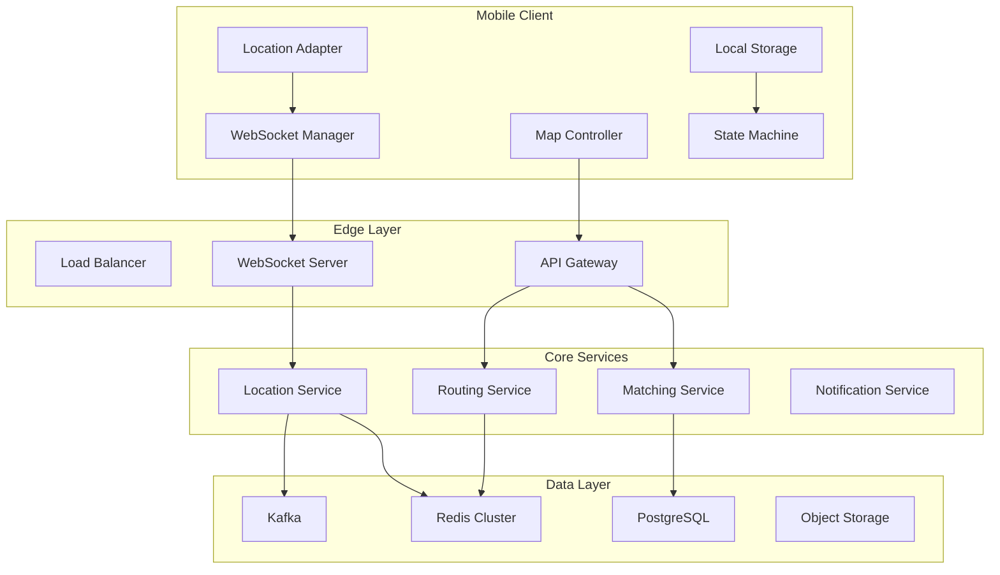
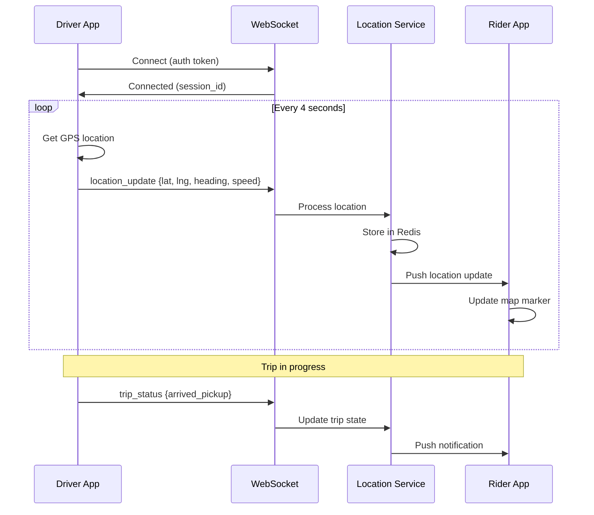
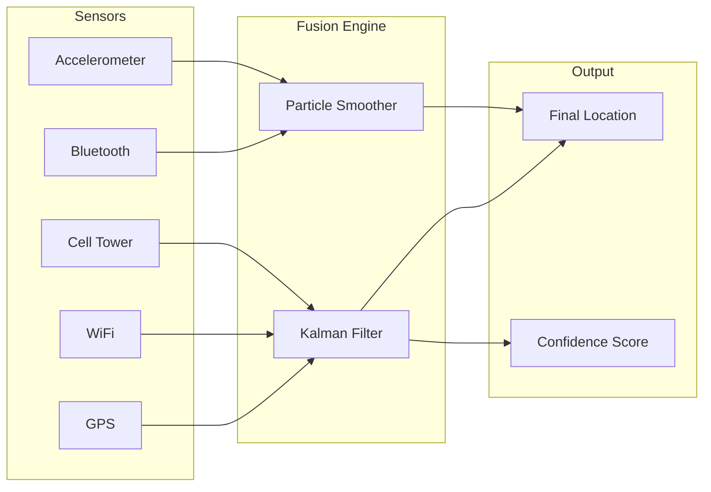
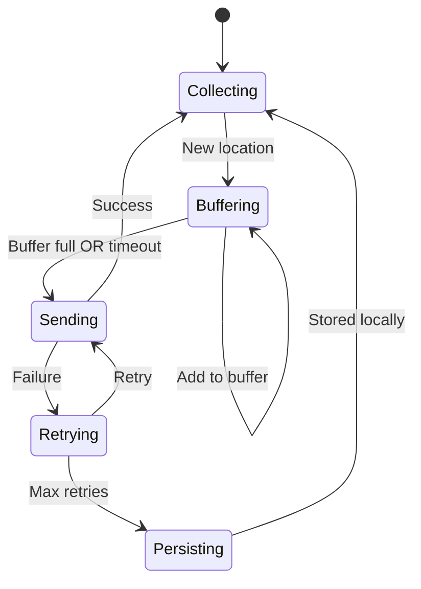
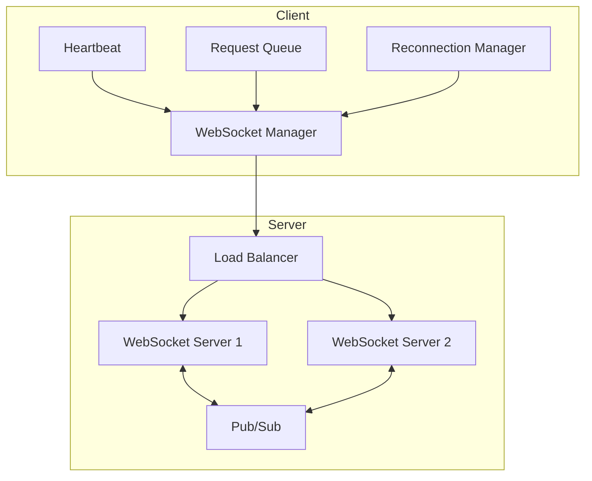
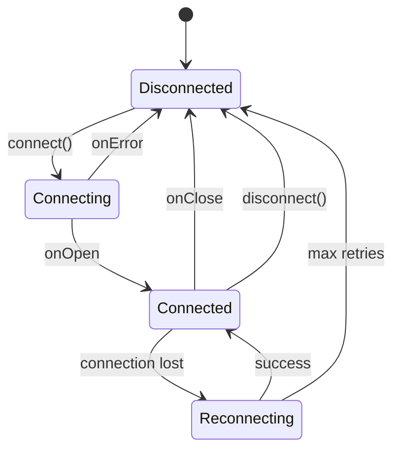
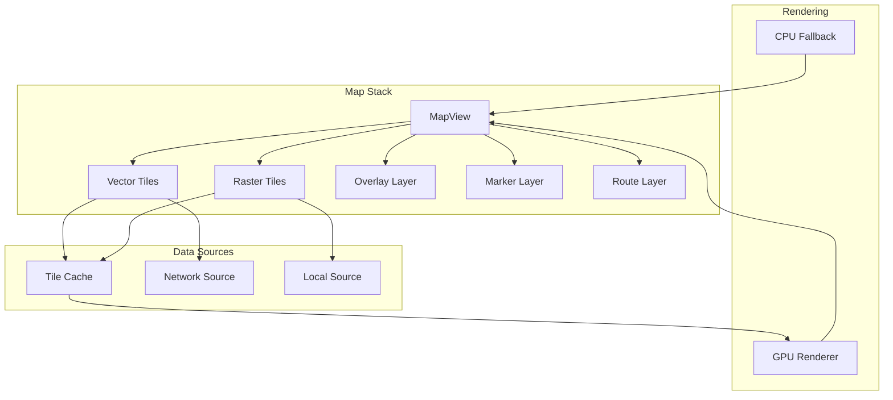
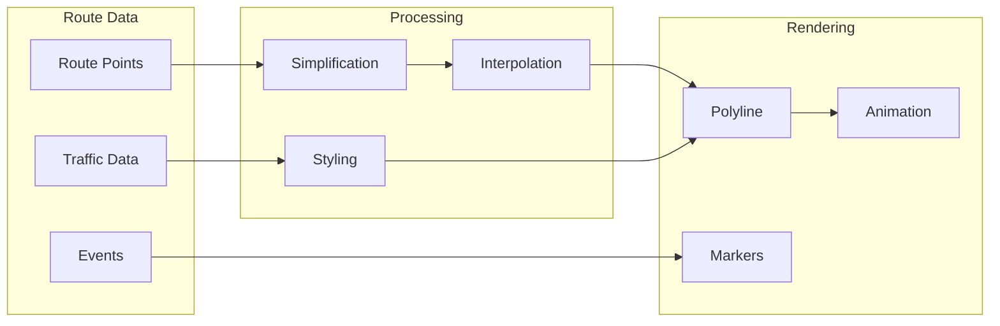
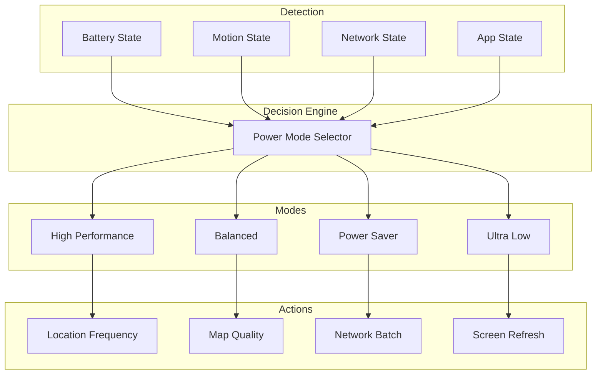
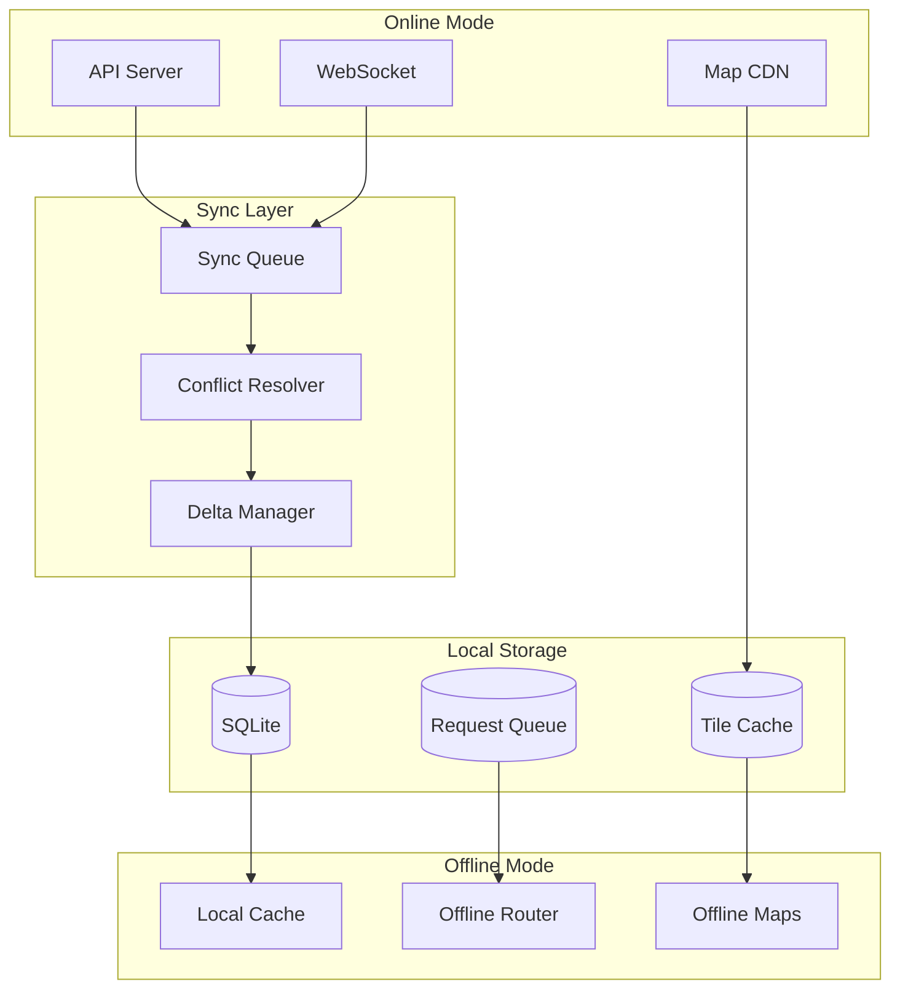

# Uber Real-Time Location System Design

## Table of Contents

1. [Introduction](#introduction)
2. [System Requirements](#system-requirements)
3. [High-Level Architecture](#high-level-architecture)
4. [Location Data Pipeline](#location-data-pipeline)
5. [Real-Time Communication](#real-time-communication)
6. [Map Rendering Engine](#map-rendering-engine)
7. [Battery Optimization](#battery-optimization)
8. [Offline Capabilities](#offline-capabilities)
9. [Testing Strategy](#testing-strategy)
10. [Performance Metrics](#performance-metrics)

---

## Introduction

Building a real-time location tracking system like Uber requires solving complex mobile engineering challenges. This case study explores the architecture decisions, trade-offs, and implementation patterns for creating a robust, battery-efficient location system that works reliably across diverse network conditions.

### Key Challenges

| Challenge | Impact | Solution Approach |
|-----------|--------|-------------------|
| Battery drain | User experience | Adaptive location sampling |
| Network reliability | Real-time updates | WebSocket + fallback |
| GPS accuracy | Location precision | Sensor fusion |
| Map performance | Smooth animations | Tile caching + vector maps |
| Offline support | Service continuity | Local storage + sync |

### Scale Requirements

- **Active drivers**: 5M+ concurrent
- **Active riders**: 20M+ concurrent
- **Location updates**: 100M+ per minute
- **Map tile requests**: 500M+ daily
- **Latency target**: < 500ms end-to-end

---

## System Requirements

### Functional Requirements

```
┌─────────────────────────────────────────────────────────────┐
│                    FUNCTIONAL REQUIREMENTS                   │
├─────────────────────────────────────────────────────────────┤
│                                                             │
│  Driver Side:                                               │
│  ├── Real-time location sharing                            │
│  ├── Route navigation with turn-by-turn                    │
│  ├── ETA calculation and updates                           │
│  ├── Trip status broadcasting                              │
│  └── Offline trip recording                                │
│                                                             │
│  Rider Side:                                                │
│  ├── Driver location tracking                              │
│  ├── ETA display and notifications                         │
│  ├── Route visualization                                   │
│  ├── Pickup point selection                                │
│  └── Real-time fare updates                                │
│                                                             │
│  Shared:                                                    │
│  ├── Map display with custom styling                       │
│  ├── Search and geocoding                                  │
│  ├── Place details and POIs                                │
│  └── Traffic layer visualization                           │
│                                                             │
└─────────────────────────────────────────────────────────────┘
```

### Non-Functional Requirements

#### Performance Targets

| Metric | Target | Critical Threshold |
|--------|--------|-------------------|
| Location update latency | < 500ms | < 1000ms |
| Map tile load time | < 200ms | < 500ms |
| Battery consumption | < 5%/hour | < 8%/hour |
| Memory footprint | < 150MB | < 250MB |
| Offline storage | < 500MB | < 1GB |
| Cold start time | < 2s | < 4s |

#### Reliability Targets

```
Availability: 99.95% uptime
Data Consistency: Eventual (< 3s convergence)
Failover Time: < 30 seconds
Data Loss: Zero for trip data
```

---

## High-Level Architecture

### System Overview



### Mobile Architecture Layers

```
┌─────────────────────────────────────────────────────────────┐
│                    PRESENTATION LAYER                        │
├─────────────────────────────────────────────────────────────┤
│  MapViewController    │  TripViewController  │  SearchVC    │
│  DriverMapFragment    │  RiderMapFragment    │  SearchFrag  │
└─────────────────────────────────────────────────────────────┘
                              │
┌─────────────────────────────────────────────────────────────┐
│                    DOMAIN LAYER                              │
├─────────────────────────────────────────────────────────────┤
│  LocationUseCase      │  TripUseCase         │  MapUseCase  │
│  NavigationUseCase    │  ETAUseCase          │  SearchUC    │
└─────────────────────────────────────────────────────────────┘
                              │
┌─────────────────────────────────────────────────────────────┐
│                    DATA LAYER                                │
├─────────────────────────────────────────────────────────────┤
│  LocationRepository   │  TripRepository      │  MapRepo     │
│  WebSocketClient      │  RESTClient          │  CacheRepo   │
└─────────────────────────────────────────────────────────────┘
                              │
┌─────────────────────────────────────────────────────────────┐
│                    PLATFORM LAYER                            │
├─────────────────────────────────────────────────────────────┤
│  CLLocationManager    │  FusedLocationClient │  MapKit      │
│  CoreMotion           │  SensorManager       │  Google Maps │
└─────────────────────────────────────────────────────────────┘
```

### Component Interaction Flow



---

## Location Data Pipeline

### Location Collection Strategy



### Adaptive Sampling Algorithm

The location sampling frequency adapts based on multiple factors:

```
┌─────────────────────────────────────────────────────────────┐
│              ADAPTIVE SAMPLING DECISION TREE                 │
├─────────────────────────────────────────────────────────────┤
│                                                             │
│  IF trip_active:                                            │
│    IF speed > 50 km/h:                                      │
│      sample_interval = 2 seconds                            │
│    ELIF speed > 20 km/h:                                    │
│      sample_interval = 4 seconds                            │
│    ELSE:                                                    │
│      sample_interval = 8 seconds                            │
│                                                             │
│  ELIF driver_available:                                     │
│    IF movement_detected:                                    │
│      sample_interval = 30 seconds                           │
│    ELSE:                                                    │
│      sample_interval = 120 seconds                          │
│                                                             │
│  ELSE (app_background):                                     │
│    sample_interval = 300 seconds (significant change only)  │
│                                                             │
└─────────────────────────────────────────────────────────────┘
```

### Location Data Model

```swift
// iOS Location Model
struct LocationUpdate: Codable {
    let id: UUID
    let coordinate: Coordinate
    let accuracy: LocationAccuracy
    let timestamp: Date
    let source: LocationSource
    let metadata: LocationMetadata
    
    struct Coordinate: Codable {
        let latitude: Double
        let longitude: Double
        let altitude: Double?
        let heading: Double?
        let speed: Double?
    }
    
    struct LocationAccuracy: Codable {
        let horizontal: Double
        let vertical: Double?
        let headingAccuracy: Double?
        let speedAccuracy: Double?
        let confidence: ConfidenceLevel
        
        enum ConfidenceLevel: String, Codable {
            case high, medium, low, unknown
        }
    }
    
    enum LocationSource: String, Codable {
        case gps
        case wifi
        case cellular
        case fused
        case cached
    }
    
    struct LocationMetadata: Codable {
        let batteryLevel: Double?
        let networkType: String?
        let isCharging: Bool?
        let motionActivity: String?
        let signalStrength: Int?
    }
}
```

```kotlin
// Android Location Model
data class LocationUpdate(
    val id: String = UUID.randomUUID().toString(),
    val coordinate: Coordinate,
    val accuracy: LocationAccuracy,
    val timestamp: Long = System.currentTimeMillis(),
    val source: LocationSource,
    val metadata: LocationMetadata
) {
    data class Coordinate(
        val latitude: Double,
        val longitude: Double,
        val altitude: Double? = null,
        val heading: Float? = null,
        val speed: Float? = null
    )
    
    data class LocationAccuracy(
        val horizontal: Float,
        val vertical: Float? = null,
        val headingAccuracy: Float? = null,
        val speedAccuracy: Float? = null,
        val confidence: ConfidenceLevel = ConfidenceLevel.UNKNOWN
    )
    
    enum class ConfidenceLevel {
        HIGH, MEDIUM, LOW, UNKNOWN
    }
    
    enum class LocationSource {
        GPS, WIFI, CELLULAR, FUSED, CACHED
    }
    
    data class LocationMetadata(
        val batteryLevel: Float? = null,
        val networkType: String? = null,
        val isCharging: Boolean? = null,
        val motionActivity: String? = null,
        val signalStrength: Int? = null
    )
}
```

### Location Buffer and Batching



### Buffer Implementation

```swift
// iOS Location Buffer
final class LocationBuffer {
    private let maxSize: Int
    private let maxAge: TimeInterval
    private var buffer: [LocationUpdate] = []
    private let queue = DispatchQueue(label: "location.buffer", qos: .utility)
    private var flushTimer: Timer?
    
    var onFlush: (([LocationUpdate]) -> Void)?
    
    init(maxSize: Int = 10, maxAge: TimeInterval = 30) {
        self.maxSize = maxSize
        self.maxAge = maxAge
        startFlushTimer()
    }
    
    func add(_ location: LocationUpdate) {
        queue.async { [weak self] in
            guard let self = self else { return }
            self.buffer.append(location)
            
            if self.buffer.count >= self.maxSize {
                self.flush()
            }
        }
    }
    
    private func flush() {
        guard !buffer.isEmpty else { return }
        
        let locations = buffer
        buffer.removeAll(keepingCapacity: true)
        
        DispatchQueue.main.async { [weak self] in
            self?.onFlush?(locations)
        }
    }
    
    private func startFlushTimer() {
        flushTimer = Timer.scheduledTimer(
            withTimeInterval: maxAge,
            repeats: true
        ) { [weak self] _ in
            self?.queue.async {
                self?.flush()
            }
        }
    }
    
    func forceFlush() {
        queue.async { [weak self] in
            self?.flush()
        }
    }
}
```

```kotlin
// Android Location Buffer
class LocationBuffer(
    private val maxSize: Int = 10,
    private val maxAgeMs: Long = 30_000,
    private val scope: CoroutineScope,
    private val onFlush: suspend (List<LocationUpdate>) -> Unit
) {
    private val buffer = mutableListOf<LocationUpdate>()
    private val mutex = Mutex()
    private var flushJob: Job? = null
    
    init {
        startFlushTimer()
    }
    
    suspend fun add(location: LocationUpdate) {
        mutex.withLock {
            buffer.add(location)
            if (buffer.size >= maxSize) {
                flush()
            }
        }
    }
    
    private suspend fun flush() {
        if (buffer.isEmpty()) return
        
        val locations = buffer.toList()
        buffer.clear()
        
        onFlush(locations)
    }
    
    private fun startFlushTimer() {
        flushJob = scope.launch {
            while (isActive) {
                delay(maxAgeMs)
                mutex.withLock { flush() }
            }
        }
    }
    
    suspend fun forceFlush() {
        mutex.withLock { flush() }
    }
    
    fun cancel() {
        flushJob?.cancel()
    }
}
```

### Kalman Filter for Location Smoothing

```swift
// iOS Kalman Filter Implementation
final class LocationKalmanFilter {
    private var latitude: Double = 0
    private var longitude: Double = 0
    private var variance: Double = -1
    
    private let minAccuracy: Double = 1.0
    
    func process(_ location: LocationUpdate) -> LocationUpdate {
        let accuracy = max(location.accuracy.horizontal, minAccuracy)
        
        if variance < 0 {
            // First location
            latitude = location.coordinate.latitude
            longitude = location.coordinate.longitude
            variance = accuracy * accuracy
            return location
        }
        
        // Kalman gain
        let k = variance / (variance + accuracy * accuracy)
        
        // Update estimate
        latitude += k * (location.coordinate.latitude - latitude)
        longitude += k * (location.coordinate.longitude - longitude)
        
        // Update variance
        variance = (1 - k) * variance
        
        // Create filtered location
        var filtered = location
        filtered.coordinate = LocationUpdate.Coordinate(
            latitude: latitude,
            longitude: longitude,
            altitude: location.coordinate.altitude,
            heading: location.coordinate.heading,
            speed: location.coordinate.speed
        )
        
        return filtered
    }
    
    func reset() {
        variance = -1
    }
}
```

---

## Real-Time Communication

### WebSocket Architecture



### Connection State Machine



### WebSocket Manager Implementation

```swift
// iOS WebSocket Manager
final class WebSocketManager: NSObject {
    enum State {
        case disconnected
        case connecting
        case connected
        case reconnecting
    }
    
    private var webSocket: URLSessionWebSocketTask?
    private var session: URLSession!
    private let url: URL
    private let queue = DispatchQueue(label: "websocket.manager")
    
    private(set) var state: State = .disconnected {
        didSet {
            onStateChange?(state)
        }
    }
    
    private var reconnectAttempts = 0
    private let maxReconnectAttempts = 5
    private var heartbeatTimer: Timer?
    private var pendingMessages: [WebSocketMessage] = []
    
    var onStateChange: ((State) -> Void)?
    var onMessage: ((WebSocketMessage) -> Void)?
    var onError: ((Error) -> Void)?
    
    init(url: URL) {
        self.url = url
        super.init()
        self.session = URLSession(
            configuration: .default,
            delegate: self,
            delegateQueue: OperationQueue()
        )
    }
    
    func connect() {
        guard state == .disconnected else { return }
        
        state = .connecting
        webSocket = session.webSocketTask(with: url)
        webSocket?.resume()
        receiveMessage()
    }
    
    func disconnect() {
        stopHeartbeat()
        webSocket?.cancel(with: .normalClosure, reason: nil)
        state = .disconnected
        reconnectAttempts = 0
    }
    
    func send(_ message: WebSocketMessage) {
        guard state == .connected else {
            pendingMessages.append(message)
            return
        }
        
        do {
            let data = try JSONEncoder().encode(message)
            webSocket?.send(.data(data)) { [weak self] error in
                if let error = error {
                    self?.onError?(error)
                }
            }
        } catch {
            onError?(error)
        }
    }
    
    private func receiveMessage() {
        webSocket?.receive { [weak self] result in
            switch result {
            case .success(let message):
                self?.handleMessage(message)
                self?.receiveMessage()
            case .failure(let error):
                self?.handleError(error)
            }
        }
    }
    
    private func handleMessage(_ message: URLSessionWebSocketTask.Message) {
        switch message {
        case .data(let data):
            if let wsMessage = try? JSONDecoder().decode(WebSocketMessage.self, from: data) {
                DispatchQueue.main.async { [weak self] in
                    self?.onMessage?(wsMessage)
                }
            }
        case .string(let text):
            if let data = text.data(using: .utf8),
               let wsMessage = try? JSONDecoder().decode(WebSocketMessage.self, from: data) {
                DispatchQueue.main.async { [weak self] in
                    self?.onMessage?(wsMessage)
                }
            }
        @unknown default:
            break
        }
    }
    
    private func handleError(_ error: Error) {
        onError?(error)
        attemptReconnect()
    }
    
    private func attemptReconnect() {
        guard reconnectAttempts < maxReconnectAttempts else {
            state = .disconnected
            return
        }
        
        state = .reconnecting
        reconnectAttempts += 1
        
        let delay = calculateBackoff()
        
        DispatchQueue.main.asyncAfter(deadline: .now() + delay) { [weak self] in
            self?.webSocket = self?.session.webSocketTask(with: self!.url)
            self?.webSocket?.resume()
            self?.receiveMessage()
        }
    }
    
    private func calculateBackoff() -> TimeInterval {
        let base: TimeInterval = 1.0
        let maxDelay: TimeInterval = 30.0
        let delay = min(base * pow(2.0, Double(reconnectAttempts - 1)), maxDelay)
        let jitter = Double.random(in: 0...0.3) * delay
        return delay + jitter
    }
    
    private func startHeartbeat() {
        heartbeatTimer = Timer.scheduledTimer(
            withTimeInterval: 30,
            repeats: true
        ) { [weak self] _ in
            self?.sendHeartbeat()
        }
    }
    
    private func sendHeartbeat() {
        let ping = WebSocketMessage(type: .ping, payload: [:])
        send(ping)
    }
    
    private func stopHeartbeat() {
        heartbeatTimer?.invalidate()
        heartbeatTimer = nil
    }
    
    private func flushPendingMessages() {
        let messages = pendingMessages
        pendingMessages.removeAll()
        messages.forEach { send($0) }
    }
}

extension WebSocketManager: URLSessionWebSocketDelegate {
    func urlSession(
        _ session: URLSession,
        webSocketTask: URLSessionWebSocketTask,
        didOpenWithProtocol protocol: String?
    ) {
        state = .connected
        reconnectAttempts = 0
        startHeartbeat()
        flushPendingMessages()
    }
    
    func urlSession(
        _ session: URLSession,
        webSocketTask: URLSessionWebSocketTask,
        didCloseWith closeCode: URLSessionWebSocketTask.CloseCode,
        reason: Data?
    ) {
        stopHeartbeat()
        if closeCode != .normalClosure {
            attemptReconnect()
        } else {
            state = .disconnected
        }
    }
}
```

```kotlin
// Android WebSocket Manager
class WebSocketManager(
    private val url: String,
    private val scope: CoroutineScope
) {
    sealed class State {
        object Disconnected : State()
        object Connecting : State()
        object Connected : State()
        object Reconnecting : State()
    }
    
    private val client = OkHttpClient.Builder()
        .pingInterval(30, TimeUnit.SECONDS)
        .build()
    
    private var webSocket: WebSocket? = null
    private var reconnectAttempts = 0
    private val maxReconnectAttempts = 5
    private val pendingMessages = mutableListOf<WebSocketMessage>()
    
    private val _state = MutableStateFlow<State>(State.Disconnected)
    val state: StateFlow<State> = _state.asStateFlow()
    
    private val _messages = MutableSharedFlow<WebSocketMessage>()
    val messages: SharedFlow<WebSocketMessage> = _messages.asSharedFlow()
    
    private val _errors = MutableSharedFlow<Throwable>()
    val errors: SharedFlow<Throwable> = _errors.asSharedFlow()
    
    private val json = Json { ignoreUnknownKeys = true }
    
    fun connect() {
        if (_state.value != State.Disconnected) return
        
        _state.value = State.Connecting
        
        val request = Request.Builder()
            .url(url)
            .build()
        
        webSocket = client.newWebSocket(request, createListener())
    }
    
    fun disconnect() {
        webSocket?.close(1000, "Normal closure")
        _state.value = State.Disconnected
        reconnectAttempts = 0
    }
    
    fun send(message: WebSocketMessage) {
        if (_state.value != State.Connected) {
            pendingMessages.add(message)
            return
        }
        
        val payload = json.encodeToString(message)
        webSocket?.send(payload)
    }
    
    private fun createListener() = object : WebSocketListener() {
        override fun onOpen(webSocket: WebSocket, response: Response) {
            _state.value = State.Connected
            reconnectAttempts = 0
            flushPendingMessages()
        }
        
        override fun onMessage(webSocket: WebSocket, text: String) {
            scope.launch {
                try {
                    val message = json.decodeFromString<WebSocketMessage>(text)
                    _messages.emit(message)
                } catch (e: Exception) {
                    _errors.emit(e)
                }
            }
        }
        
        override fun onFailure(webSocket: WebSocket, t: Throwable, response: Response?) {
            scope.launch {
                _errors.emit(t)
                attemptReconnect()
            }
        }
        
        override fun onClosed(webSocket: WebSocket, code: Int, reason: String) {
            if (code != 1000) {
                scope.launch { attemptReconnect() }
            } else {
                _state.value = State.Disconnected
            }
        }
    }
    
    private fun attemptReconnect() {
        if (reconnectAttempts >= maxReconnectAttempts) {
            _state.value = State.Disconnected
            return
        }
        
        _state.value = State.Reconnecting
        reconnectAttempts++
        
        val delay = calculateBackoff()
        
        scope.launch {
            delay(delay)
            connect()
        }
    }
    
    private fun calculateBackoff(): Long {
        val base = 1000L
        val maxDelay = 30_000L
        val delay = minOf(base * 2.0.pow(reconnectAttempts - 1).toLong(), maxDelay)
        val jitter = (Random.nextFloat() * 0.3 * delay).toLong()
        return delay + jitter
    }
    
    private fun flushPendingMessages() {
        val messages = pendingMessages.toList()
        pendingMessages.clear()
        messages.forEach { send(it) }
    }
}
```

### Message Protocol

```
┌─────────────────────────────────────────────────────────────┐
│                    MESSAGE PROTOCOL                          │
├─────────────────────────────────────────────────────────────┤
│                                                             │
│  Client → Server:                                           │
│  ├── location_update: Driver location                       │
│  ├── trip_status: Status changes                            │
│  ├── ping: Heartbeat                                        │
│  └── subscribe: Channel subscription                        │
│                                                             │
│  Server → Client:                                           │
│  ├── driver_location: For rider tracking                    │
│  ├── trip_update: Trip state changes                        │
│  ├── eta_update: ETA recalculations                         │
│  ├── pong: Heartbeat response                               │
│  └── notification: Push notifications                       │
│                                                             │
└─────────────────────────────────────────────────────────────┘
```

### Message Types

```swift
// iOS Message Types
struct WebSocketMessage: Codable {
    let type: MessageType
    let payload: [String: AnyCodable]
    let timestamp: Date
    let messageId: String
    
    enum MessageType: String, Codable {
        case ping
        case pong
        case locationUpdate = "location_update"
        case tripStatus = "trip_status"
        case driverLocation = "driver_location"
        case tripUpdate = "trip_update"
        case etaUpdate = "eta_update"
        case notification
        case subscribe
        case unsubscribe
        case error
    }
    
    init(type: MessageType, payload: [String: Any]) {
        self.type = type
        self.payload = payload.mapValues { AnyCodable($0) }
        self.timestamp = Date()
        self.messageId = UUID().uuidString
    }
}

// Location Update Payload
struct LocationUpdatePayload: Codable {
    let tripId: String?
    let latitude: Double
    let longitude: Double
    let heading: Double?
    let speed: Double?
    let accuracy: Double
    let timestamp: Date
}

// Trip Status Payload
struct TripStatusPayload: Codable {
    let tripId: String
    let status: TripStatus
    let timestamp: Date
    let location: LocationCoordinate?
    
    enum TripStatus: String, Codable {
        case requested
        case accepted
        case driverEnRoute = "driver_en_route"
        case arrivedPickup = "arrived_pickup"
        case tripStarted = "trip_started"
        case arrivedDestination = "arrived_destination"
        case completed
        case cancelled
    }
}
```

---

## Map Rendering Engine

### Map Architecture Overview



### Tile Caching Strategy

```
┌─────────────────────────────────────────────────────────────┐
│                    TILE CACHING LAYERS                       │
├─────────────────────────────────────────────────────────────┤
│                                                             │
│  L1 - Memory Cache (LRU):                                   │
│  ├── Capacity: 100 tiles                                    │
│  ├── TTL: Session duration                                  │
│  └── Access: O(1)                                           │
│                                                             │
│  L2 - Disk Cache (SQLite):                                  │
│  ├── Capacity: 500MB                                        │
│  ├── TTL: 7 days                                            │
│  └── Access: ~5ms                                           │
│                                                             │
│  L3 - Pre-downloaded (Offline):                             │
│  ├── Capacity: 2GB per region                               │
│  ├── TTL: 30 days                                           │
│  └── Access: ~10ms                                          │
│                                                             │
│  L4 - Network (CDN):                                        │
│  ├── Capacity: Unlimited                                    │
│  ├── TTL: Response headers                                  │
│  └── Access: 50-200ms                                       │
│                                                             │
└─────────────────────────────────────────────────────────────┘
```

### Map Tile Cache Implementation

```swift
// iOS Tile Cache
final class TileCache {
    private let memoryCache: NSCache<NSString, NSData>
    private let diskCache: DiskCache
    private let queue = DispatchQueue(label: "tile.cache", qos: .utility)
    
    init(memoryCacheSize: Int = 100, diskCacheSizeMB: Int = 500) {
        memoryCache = NSCache()
        memoryCache.countLimit = memoryCacheSize
        
        diskCache = DiskCache(maxSizeMB: diskCacheSizeMB)
    }
    
    func getTile(x: Int, y: Int, z: Int) async -> Data? {
        let key = tileKey(x: x, y: y, z: z)
        
        // L1: Memory
        if let data = memoryCache.object(forKey: key as NSString) {
            return data as Data
        }
        
        // L2: Disk
        if let data = await diskCache.get(key: key) {
            memoryCache.setObject(data as NSData, forKey: key as NSString)
            return data
        }
        
        return nil
    }
    
    func setTile(x: Int, y: Int, z: Int, data: Data) async {
        let key = tileKey(x: x, y: y, z: z)
        
        memoryCache.setObject(data as NSData, forKey: key as NSString)
        await diskCache.set(key: key, data: data)
    }
    
    private func tileKey(x: Int, y: Int, z: Int) -> String {
        return "\(z)/\(x)/\(y)"
    }
    
    func prefetchTiles(around coordinate: CLLocationCoordinate2D, zoom: Int, radius: Int = 2) async {
        let centerX = longitudeToTileX(coordinate.longitude, zoom: zoom)
        let centerY = latitudeToTileY(coordinate.latitude, zoom: zoom)
        
        var tilesToFetch: [(Int, Int, Int)] = []
        
        for dx in -radius...radius {
            for dy in -radius...radius {
                let x = centerX + dx
                let y = centerY + dy
                
                if await getTile(x: x, y: y, z: zoom) == nil {
                    tilesToFetch.append((x, y, zoom))
                }
            }
        }
        
        await withTaskGroup(of: Void.self) { group in
            for (x, y, z) in tilesToFetch {
                group.addTask {
                    await self.fetchAndCacheTile(x: x, y: y, z: z)
                }
            }
        }
    }
    
    private func fetchAndCacheTile(x: Int, y: Int, z: Int) async {
        let url = URL(string: "https://tiles.example.com/\(z)/\(x)/\(y).mvt")!
        
        do {
            let (data, _) = try await URLSession.shared.data(from: url)
            await setTile(x: x, y: y, z: z, data: data)
        } catch {
            // Handle error silently for prefetch
        }
    }
    
    private func longitudeToTileX(_ longitude: Double, zoom: Int) -> Int {
        return Int(floor((longitude + 180) / 360 * pow(2.0, Double(zoom))))
    }
    
    private func latitudeToTileY(_ latitude: Double, zoom: Int) -> Int {
        let latRad = latitude * .pi / 180
        return Int(floor((1 - log(tan(latRad) + 1 / cos(latRad)) / .pi) / 2 * pow(2.0, Double(zoom))))
    }
}

// Disk Cache
final class DiskCache {
    private let fileManager = FileManager.default
    private let cacheDirectory: URL
    private let maxSizeBytes: Int64
    private let db: SQLiteDatabase
    
    init(maxSizeMB: Int) {
        self.maxSizeBytes = Int64(maxSizeMB) * 1024 * 1024
        
        let paths = fileManager.urls(for: .cachesDirectory, in: .userDomainMask)
        cacheDirectory = paths[0].appendingPathComponent("tiles")
        
        try? fileManager.createDirectory(at: cacheDirectory, withIntermediateDirectories: true)
        
        db = SQLiteDatabase(path: cacheDirectory.appendingPathComponent("tiles.db").path)
        setupDatabase()
    }
    
    private func setupDatabase() {
        db.execute("""
            CREATE TABLE IF NOT EXISTS tiles (
                key TEXT PRIMARY KEY,
                path TEXT NOT NULL,
                size INTEGER NOT NULL,
                created_at INTEGER NOT NULL,
                accessed_at INTEGER NOT NULL
            )
        """)
        
        db.execute("CREATE INDEX IF NOT EXISTS idx_accessed ON tiles(accessed_at)")
    }
    
    func get(key: String) async -> Data? {
        guard let row = db.query("SELECT path FROM tiles WHERE key = ?", [key]).first,
              let path = row["path"] as? String else {
            return nil
        }
        
        let fileURL = cacheDirectory.appendingPathComponent(path)
        
        guard let data = try? Data(contentsOf: fileURL) else {
            db.execute("DELETE FROM tiles WHERE key = ?", [key])
            return nil
        }
        
        db.execute(
            "UPDATE tiles SET accessed_at = ? WHERE key = ?",
            [Int(Date().timeIntervalSince1970), key]
        )
        
        return data
    }
    
    func set(key: String, data: Data) async {
        let filename = key.replacingOccurrences(of: "/", with: "_") + ".tile"
        let fileURL = cacheDirectory.appendingPathComponent(filename)
        
        do {
            try data.write(to: fileURL)
            
            let timestamp = Int(Date().timeIntervalSince1970)
            db.execute("""
                INSERT OR REPLACE INTO tiles (key, path, size, created_at, accessed_at)
                VALUES (?, ?, ?, ?, ?)
            """, [key, filename, data.count, timestamp, timestamp])
            
            await enforceMaxSize()
        } catch {
            // Handle write error
        }
    }
    
    private func enforceMaxSize() async {
        let totalSize = db.query("SELECT SUM(size) as total FROM tiles")
            .first?["total"] as? Int64 ?? 0
        
        guard totalSize > maxSizeBytes else { return }
        
        let toDelete = totalSize - maxSizeBytes + (maxSizeBytes / 10) // Delete extra 10%
        
        let oldTiles = db.query("""
            SELECT key, path, size FROM tiles
            ORDER BY accessed_at ASC
        """)
        
        var deletedSize: Int64 = 0
        for tile in oldTiles {
            guard deletedSize < toDelete else { break }
            
            if let key = tile["key"] as? String,
               let path = tile["path"] as? String,
               let size = tile["size"] as? Int64 {
                
                let fileURL = cacheDirectory.appendingPathComponent(path)
                try? fileManager.removeItem(at: fileURL)
                db.execute("DELETE FROM tiles WHERE key = ?", [key])
                deletedSize += size
            }
        }
    }
}
```

### Route Rendering



### Route Renderer Implementation

```swift
// iOS Route Renderer
final class RouteRenderer {
    private weak var mapView: MKMapView?
    private var routeOverlay: MKPolyline?
    private var trafficOverlays: [MKPolyline] = []
    
    private let routeColor = UIColor.systemBlue
    private let trafficColors: [TrafficLevel: UIColor] = [
        .light: .systemGreen,
        .moderate: .systemYellow,
        .heavy: .systemOrange,
        .severe: .systemRed
    ]
    
    init(mapView: MKMapView) {
        self.mapView = mapView
    }
    
    func displayRoute(_ route: Route) {
        clearRoute()
        
        // Simplify points for rendering
        let simplifiedPoints = simplifyRoute(route.polyline, tolerance: 0.0001)
        
        // Create main route overlay
        let coordinates = simplifiedPoints.map { CLLocationCoordinate2D(latitude: $0.latitude, longitude: $0.longitude) }
        routeOverlay = MKPolyline(coordinates: coordinates, count: coordinates.count)
        
        if let overlay = routeOverlay {
            mapView?.addOverlay(overlay, level: .aboveRoads)
        }
        
        // Add traffic overlays
        for segment in route.trafficSegments {
            let segmentCoords = segment.points.map { 
                CLLocationCoordinate2D(latitude: $0.latitude, longitude: $0.longitude) 
            }
            let trafficOverlay = TrafficPolyline(
                coordinates: segmentCoords, 
                count: segmentCoords.count,
                trafficLevel: segment.level
            )
            trafficOverlays.append(trafficOverlay)
            mapView?.addOverlay(trafficOverlay, level: .aboveRoads)
        }
    }
    
    func updateDriverProgress(at coordinate: CLLocationCoordinate2D) {
        guard let route = routeOverlay else { return }
        
        // Find closest point on route
        let closestIndex = findClosestPointIndex(to: coordinate, on: route)
        
        // Update overlay to show completed portion
        animateProgress(to: closestIndex)
    }
    
    private func simplifyRoute(_ points: [Coordinate], tolerance: Double) -> [Coordinate] {
        guard points.count > 2 else { return points }
        
        // Douglas-Peucker algorithm
        var result: [Coordinate] = []
        simplifyDouglasPeucker(points: points, tolerance: tolerance, result: &result)
        return result
    }
    
    private func simplifyDouglasPeucker(points: [Coordinate], tolerance: Double, result: inout [Coordinate]) {
        guard points.count > 2 else {
            result.append(contentsOf: points)
            return
        }
        
        var maxDistance: Double = 0
        var maxIndex = 0
        
        let first = points.first!
        let last = points.last!
        
        for i in 1..<points.count - 1 {
            let distance = perpendicularDistance(point: points[i], lineStart: first, lineEnd: last)
            if distance > maxDistance {
                maxDistance = distance
                maxIndex = i
            }
        }
        
        if maxDistance > tolerance {
            let leftPoints = Array(points[0...maxIndex])
            let rightPoints = Array(points[maxIndex...])
            
            simplifyDouglasPeucker(points: leftPoints, tolerance: tolerance, result: &result)
            result.removeLast()
            simplifyDouglasPeucker(points: rightPoints, tolerance: tolerance, result: &result)
        } else {
            result.append(first)
            result.append(last)
        }
    }
    
    private func perpendicularDistance(point: Coordinate, lineStart: Coordinate, lineEnd: Coordinate) -> Double {
        let dx = lineEnd.longitude - lineStart.longitude
        let dy = lineEnd.latitude - lineStart.latitude
        
        let numerator = abs(dy * point.longitude - dx * point.latitude + lineEnd.longitude * lineStart.latitude - lineEnd.latitude * lineStart.longitude)
        let denominator = sqrt(dx * dx + dy * dy)
        
        return denominator > 0 ? numerator / denominator : 0
    }
    
    private func findClosestPointIndex(to coordinate: CLLocationCoordinate2D, on polyline: MKPolyline) -> Int {
        var minDistance = Double.greatestFiniteMagnitude
        var closestIndex = 0
        
        let points = polyline.points()
        
        for i in 0..<polyline.pointCount {
            let point = points[i]
            let distance = distanceBetween(
                CLLocationCoordinate2D(latitude: point.y, longitude: point.x),
                coordinate
            )
            
            if distance < minDistance {
                minDistance = distance
                closestIndex = i
            }
        }
        
        return closestIndex
    }
    
    private func distanceBetween(_ c1: CLLocationCoordinate2D, _ c2: CLLocationCoordinate2D) -> Double {
        let loc1 = CLLocation(latitude: c1.latitude, longitude: c1.longitude)
        let loc2 = CLLocation(latitude: c2.latitude, longitude: c2.longitude)
        return loc1.distance(from: loc2)
    }
    
    private func animateProgress(to index: Int) {
        // Implementation for animated progress
    }
    
    func clearRoute() {
        if let overlay = routeOverlay {
            mapView?.removeOverlay(overlay)
        }
        trafficOverlays.forEach { mapView?.removeOverlay($0) }
        trafficOverlays.removeAll()
        routeOverlay = nil
    }
}

// Custom overlay for traffic
class TrafficPolyline: MKPolyline {
    var trafficLevel: TrafficLevel = .light
    
    convenience init(coordinates: [CLLocationCoordinate2D], count: Int, trafficLevel: TrafficLevel) {
        self.init(coordinates: coordinates, count: count)
        self.trafficLevel = trafficLevel
    }
}

enum TrafficLevel {
    case light, moderate, heavy, severe
}
```

### Marker Animation

```swift
// iOS Marker Animation
final class DriverMarkerAnimator {
    private var displayLink: CADisplayLink?
    private var startCoordinate: CLLocationCoordinate2D?
    private var endCoordinate: CLLocationCoordinate2D?
    private var startTime: CFTimeInterval = 0
    private let animationDuration: CFTimeInterval = 1.0
    
    private weak var annotation: MKAnnotation?
    var onPositionUpdate: ((CLLocationCoordinate2D) -> Void)?
    
    func animate(from start: CLLocationCoordinate2D, to end: CLLocationCoordinate2D) {
        startCoordinate = start
        endCoordinate = end
        startTime = CACurrentMediaTime()
        
        stopAnimation()
        
        displayLink = CADisplayLink(target: self, selector: #selector(tick))
        displayLink?.add(to: .main, forMode: .common)
    }
    
    @objc private func tick(_ displayLink: CADisplayLink) {
        guard let start = startCoordinate, let end = endCoordinate else {
            stopAnimation()
            return
        }
        
        let elapsed = CACurrentMediaTime() - startTime
        let progress = min(elapsed / animationDuration, 1.0)
        
        // Ease out cubic
        let easedProgress = 1 - pow(1 - progress, 3)
        
        let lat = start.latitude + (end.latitude - start.latitude) * easedProgress
        let lng = start.longitude + (end.longitude - start.longitude) * easedProgress
        
        let interpolated = CLLocationCoordinate2D(latitude: lat, longitude: lng)
        onPositionUpdate?(interpolated)
        
        if progress >= 1.0 {
            stopAnimation()
        }
    }
    
    func stopAnimation() {
        displayLink?.invalidate()
        displayLink = nil
    }
}
```

---

## Battery Optimization

### Battery Impact Analysis

```
┌─────────────────────────────────────────────────────────────┐
│                    BATTERY CONSUMERS                         │
├─────────────────────────────────────────────────────────────┤
│                                                             │
│  High Impact:                                               │
│  ├── GPS receiver (continuous)       ~15% per hour         │
│  ├── Network (WebSocket keep-alive)  ~5% per hour          │
│  └── Screen (map rendering)          ~20% per hour         │
│                                                             │
│  Medium Impact:                                             │
│  ├── CPU (route calculations)        ~3% per hour          │
│  ├── Memory (tile caching)           ~2% per hour          │
│  └── Sensors (compass, accelerometer) ~1% per hour         │
│                                                             │
│  Total Active Trip:                                         │
│  └── Combined impact                 ~46% per hour         │
│                                                             │
│  Optimized Target:                                          │
│  └── With optimizations              ~25% per hour         │
│                                                             │
└─────────────────────────────────────────────────────────────┘
```

### Optimization Strategy



### Power Mode Manager

```swift
// iOS Power Mode Manager
final class PowerModeManager {
    enum PowerMode {
        case highPerformance
        case balanced
        case powerSaver
        case ultraLow
        
        var locationInterval: TimeInterval {
            switch self {
            case .highPerformance: return 2
            case .balanced: return 4
            case .powerSaver: return 10
            case .ultraLow: return 30
            }
        }
        
        var locationAccuracy: CLLocationAccuracy {
            switch self {
            case .highPerformance: return kCLLocationAccuracyBest
            case .balanced: return kCLLocationAccuracyNearestTenMeters
            case .powerSaver: return kCLLocationAccuracyHundredMeters
            case .ultraLow: return kCLLocationAccuracyKilometer
            }
        }
        
        var mapUpdateFrequency: Int {
            switch self {
            case .highPerformance: return 60
            case .balanced: return 30
            case .powerSaver: return 15
            case .ultraLow: return 5
            }
        }
        
        var networkBatchSize: Int {
            switch self {
            case .highPerformance: return 1
            case .balanced: return 5
            case .powerSaver: return 10
            case .ultraLow: return 20
            }
        }
    }
    
    private(set) var currentMode: PowerMode = .balanced
    
    private var batteryLevel: Float = 1.0
    private var isCharging: Bool = false
    private var isMoving: Bool = false
    private var hasActiveTrip: Bool = false
    private var networkQuality: NetworkQuality = .good
    
    var onModeChange: ((PowerMode) -> Void)?
    
    init() {
        setupBatteryMonitoring()
        setupMotionMonitoring()
    }
    
    private func setupBatteryMonitoring() {
        UIDevice.current.isBatteryMonitoringEnabled = true
        
        NotificationCenter.default.addObserver(
            self,
            selector: #selector(batteryLevelChanged),
            name: UIDevice.batteryLevelDidChangeNotification,
            object: nil
        )
        
        NotificationCenter.default.addObserver(
            self,
            selector: #selector(batteryStateChanged),
            name: UIDevice.batteryStateDidChangeNotification,
            object: nil
        )
        
        batteryLevel = UIDevice.current.batteryLevel
        isCharging = UIDevice.current.batteryState == .charging || UIDevice.current.batteryState == .full
    }
    
    @objc private func batteryLevelChanged() {
        batteryLevel = UIDevice.current.batteryLevel
        recalculateMode()
    }
    
    @objc private func batteryStateChanged() {
        isCharging = UIDevice.current.batteryState == .charging || UIDevice.current.batteryState == .full
        recalculateMode()
    }
    
    private func setupMotionMonitoring() {
        // Motion activity monitoring setup
    }
    
    func setActiveTrip(_ active: Bool) {
        hasActiveTrip = active
        recalculateMode()
    }
    
    func setMoving(_ moving: Bool) {
        isMoving = moving
        recalculateMode()
    }
    
    func setNetworkQuality(_ quality: NetworkQuality) {
        networkQuality = quality
        recalculateMode()
    }
    
    private func recalculateMode() {
        let newMode = determinePowerMode()
        
        if newMode != currentMode {
            currentMode = newMode
            onModeChange?(newMode)
        }
    }
    
    private func determinePowerMode() -> PowerMode {
        // Charging = high performance
        if isCharging {
            return .highPerformance
        }
        
        // Active trip with good battery
        if hasActiveTrip {
            if batteryLevel > 0.5 {
                return .highPerformance
            } else if batteryLevel > 0.2 {
                return .balanced
            } else {
                return .powerSaver
            }
        }
        
        // No active trip
        if batteryLevel > 0.5 {
            return isMoving ? .balanced : .powerSaver
        } else if batteryLevel > 0.2 {
            return .powerSaver
        } else {
            return .ultraLow
        }
    }
}

enum NetworkQuality {
    case excellent
    case good
    case fair
    case poor
    case offline
}
```

### Location Manager with Power Awareness

```swift
// iOS Power-Aware Location Manager
final class PowerAwareLocationManager: NSObject {
    private let locationManager = CLLocationManager()
    private let powerModeManager: PowerModeManager
    private var updateTimer: Timer?
    
    var onLocationUpdate: ((CLLocation) -> Void)?
    
    init(powerModeManager: PowerModeManager) {
        self.powerModeManager = powerModeManager
        super.init()
        
        setupLocationManager()
        observePowerMode()
    }
    
    private func setupLocationManager() {
        locationManager.delegate = self
        locationManager.allowsBackgroundLocationUpdates = true
        locationManager.pausesLocationUpdatesAutomatically = false
    }
    
    private func observePowerMode() {
        powerModeManager.onModeChange = { [weak self] mode in
            self?.applyPowerMode(mode)
        }
        applyPowerMode(powerModeManager.currentMode)
    }
    
    private func applyPowerMode(_ mode: PowerModeManager.PowerMode) {
        locationManager.desiredAccuracy = mode.locationAccuracy
        
        // Restart update timer with new interval
        updateTimer?.invalidate()
        
        if mode == .highPerformance {
            // Continuous updates for high performance
            locationManager.distanceFilter = 10
            locationManager.startUpdatingLocation()
        } else {
            // Timer-based updates for power saving
            locationManager.distanceFilter = kCLDistanceFilterNone
            locationManager.stopUpdatingLocation()
            
            updateTimer = Timer.scheduledTimer(
                withTimeInterval: mode.locationInterval,
                repeats: true
            ) { [weak self] _ in
                self?.requestSingleLocation()
            }
        }
    }
    
    private func requestSingleLocation() {
        locationManager.requestLocation()
    }
    
    func startTracking() {
        locationManager.requestAlwaysAuthorization()
        applyPowerMode(powerModeManager.currentMode)
    }
    
    func stopTracking() {
        locationManager.stopUpdatingLocation()
        updateTimer?.invalidate()
        updateTimer = nil
    }
}

extension PowerAwareLocationManager: CLLocationManagerDelegate {
    func locationManager(_ manager: CLLocationManager, didUpdateLocations locations: [CLLocation]) {
        guard let location = locations.last else { return }
        onLocationUpdate?(location)
    }
    
    func locationManager(_ manager: CLLocationManager, didFailWithError error: Error) {
        // Handle error
    }
}
```

### Motion-Based Optimization

```swift
// iOS Motion-Based Optimization
final class MotionActivityManager {
    private let motionActivityManager = CMMotionActivityManager()
    private let pedometer = CMPedometer()
    
    var onActivityChange: ((MotionActivity) -> Void)?
    
    enum MotionActivity {
        case stationary
        case walking
        case running
        case cycling
        case automotive
        case unknown
    }
    
    func startMonitoring() {
        guard CMMotionActivityManager.isActivityAvailable() else { return }
        
        motionActivityManager.startActivityUpdates(to: .main) { [weak self] activity in
            guard let activity = activity else { return }
            
            let motionActivity = self?.mapActivity(activity) ?? .unknown
            self?.onActivityChange?(motionActivity)
        }
    }
    
    func stopMonitoring() {
        motionActivityManager.stopActivityUpdates()
    }
    
    private func mapActivity(_ activity: CMMotionActivity) -> MotionActivity {
        if activity.stationary {
            return .stationary
        } else if activity.automotive {
            return .automotive
        } else if activity.cycling {
            return .cycling
        } else if activity.running {
            return .running
        } else if activity.walking {
            return .walking
        } else {
            return .unknown
        }
    }
}
```

---

## Offline Capabilities

### Offline Architecture



### Offline Data Strategy

```
┌─────────────────────────────────────────────────────────────┐
│                    OFFLINE DATA STRATEGY                     │
├─────────────────────────────────────────────────────────────┤
│                                                             │
│  Pre-Downloaded:                                            │
│  ├── Map tiles for common areas                             │
│  ├── POI database                                           │
│  ├── Routing graph data                                     │
│  └── Fare estimation data                                   │
│                                                             │
│  Session Cached:                                            │
│  ├── Current trip data                                      │
│  ├── Driver/rider profiles                                  │
│  ├── Recent routes                                          │
│  └── Search history                                         │
│                                                             │
│  Queued for Sync:                                           │
│  ├── Location updates                                       │
│  ├── Trip status changes                                    │
│  ├── User actions                                           │
│  └── Analytics events                                       │
│                                                             │
└─────────────────────────────────────────────────────────────┘
```

### Offline Trip Manager

```swift
// iOS Offline Trip Manager
final class OfflineTripManager {
    private let database: SQLiteDatabase
    private let syncQueue: OperationQueue
    private var networkMonitor: NWPathMonitor?
    private var isOnline: Bool = true
    
    init(database: SQLiteDatabase) {
        self.database = database
        self.syncQueue = OperationQueue()
        syncQueue.maxConcurrentOperationCount = 1
        
        setupDatabase()
        setupNetworkMonitoring()
    }
    
    private func setupDatabase() {
        database.execute("""
            CREATE TABLE IF NOT EXISTS offline_trips (
                id TEXT PRIMARY KEY,
                data TEXT NOT NULL,
                status TEXT NOT NULL,
                created_at INTEGER NOT NULL,
                synced INTEGER DEFAULT 0
            )
        """)
        
        database.execute("""
            CREATE TABLE IF NOT EXISTS offline_locations (
                id TEXT PRIMARY KEY,
                trip_id TEXT,
                latitude REAL NOT NULL,
                longitude REAL NOT NULL,
                timestamp INTEGER NOT NULL,
                metadata TEXT,
                synced INTEGER DEFAULT 0
            )
        """)
        
        database.execute("""
            CREATE TABLE IF NOT EXISTS sync_queue (
                id TEXT PRIMARY KEY,
                type TEXT NOT NULL,
                payload TEXT NOT NULL,
                created_at INTEGER NOT NULL,
                retry_count INTEGER DEFAULT 0,
                next_retry_at INTEGER
            )
        """)
    }
    
    private func setupNetworkMonitoring() {
        networkMonitor = NWPathMonitor()
        networkMonitor?.pathUpdateHandler = { [weak self] path in
            let wasOffline = !(self?.isOnline ?? true)
            self?.isOnline = path.status == .satisfied
            
            if wasOffline && self?.isOnline == true {
                self?.syncPendingData()
            }
        }
        networkMonitor?.start(queue: .global(qos: .utility))
    }
    
    func saveTrip(_ trip: Trip) {
        let data = try? JSONEncoder().encode(trip)
        let dataString = data.flatMap { String(data: $0, encoding: .utf8) } ?? ""
        
        database.execute("""
            INSERT OR REPLACE INTO offline_trips (id, data, status, created_at, synced)
            VALUES (?, ?, ?, ?, 0)
        """, [trip.id, dataString, trip.status.rawValue, Int(Date().timeIntervalSince1970)])
        
        if isOnline {
            queueForSync(type: "trip", payload: dataString, id: trip.id)
        }
    }
    
    func saveLocation(_ location: LocationUpdate, tripId: String?) {
        let metadata = try? JSONEncoder().encode(location.metadata)
        let metadataString = metadata.flatMap { String(data: $0, encoding: .utf8) }
        
        database.execute("""
            INSERT INTO offline_locations (id, trip_id, latitude, longitude, timestamp, metadata, synced)
            VALUES (?, ?, ?, ?, ?, ?, 0)
        """, [
            location.id.uuidString,
            tripId as Any,
            location.coordinate.latitude,
            location.coordinate.longitude,
            Int(location.timestamp.timeIntervalSince1970),
            metadataString as Any
        ])
        
        if isOnline {
            let payload = try? JSONEncoder().encode(location)
            let payloadString = payload.flatMap { String(data: $0, encoding: .utf8) } ?? ""
            queueForSync(type: "location", payload: payloadString, id: location.id.uuidString)
        }
    }
    
    func getTrip(id: String) -> Trip? {
        guard let row = database.query(
            "SELECT data FROM offline_trips WHERE id = ?", [id]
        ).first,
              let dataString = row["data"] as? String,
              let data = dataString.data(using: .utf8) else {
            return nil
        }
        
        return try? JSONDecoder().decode(Trip.self, from: data)
    }
    
    func getUnsyncedLocations(limit: Int = 100) -> [LocationUpdate] {
        let rows = database.query("""
            SELECT * FROM offline_locations
            WHERE synced = 0
            ORDER BY timestamp ASC
            LIMIT ?
        """, [limit])
        
        return rows.compactMap { row -> LocationUpdate? in
            guard let id = row["id"] as? String,
                  let latitude = row["latitude"] as? Double,
                  let longitude = row["longitude"] as? Double,
                  let timestamp = row["timestamp"] as? Int else {
                return nil
            }
            
            return LocationUpdate(
                id: UUID(uuidString: id) ?? UUID(),
                coordinate: LocationUpdate.Coordinate(
                    latitude: latitude,
                    longitude: longitude
                ),
                accuracy: LocationUpdate.LocationAccuracy(horizontal: 0, confidence: .unknown),
                timestamp: Date(timeIntervalSince1970: TimeInterval(timestamp)),
                source: .cached,
                metadata: LocationUpdate.LocationMetadata()
            )
        }
    }
    
    private func queueForSync(type: String, payload: String, id: String) {
        database.execute("""
            INSERT OR REPLACE INTO sync_queue (id, type, payload, created_at)
            VALUES (?, ?, ?, ?)
        """, [id, type, payload, Int(Date().timeIntervalSince1970)])
        
        processSyncQueue()
    }
    
    private func processSyncQueue() {
        syncQueue.addOperation { [weak self] in
            self?.processNextInQueue()
        }
    }
    
    private func processNextInQueue() {
        guard isOnline else { return }
        
        let items = database.query("""
            SELECT * FROM sync_queue
            WHERE (next_retry_at IS NULL OR next_retry_at <= ?)
            ORDER BY created_at ASC
            LIMIT 10
        """, [Int(Date().timeIntervalSince1970)])
        
        for item in items {
            guard let id = item["id"] as? String,
                  let type = item["type"] as? String,
                  let payload = item["payload"] as? String else {
                continue
            }
            
            // Sync with server (simulated)
            syncItem(id: id, type: type, payload: payload) { [weak self] success in
                if success {
                    self?.database.execute(
                        "DELETE FROM sync_queue WHERE id = ?", [id]
                    )
                    self?.markAsSynced(type: type, id: id)
                } else {
                    self?.scheduleRetry(id: id)
                }
            }
        }
    }
    
    private func syncItem(id: String, type: String, payload: String, completion: @escaping (Bool) -> Void) {
        // API call to sync item
        // This would be replaced with actual network call
        completion(true)
    }
    
    private func markAsSynced(type: String, id: String) {
        switch type {
        case "trip":
            database.execute("UPDATE offline_trips SET synced = 1 WHERE id = ?", [id])
        case "location":
            database.execute("UPDATE offline_locations SET synced = 1 WHERE id = ?", [id])
        default:
            break
        }
    }
    
    private func scheduleRetry(id: String) {
        let retryCount = database.query(
            "SELECT retry_count FROM sync_queue WHERE id = ?", [id]
        ).first?["retry_count"] as? Int ?? 0
        
        let backoff = min(pow(2.0, Double(retryCount)) * 1000, 60000)
        let nextRetry = Int(Date().timeIntervalSince1970) + Int(backoff / 1000)
        
        database.execute("""
            UPDATE sync_queue
            SET retry_count = ?, next_retry_at = ?
            WHERE id = ?
        """, [retryCount + 1, nextRetry, id])
    }
    
    private func syncPendingData() {
        // Sync all pending data when coming online
        processSyncQueue()
    }
}
```

### Offline Routing

```swift
// iOS Offline Router
final class OfflineRouter {
    private let graphDatabase: SQLiteDatabase
    private let tileCache: TileCache
    
    init(graphDatabase: SQLiteDatabase, tileCache: TileCache) {
        self.graphDatabase = graphDatabase
        self.tileCache = tileCache
    }
    
    func calculateRoute(
        from origin: CLLocationCoordinate2D,
        to destination: CLLocationCoordinate2D
    ) -> Route? {
        // Check if we have graph data for this area
        guard hasGraphData(for: origin) && hasGraphData(for: destination) else {
            return nil
        }
        
        // Find nearest nodes
        guard let originNode = findNearestNode(to: origin),
              let destNode = findNearestNode(to: destination) else {
            return nil
        }
        
        // A* pathfinding
        let path = findPath(from: originNode, to: destNode)
        
        guard !path.isEmpty else { return nil }
        
        // Convert to route
        return createRoute(from: path)
    }
    
    private func hasGraphData(for coordinate: CLLocationCoordinate2D) -> Bool {
        let tileX = longitudeToTileX(coordinate.longitude, zoom: 14)
        let tileY = latitudeToTileY(coordinate.latitude, zoom: 14)
        
        let count = graphDatabase.query("""
            SELECT COUNT(*) as count FROM graph_tiles
            WHERE x = ? AND y = ?
        """, [tileX, tileY]).first?["count"] as? Int ?? 0
        
        return count > 0
    }
    
    private func findNearestNode(to coordinate: CLLocationCoordinate2D) -> GraphNode? {
        let results = graphDatabase.query("""
            SELECT id, latitude, longitude,
                   ((latitude - ?) * (latitude - ?) + (longitude - ?) * (longitude - ?)) as distance_sq
            FROM graph_nodes
            ORDER BY distance_sq ASC
            LIMIT 1
        """, [
            coordinate.latitude, coordinate.latitude,
            coordinate.longitude, coordinate.longitude
        ])
        
        guard let row = results.first,
              let id = row["id"] as? Int64,
              let lat = row["latitude"] as? Double,
              let lng = row["longitude"] as? Double else {
            return nil
        }
        
        return GraphNode(id: id, latitude: lat, longitude: lng)
    }
    
    private func findPath(from origin: GraphNode, to destination: GraphNode) -> [GraphNode] {
        var openSet: Set<Int64> = [origin.id]
        var cameFrom: [Int64: Int64] = [:]
        var gScore: [Int64: Double] = [origin.id: 0]
        var fScore: [Int64: Double] = [origin.id: heuristic(origin, destination)]
        
        while !openSet.isEmpty {
            // Get node with lowest fScore
            guard let current = openSet.min(by: { fScore[$0] ?? .infinity < fScore[$1] ?? .infinity }) else {
                break
            }
            
            if current == destination.id {
                return reconstructPath(cameFrom: cameFrom, current: current)
            }
            
            openSet.remove(current)
            
            for neighbor in getNeighbors(of: current) {
                let tentativeGScore = (gScore[current] ?? .infinity) + neighbor.weight
                
                if tentativeGScore < (gScore[neighbor.node.id] ?? .infinity) {
                    cameFrom[neighbor.node.id] = current
                    gScore[neighbor.node.id] = tentativeGScore
                    fScore[neighbor.node.id] = tentativeGScore + heuristic(neighbor.node, destination)
                    
                    openSet.insert(neighbor.node.id)
                }
            }
        }
        
        return []
    }
    
    private func heuristic(_ a: GraphNode, _ b: GraphNode) -> Double {
        // Haversine distance
        let R = 6371000.0 // Earth radius in meters
        let lat1 = a.latitude * .pi / 180
        let lat2 = b.latitude * .pi / 180
        let dLat = (b.latitude - a.latitude) * .pi / 180
        let dLon = (b.longitude - a.longitude) * .pi / 180
        
        let sinDLat = sin(dLat / 2)
        let sinDLon = sin(dLon / 2)
        let h = sinDLat * sinDLat + cos(lat1) * cos(lat2) * sinDLon * sinDLon
        
        return 2 * R * asin(sqrt(h))
    }
    
    private func getNeighbors(of nodeId: Int64) -> [(node: GraphNode, weight: Double)] {
        let results = graphDatabase.query("""
            SELECT e.to_node, e.weight, n.latitude, n.longitude
            FROM graph_edges e
            JOIN graph_nodes n ON e.to_node = n.id
            WHERE e.from_node = ?
        """, [nodeId])
        
        return results.compactMap { row -> (GraphNode, Double)? in
            guard let id = row["to_node"] as? Int64,
                  let weight = row["weight"] as? Double,
                  let lat = row["latitude"] as? Double,
                  let lng = row["longitude"] as? Double else {
                return nil
            }
            
            return (GraphNode(id: id, latitude: lat, longitude: lng), weight)
        }
    }
    
    private func reconstructPath(cameFrom: [Int64: Int64], current: Int64) -> [GraphNode] {
        var path: [GraphNode] = []
        var current = current
        
        while let previous = cameFrom[current] {
            if let node = getNode(id: current) {
                path.insert(node, at: 0)
            }
            current = previous
        }
        
        if let node = getNode(id: current) {
            path.insert(node, at: 0)
        }
        
        return path
    }
    
    private func getNode(id: Int64) -> GraphNode? {
        let results = graphDatabase.query(
            "SELECT id, latitude, longitude FROM graph_nodes WHERE id = ?", [id]
        )
        
        guard let row = results.first,
              let lat = row["latitude"] as? Double,
              let lng = row["longitude"] as? Double else {
            return nil
        }
        
        return GraphNode(id: id, latitude: lat, longitude: lng)
    }
    
    private func createRoute(from path: [GraphNode]) -> Route {
        let polyline = path.map { Coordinate(latitude: $0.latitude, longitude: $0.longitude) }
        
        var totalDistance: Double = 0
        for i in 1..<path.count {
            totalDistance += heuristic(path[i-1], path[i])
        }
        
        let estimatedTime = totalDistance / 10 // Assume 10 m/s average
        
        return Route(
            polyline: polyline,
            distance: totalDistance,
            duration: estimatedTime,
            trafficSegments: []
        )
    }
    
    private func longitudeToTileX(_ longitude: Double, zoom: Int) -> Int {
        return Int(floor((longitude + 180) / 360 * pow(2.0, Double(zoom))))
    }
    
    private func latitudeToTileY(_ latitude: Double, zoom: Int) -> Int {
        let latRad = latitude * .pi / 180
        return Int(floor((1 - log(tan(latRad) + 1 / cos(latRad)) / .pi) / 2 * pow(2.0, Double(zoom))))
    }
}

struct GraphNode: Hashable {
    let id: Int64
    let latitude: Double
    let longitude: Double
    
    func hash(into hasher: inout Hasher) {
        hasher.combine(id)
    }
    
    static func == (lhs: GraphNode, rhs: GraphNode) -> Bool {
        return lhs.id == rhs.id
    }
}
```

---

## Testing Strategy

### Test Categories

```
┌─────────────────────────────────────────────────────────────┐
│                    TESTING PYRAMID                           │
├─────────────────────────────────────────────────────────────┤
│                                                             │
│                      ┌─────────┐                            │
│                     /   E2E    \                            │
│                    /    10%     \                           │
│                   ┌─────────────┐                           │
│                  /  Integration  \                          │
│                 /      20%        \                         │
│                ┌───────────────────┐                        │
│               /       Unit          \                       │
│              /        70%            \                      │
│             └─────────────────────────┘                     │
│                                                             │
└─────────────────────────────────────────────────────────────┘
```

### Location Testing

```swift
// iOS Location Testing
final class LocationServiceTests: XCTestCase {
    var sut: LocationService!
    var mockLocationManager: MockCLLocationManager!
    var mockDelegate: MockLocationServiceDelegate!
    
    override func setUp() {
        super.setUp()
        mockLocationManager = MockCLLocationManager()
        mockDelegate = MockLocationServiceDelegate()
        sut = LocationService(locationManager: mockLocationManager)
        sut.delegate = mockDelegate
    }
    
    func testStartTracking_RequestsAuthorization() {
        sut.startTracking()
        
        XCTAssertTrue(mockLocationManager.requestAlwaysAuthorizationCalled)
    }
    
    func testStartTracking_StartsUpdating() {
        sut.startTracking()
        
        XCTAssertTrue(mockLocationManager.startUpdatingLocationCalled)
    }
    
    func testLocationUpdate_NotifiesDelegate() {
        let location = CLLocation(latitude: 37.7749, longitude: -122.4194)
        
        sut.startTracking()
        mockLocationManager.simulateLocationUpdate(location)
        
        XCTAssertEqual(mockDelegate.receivedLocations.count, 1)
        XCTAssertEqual(mockDelegate.receivedLocations.first?.coordinate.latitude, 37.7749)
    }
    
    func testLocationFiltering_RemovesInaccurate() {
        let accurateLocation = CLLocation(
            coordinate: CLLocationCoordinate2D(latitude: 37.7749, longitude: -122.4194),
            altitude: 0,
            horizontalAccuracy: 10,
            verticalAccuracy: 10,
            timestamp: Date()
        )
        
        let inaccurateLocation = CLLocation(
            coordinate: CLLocationCoordinate2D(latitude: 37.7750, longitude: -122.4195),
            altitude: 0,
            horizontalAccuracy: 200,
            verticalAccuracy: 200,
            timestamp: Date()
        )
        
        sut.startTracking()
        mockLocationManager.simulateLocationUpdate(accurateLocation)
        mockLocationManager.simulateLocationUpdate(inaccurateLocation)
        
        XCTAssertEqual(mockDelegate.receivedLocations.count, 1)
    }
    
    func testBackgroundTracking_SetsAllowsBackground() {
        sut.enableBackgroundTracking()
        
        XCTAssertTrue(mockLocationManager.allowsBackgroundLocationUpdates)
    }
}

// Mock Location Manager
class MockCLLocationManager: CLLocationManager {
    var requestAlwaysAuthorizationCalled = false
    var startUpdatingLocationCalled = false
    var stopUpdatingLocationCalled = false
    
    override func requestAlwaysAuthorization() {
        requestAlwaysAuthorizationCalled = true
    }
    
    override func startUpdatingLocation() {
        startUpdatingLocationCalled = true
    }
    
    override func stopUpdatingLocation() {
        stopUpdatingLocationCalled = true
    }
    
    func simulateLocationUpdate(_ location: CLLocation) {
        delegate?.locationManager?(self, didUpdateLocations: [location])
    }
}
```

### WebSocket Testing

```swift
// iOS WebSocket Testing
final class WebSocketManagerTests: XCTestCase {
    var sut: WebSocketManager!
    var mockURLSession: MockURLSession!
    
    override func setUp() {
        super.setUp()
        mockURLSession = MockURLSession()
        sut = WebSocketManager(url: URL(string: "wss://test.example.com")!, session: mockURLSession)
    }
    
    func testConnect_CreatesWebSocketTask() {
        sut.connect()
        
        XCTAssertTrue(mockURLSession.webSocketTaskCreated)
    }
    
    func testConnect_SetsStateToConnecting() {
        sut.connect()
        
        XCTAssertEqual(sut.state, .connecting)
    }
    
    func testOnOpen_SetsStateToConnected() {
        sut.connect()
        mockURLSession.simulateOpen()
        
        XCTAssertEqual(sut.state, .connected)
    }
    
    func testSend_WhileConnected_SendsMessage() {
        sut.connect()
        mockURLSession.simulateOpen()
        
        let message = WebSocketMessage(type: .ping, payload: [:])
        sut.send(message)
        
        XCTAssertEqual(mockURLSession.sentMessages.count, 1)
    }
    
    func testSend_WhileDisconnected_QueuesPendingMessage() {
        let message = WebSocketMessage(type: .ping, payload: [:])
        sut.send(message)
        
        XCTAssertEqual(mockURLSession.sentMessages.count, 0)
        
        sut.connect()
        mockURLSession.simulateOpen()
        
        XCTAssertEqual(mockURLSession.sentMessages.count, 1)
    }
    
    func testConnectionFailure_TriggersReconnect() {
        sut.connect()
        mockURLSession.simulateError(NSError(domain: "test", code: 1))
        
        // Wait for reconnect delay
        let expectation = expectation(description: "Reconnect")
        DispatchQueue.main.asyncAfter(deadline: .now() + 2) {
            expectation.fulfill()
        }
        wait(for: [expectation], timeout: 3)
        
        XCTAssertEqual(sut.state, .reconnecting)
    }
    
    func testDisconnect_SendsCloseFrame() {
        sut.connect()
        mockURLSession.simulateOpen()
        sut.disconnect()
        
        XCTAssertTrue(mockURLSession.closeCalled)
        XCTAssertEqual(sut.state, .disconnected)
    }
}
```

### Performance Testing

```swift
// iOS Performance Tests
final class PerformanceTests: XCTestCase {
    func testLocationProcessingPerformance() {
        let processor = LocationProcessor()
        let locations = generateTestLocations(count: 1000)
        
        measure {
            for location in locations {
                _ = processor.process(location)
            }
        }
    }
    
    func testRouteSimplificationPerformance() {
        let renderer = RouteRenderer(mapView: MKMapView())
        let route = generateTestRoute(pointCount: 10000)
        
        measure {
            renderer.displayRoute(route)
        }
    }
    
    func testTileCacheReadPerformance() {
        let cache = TileCache()
        
        // Pre-populate cache
        for z in 10...16 {
            for x in 0..<10 {
                for y in 0..<10 {
                    let data = Data(repeating: 0, count: 10000)
                    Task {
                        await cache.setTile(x: x, y: y, z: z, data: data)
                    }
                }
            }
        }
        
        measure {
            let group = DispatchGroup()
            for _ in 0..<100 {
                group.enter()
                Task {
                    let z = Int.random(in: 10...16)
                    let x = Int.random(in: 0..<10)
                    let y = Int.random(in: 0..<10)
                    _ = await cache.getTile(x: x, y: y, z: z)
                    group.leave()
                }
            }
            group.wait()
        }
    }
    
    func testKalmanFilterPerformance() {
        let filter = LocationKalmanFilter()
        let locations = generateTestLocations(count: 10000)
        
        measure {
            for location in locations {
                _ = filter.process(location)
            }
        }
    }
    
    private func generateTestLocations(count: Int) -> [LocationUpdate] {
        return (0..<count).map { i in
            LocationUpdate(
                id: UUID(),
                coordinate: LocationUpdate.Coordinate(
                    latitude: 37.7749 + Double(i) * 0.0001,
                    longitude: -122.4194 + Double(i) * 0.0001
                ),
                accuracy: LocationUpdate.LocationAccuracy(horizontal: Double.random(in: 5...50), confidence: .medium),
                timestamp: Date().addingTimeInterval(TimeInterval(i)),
                source: .gps,
                metadata: LocationUpdate.LocationMetadata()
            )
        }
    }
    
    private func generateTestRoute(pointCount: Int) -> Route {
        let polyline = (0..<pointCount).map { i in
            Coordinate(
                latitude: 37.7749 + Double(i) * 0.0001,
                longitude: -122.4194 + Double(i) * 0.0001
            )
        }
        
        return Route(
            polyline: polyline,
            distance: Double(pointCount) * 10,
            duration: Double(pointCount),
            trafficSegments: []
        )
    }
}
```

---

## Performance Metrics

### Key Performance Indicators

| Metric | Target | Warning | Critical |
|--------|--------|---------|----------|
| Location latency | < 500ms | 500-1000ms | > 1000ms |
| Map frame rate | > 55fps | 45-55fps | < 45fps |
| Memory usage | < 150MB | 150-200MB | > 200MB |
| Battery drain | < 5%/hr | 5-8%/hr | > 8%/hr |
| Crash rate | < 0.1% | 0.1-0.5% | > 0.5% |
| ANR rate | < 0.1% | 0.1-0.3% | > 0.3% |

### Monitoring Implementation

```swift
// iOS Performance Monitor
final class PerformanceMonitor {
    static let shared = PerformanceMonitor()
    
    private var metrics: [String: [MetricSample]] = [:]
    private let queue = DispatchQueue(label: "performance.monitor")
    
    struct MetricSample {
        let value: Double
        let timestamp: Date
    }
    
    func recordMetric(name: String, value: Double) {
        queue.async { [weak self] in
            if self?.metrics[name] == nil {
                self?.metrics[name] = []
            }
            
            self?.metrics[name]?.append(MetricSample(value: value, timestamp: Date()))
            
            // Keep only last 1000 samples
            if let count = self?.metrics[name]?.count, count > 1000 {
                self?.metrics[name]?.removeFirst(count - 1000)
            }
        }
    }
    
    func getMetricStats(name: String) -> MetricStats? {
        return queue.sync {
            guard let samples = metrics[name], !samples.isEmpty else {
                return nil
            }
            
            let values = samples.map { $0.value }
            let sorted = values.sorted()
            
            return MetricStats(
                count: values.count,
                min: sorted.first ?? 0,
                max: sorted.last ?? 0,
                average: values.reduce(0, +) / Double(values.count),
                p50: sorted[sorted.count / 2],
                p90: sorted[Int(Double(sorted.count) * 0.9)],
                p99: sorted[Int(Double(sorted.count) * 0.99)]
            )
        }
    }
    
    struct MetricStats {
        let count: Int
        let min: Double
        let max: Double
        let average: Double
        let p50: Double
        let p90: Double
        let p99: Double
    }
    
    // Frame rate monitoring
    private var displayLink: CADisplayLink?
    private var lastFrameTime: CFTimeInterval = 0
    private var frameCount: Int = 0
    
    func startFrameRateMonitoring() {
        displayLink = CADisplayLink(target: self, selector: #selector(frameCallback))
        displayLink?.add(to: .main, forMode: .common)
    }
    
    @objc private func frameCallback(_ link: CADisplayLink) {
        if lastFrameTime == 0 {
            lastFrameTime = link.timestamp
            return
        }
        
        frameCount += 1
        let elapsed = link.timestamp - lastFrameTime
        
        if elapsed >= 1.0 {
            let fps = Double(frameCount) / elapsed
            recordMetric(name: "frame_rate", value: fps)
            
            frameCount = 0
            lastFrameTime = link.timestamp
        }
    }
    
    // Memory monitoring
    func recordMemoryUsage() {
        var info = mach_task_basic_info()
        var count = mach_msg_type_number_t(MemoryLayout<mach_task_basic_info>.size) / 4
        
        let result = withUnsafeMutablePointer(to: &info) {
            $0.withMemoryRebound(to: integer_t.self, capacity: 1) {
                task_info(mach_task_self_, task_flavor_t(MACH_TASK_BASIC_INFO), $0, &count)
            }
        }
        
        if result == KERN_SUCCESS {
            let memoryMB = Double(info.resident_size) / 1024 / 1024
            recordMetric(name: "memory_usage_mb", value: memoryMB)
        }
    }
    
    // Location latency monitoring
    func recordLocationLatency(_ latency: TimeInterval) {
        recordMetric(name: "location_latency_ms", value: latency * 1000)
    }
    
    // Network latency monitoring
    func recordNetworkLatency(_ latency: TimeInterval) {
        recordMetric(name: "network_latency_ms", value: latency * 1000)
    }
}
```

### Dashboard Metrics

```
┌─────────────────────────────────────────────────────────────┐
│                    REAL-TIME DASHBOARD                       │
├─────────────────────────────────────────────────────────────┤
│                                                             │
│  Location Pipeline                                          │
│  ├── Updates/sec: ████████████░░░░ 847/1000                │
│  ├── Latency p50: ████████░░░░░░░░ 234ms                   │
│  ├── Latency p99: ██████████████░░ 687ms                   │
│  └── Queue depth: ██░░░░░░░░░░░░░░ 12                      │
│                                                             │
│  Map Rendering                                              │
│  ├── Frame rate:  █████████████░░░ 58fps                   │
│  ├── Tile cache:  ████████████░░░░ 78% hit                 │
│  └── Draw calls:  ████░░░░░░░░░░░░ 24                      │
│                                                             │
│  Resources                                                  │
│  ├── Memory:      ████████░░░░░░░░ 142MB                   │
│  ├── CPU:         ██████░░░░░░░░░░ 23%                     │
│  └── Battery:     ████████████████ 87%                     │
│                                                             │
│  Network                                                    │
│  ├── WebSocket:   ● Connected                              │
│  ├── Latency:     ████░░░░░░░░░░░░ 45ms                    │
│  └── Bandwidth:   ██████░░░░░░░░░░ 12KB/s                  │
│                                                             │
└─────────────────────────────────────────────────────────────┘
```

---

## Summary

Building a real-time location system like Uber requires careful attention to:

1. **Location accuracy** - Sensor fusion and Kalman filtering
2. **Battery efficiency** - Adaptive sampling and power modes
3. **Network resilience** - WebSocket with reconnection and offline support
4. **Map performance** - Tile caching and route optimization
5. **Testing coverage** - Unit, integration, and performance tests
6. **Monitoring** - Real-time metrics and alerting

The architecture presented balances these concerns while maintaining code quality and testability.

---

## References

- [Apple Core Location Documentation](https://developer.apple.com/documentation/corelocation)
- [Android Location APIs](https://developer.android.com/training/location)
- [WebSocket Protocol RFC 6455](https://tools.ietf.org/html/rfc6455)
- [Kalman Filter Tutorial](https://www.kalmanfilter.net/)
- [Douglas-Peucker Algorithm](https://en.wikipedia.org/wiki/Ramer%E2%80%93Douglas%E2%80%93Peucker_algorithm)
