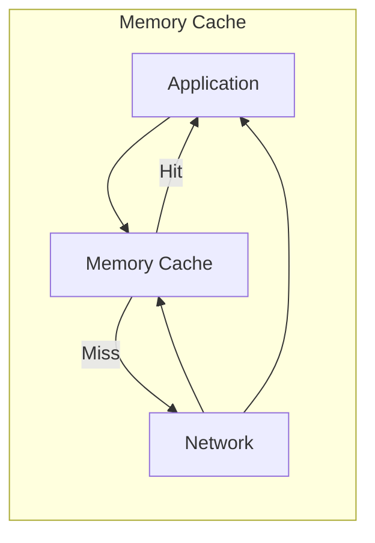
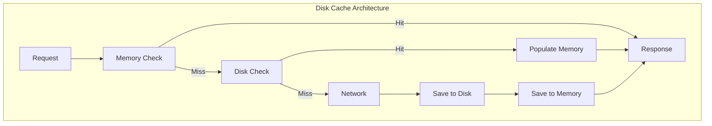
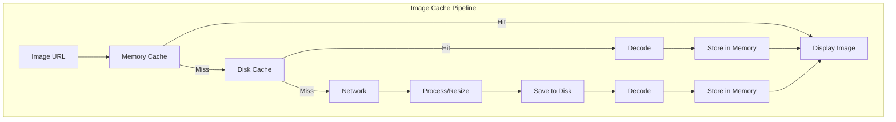
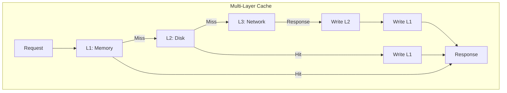

# Mobile Caching Strategies

## Table of Contents

1. [Introduction](#introduction)
2. [Cache Types](#cache-types)
3. [Cache Invalidation](#cache-invalidation)
4. [Multi-Layer Caching](#multi-layer-caching)
5. [Implementation Patterns](#implementation-patterns)
6. [Platform-Specific Solutions](#platform-specific-solutions)
7. [Performance Considerations](#performance-considerations)
8. [Testing Cache Logic](#testing-cache-logic)

---

## Introduction

Caching is fundamental to mobile app performance. Well-designed caching strategies reduce network requests, improve responsiveness, and enable offline functionality. This guide covers comprehensive caching patterns for mobile applications.

### Why Caching Matters

```
┌─────────────────────────────────────────────────────────────┐
│                    CACHING BENEFITS                          │
├─────────────────────────────────────────────────────────────┤
│                                                             │
│  Performance:                                               │
│  ├── Reduce network latency (100ms → 1ms)                  │
│  ├── Decrease bandwidth usage (up to 90%)                  │
│  └── Improve app responsiveness                             │
│                                                             │
│  User Experience:                                           │
│  ├── Instant content display                               │
│  ├── Offline access                                         │
│  └── Reduced loading spinners                               │
│                                                             │
│  Battery & Data:                                            │
│  ├── Fewer network requests                                │
│  ├── Reduced radio usage                                    │
│  └── Lower data consumption                                 │
│                                                             │
│  Cost:                                                      │
│  ├── Reduced server load                                   │
│  ├── Lower CDN costs                                       │
│  └── Decreased infrastructure requirements                  │
│                                                             │
└─────────────────────────────────────────────────────────────┘
```

### Cache Trade-offs

| Aspect | Benefit | Challenge |
|--------|---------|-----------|
| Speed | Faster access | Memory usage |
| Freshness | Instant display | Stale data |
| Complexity | Better UX | More code |
| Storage | Offline support | Device limits |
| Consistency | Reduced load | Sync issues |

---

## Cache Types

### Memory Cache



#### Implementation

```swift
// iOS Memory Cache
final class MemoryCache<Key: Hashable, Value> {
    private let cache = NSCache<WrappedKey, WrappedValue>()
    private let dateProvider: () -> Date
    private let entryLifetime: TimeInterval
    
    init(maximumEntryCount: Int = 100,
         entryLifetime: TimeInterval = 300,
         dateProvider: @escaping () -> Date = Date.init) {
        self.dateProvider = dateProvider
        self.entryLifetime = entryLifetime
        cache.countLimit = maximumEntryCount
    }
    
    func get(_ key: Key) -> Value? {
        guard let entry = cache.object(forKey: WrappedKey(key)) else {
            return nil
        }
        
        guard dateProvider() < entry.expirationDate else {
            remove(key)
            return nil
        }
        
        return entry.value
    }
    
    func set(_ value: Value, forKey key: Key) {
        let expirationDate = dateProvider().addingTimeInterval(entryLifetime)
        let entry = WrappedValue(value: value, expirationDate: expirationDate)
        cache.setObject(entry, forKey: WrappedKey(key))
    }
    
    func remove(_ key: Key) {
        cache.removeObject(forKey: WrappedKey(key))
    }
    
    func removeAll() {
        cache.removeAllObjects()
    }
    
    private final class WrappedKey: NSObject {
        let key: Key
        
        init(_ key: Key) {
            self.key = key
        }
        
        override var hash: Int {
            return key.hashValue
        }
        
        override func isEqual(_ object: Any?) -> Bool {
            guard let other = object as? WrappedKey else { return false }
            return key == other.key
        }
    }
    
    private final class WrappedValue {
        let value: Value
        let expirationDate: Date
        
        init(value: Value, expirationDate: Date) {
            self.value = value
            self.expirationDate = expirationDate
        }
    }
}
```

```kotlin
// Android Memory Cache
class MemoryCache<K : Any, V : Any>(
    private val maxSize: Int = 100,
    private val entryLifetimeMs: Long = 300_000,
    private val clock: Clock = Clock.systemDefaultZone()
) {
    private val cache = object : LruCache<K, CacheEntry<V>>(maxSize) {
        override fun sizeOf(key: K, value: CacheEntry<V>): Int = 1
    }
    
    fun get(key: K): V? {
        val entry = cache.get(key) ?: return null
        
        if (clock.millis() > entry.expirationTime) {
            remove(key)
            return null
        }
        
        return entry.value
    }
    
    fun put(key: K, value: V) {
        val expirationTime = clock.millis() + entryLifetimeMs
        cache.put(key, CacheEntry(value, expirationTime))
    }
    
    fun remove(key: K) {
        cache.remove(key)
    }
    
    fun clear() {
        cache.evictAll()
    }
    
    private data class CacheEntry<V>(
        val value: V,
        val expirationTime: Long
    )
}
```

### Disk Cache



#### Implementation

```swift
// iOS Disk Cache
final class DiskCache<Value: Codable> {
    private let fileManager = FileManager.default
    private let cacheDirectory: URL
    private let encoder = JSONEncoder()
    private let decoder = JSONDecoder()
    private let maxSizeBytes: Int64
    
    private var currentSize: Int64 = 0
    private let queue = DispatchQueue(label: "disk.cache", qos: .utility)
    
    init(name: String, maxSizeMB: Int = 100) {
        let paths = fileManager.urls(for: .cachesDirectory, in: .userDomainMask)
        cacheDirectory = paths[0].appendingPathComponent(name)
        maxSizeBytes = Int64(maxSizeMB) * 1024 * 1024
        
        setupCache()
    }
    
    private func setupCache() {
        try? fileManager.createDirectory(
            at: cacheDirectory,
            withIntermediateDirectories: true
        )
        calculateCurrentSize()
    }
    
    func get(_ key: String) async -> Value? {
        return await withCheckedContinuation { continuation in
            queue.async { [weak self] in
                guard let self = self else {
                    continuation.resume(returning: nil)
                    return
                }
                
                let fileURL = self.fileURL(for: key)
                
                guard let data = try? Data(contentsOf: fileURL),
                      let entry = try? self.decoder.decode(CacheEntry<Value>.self, from: data) else {
                    continuation.resume(returning: nil)
                    return
                }
                
                if Date() > entry.expirationDate {
                    try? self.fileManager.removeItem(at: fileURL)
                    continuation.resume(returning: nil)
                    return
                }
                
                // Update access time
                try? self.fileManager.setAttributes(
                    [.modificationDate: Date()],
                    ofItemAtPath: fileURL.path
                )
                
                continuation.resume(returning: entry.value)
            }
        }
    }
    
    func set(_ value: Value, forKey key: String, ttl: TimeInterval = 86400) async {
        await withCheckedContinuation { (continuation: CheckedContinuation<Void, Never>) in
            queue.async { [weak self] in
                guard let self = self else {
                    continuation.resume()
                    return
                }
                
                let entry = CacheEntry(
                    value: value,
                    expirationDate: Date().addingTimeInterval(ttl)
                )
                
                guard let data = try? self.encoder.encode(entry) else {
                    continuation.resume()
                    return
                }
                
                self.ensureCapacity(for: Int64(data.count))
                
                let fileURL = self.fileURL(for: key)
                try? data.write(to: fileURL)
                self.currentSize += Int64(data.count)
                
                continuation.resume()
            }
        }
    }
    
    func remove(_ key: String) {
        queue.async { [weak self] in
            guard let self = self else { return }
            
            let fileURL = self.fileURL(for: key)
            if let attributes = try? self.fileManager.attributesOfItem(atPath: fileURL.path),
               let size = attributes[.size] as? Int64 {
                self.currentSize -= size
            }
            try? self.fileManager.removeItem(at: fileURL)
        }
    }
    
    func clear() {
        queue.async { [weak self] in
            guard let self = self else { return }
            
            try? self.fileManager.removeItem(at: self.cacheDirectory)
            try? self.fileManager.createDirectory(
                at: self.cacheDirectory,
                withIntermediateDirectories: true
            )
            self.currentSize = 0
        }
    }
    
    private func fileURL(for key: String) -> URL {
        let filename = key.data(using: .utf8)!
            .base64EncodedString()
            .replacingOccurrences(of: "/", with: "_")
        return cacheDirectory.appendingPathComponent(filename)
    }
    
    private func calculateCurrentSize() {
        queue.async { [weak self] in
            guard let self = self else { return }
            
            let contents = try? self.fileManager.contentsOfDirectory(
                at: self.cacheDirectory,
                includingPropertiesForKeys: [.fileSizeKey]
            )
            
            self.currentSize = contents?.reduce(0) { sum, url in
                let size = try? url.resourceValues(forKeys: [.fileSizeKey]).fileSize
                return sum + Int64(size ?? 0)
            } ?? 0
        }
    }
    
    private func ensureCapacity(for requiredBytes: Int64) {
        guard currentSize + requiredBytes > maxSizeBytes else { return }
        
        let contents = try? fileManager.contentsOfDirectory(
            at: cacheDirectory,
            includingPropertiesForKeys: [.contentModificationDateKey, .fileSizeKey]
        )
        
        let sorted = contents?.sorted { url1, url2 in
            let date1 = try? url1.resourceValues(forKeys: [.contentModificationDateKey]).contentModificationDate
            let date2 = try? url2.resourceValues(forKeys: [.contentModificationDateKey]).contentModificationDate
            return (date1 ?? .distantPast) < (date2 ?? .distantPast)
        }
        
        let targetSize = maxSizeBytes - requiredBytes - (maxSizeBytes / 10) // Keep 10% buffer
        var freedSize: Int64 = 0
        
        for url in sorted ?? [] {
            if currentSize - freedSize <= targetSize { break }
            
            if let size = try? url.resourceValues(forKeys: [.fileSizeKey]).fileSize {
                try? fileManager.removeItem(at: url)
                freedSize += Int64(size)
            }
        }
        
        currentSize -= freedSize
    }
    
    private struct CacheEntry<T: Codable>: Codable {
        let value: T
        let expirationDate: Date
    }
}
```

```kotlin
// Android Disk Cache
class DiskCache<V : Any>(
    private val context: Context,
    private val name: String,
    private val maxSizeMB: Int = 100,
    private val serializer: (V) -> ByteArray,
    private val deserializer: (ByteArray) -> V
) {
    private val cacheDir = File(context.cacheDir, name).apply { mkdirs() }
    private val maxSizeBytes = maxSizeMB * 1024L * 1024L
    private val json = Json { ignoreUnknownKeys = true }
    
    private val mutex = Mutex()
    private var currentSize: Long = 0
    
    init {
        calculateCurrentSize()
    }
    
    suspend fun get(key: String): V? = mutex.withLock {
        val file = getFile(key)
        if (!file.exists()) return@withLock null
        
        try {
            val bytes = file.readBytes()
            val entry = json.decodeFromString<CacheEntry>(String(bytes))
            
            if (System.currentTimeMillis() > entry.expirationTime) {
                file.delete()
                return@withLock null
            }
            
            file.setLastModified(System.currentTimeMillis())
            deserializer(Base64.decode(entry.data, Base64.DEFAULT))
        } catch (e: Exception) {
            null
        }
    }
    
    suspend fun put(key: String, value: V, ttlMs: Long = 86400_000) = mutex.withLock {
        val data = Base64.encodeToString(serializer(value), Base64.DEFAULT)
        val entry = CacheEntry(
            data = data,
            expirationTime = System.currentTimeMillis() + ttlMs
        )
        
        val bytes = json.encodeToString(entry).toByteArray()
        ensureCapacity(bytes.size.toLong())
        
        val file = getFile(key)
        file.writeBytes(bytes)
        currentSize += bytes.size
    }
    
    suspend fun remove(key: String) = mutex.withLock {
        val file = getFile(key)
        if (file.exists()) {
            currentSize -= file.length()
            file.delete()
        }
    }
    
    suspend fun clear() = mutex.withLock {
        cacheDir.listFiles()?.forEach { it.delete() }
        currentSize = 0
    }
    
    private fun getFile(key: String): File {
        val filename = Base64.encodeToString(key.toByteArray(), Base64.NO_WRAP)
            .replace("/", "_")
        return File(cacheDir, filename)
    }
    
    private fun calculateCurrentSize() {
        currentSize = cacheDir.listFiles()?.sumOf { it.length() } ?: 0
    }
    
    private fun ensureCapacity(requiredBytes: Long) {
        if (currentSize + requiredBytes <= maxSizeBytes) return
        
        val files = cacheDir.listFiles()?.sortedBy { it.lastModified() } ?: return
        val targetSize = maxSizeBytes - requiredBytes - (maxSizeBytes / 10)
        var freedSize = 0L
        
        for (file in files) {
            if (currentSize - freedSize <= targetSize) break
            freedSize += file.length()
            file.delete()
        }
        
        currentSize -= freedSize
    }
    
    @Serializable
    private data class CacheEntry(
        val data: String,
        val expirationTime: Long
    )
}
```

### Image Cache



#### Implementation

```swift
// iOS Image Cache
final class ImageCache {
    static let shared = ImageCache()
    
    private let memoryCache: NSCache<NSString, UIImage>
    private let diskCache: DiskCache<Data>
    private var loadingTasks: [String: Task<UIImage?, Error>] = [:]
    private let taskQueue = DispatchQueue(label: "image.cache.tasks")
    
    init(memoryCacheSize: Int = 50, diskCacheSizeMB: Int = 200) {
        memoryCache = NSCache()
        memoryCache.countLimit = memoryCacheSize
        memoryCache.totalCostLimit = memoryCacheSize * 1024 * 1024
        
        diskCache = DiskCache(name: "images", maxSizeMB: diskCacheSizeMB)
    }
    
    func image(for url: URL, size: CGSize? = nil) async -> UIImage? {
        let cacheKey = cacheKey(for: url, size: size)
        
        // Check memory cache
        if let cached = memoryCache.object(forKey: cacheKey as NSString) {
            return cached
        }
        
        // Check for existing loading task
        if let existingTask = taskQueue.sync(execute: { loadingTasks[cacheKey] }) {
            return try? await existingTask.value
        }
        
        // Create loading task
        let task = Task<UIImage?, Error> {
            // Check disk cache
            if let data = await diskCache.get(cacheKey),
               let image = UIImage(data: data) {
                let processedImage = size.map { resize(image, to: $0) } ?? image
                memoryCache.setObject(processedImage, forKey: cacheKey as NSString)
                return processedImage
            }
            
            // Fetch from network
            let (data, _) = try await URLSession.shared.data(from: url)
            
            guard let image = UIImage(data: data) else {
                return nil
            }
            
            // Process image
            let processedImage = size.map { resize(image, to: $0) } ?? image
            
            // Cache to disk
            if let diskData = processedImage.jpegData(compressionQuality: 0.8) {
                await diskCache.set(diskData, forKey: cacheKey)
            }
            
            // Cache to memory
            memoryCache.setObject(processedImage, forKey: cacheKey as NSString)
            
            return processedImage
        }
        
        taskQueue.sync { loadingTasks[cacheKey] = task }
        
        let result = try? await task.value
        
        taskQueue.sync { loadingTasks.removeValue(forKey: cacheKey) }
        
        return result
    }
    
    func prefetch(urls: [URL], size: CGSize? = nil) {
        for url in urls {
            Task {
                _ = await image(for: url, size: size)
            }
        }
    }
    
    func clearMemoryCache() {
        memoryCache.removeAllObjects()
    }
    
    func clearDiskCache() {
        diskCache.clear()
    }
    
    private func cacheKey(for url: URL, size: CGSize?) -> String {
        var key = url.absoluteString
        if let size = size {
            key += "_\(Int(size.width))x\(Int(size.height))"
        }
        return key
    }
    
    private func resize(_ image: UIImage, to size: CGSize) -> UIImage {
        let renderer = UIGraphicsImageRenderer(size: size)
        return renderer.image { _ in
            image.draw(in: CGRect(origin: .zero, size: size))
        }
    }
}

// UIImageView Extension
extension UIImageView {
    func setImage(from url: URL, placeholder: UIImage? = nil, size: CGSize? = nil) {
        self.image = placeholder
        
        Task { @MainActor in
            if let image = await ImageCache.shared.image(for: url, size: size ?? self.bounds.size) {
                UIView.transition(with: self, duration: 0.2, options: .transitionCrossDissolve) {
                    self.image = image
                }
            }
        }
    }
}
```

---

## Cache Invalidation

### Invalidation Strategies

```
┌─────────────────────────────────────────────────────────────┐
│                INVALIDATION STRATEGIES                       │
├─────────────────────────────────────────────────────────────┤
│                                                             │
│  Time-Based (TTL):                                          │
│  ├── Simple to implement                                    │
│  ├── Predictable behavior                                   │
│  └── May serve stale data                                   │
│                                                             │
│  Event-Based:                                               │
│  ├── Invalidate on specific events                         │
│  ├── More accurate                                          │
│  └── Requires event system                                  │
│                                                             │
│  Version-Based (ETag):                                      │
│  ├── Server-driven invalidation                            │
│  ├── Bandwidth efficient                                    │
│  └── Requires server support                                │
│                                                             │
│  Hybrid:                                                    │
│  ├── Stale-while-revalidate                                │
│  ├── Best user experience                                   │
│  └── More complex                                           │
│                                                             │
└─────────────────────────────────────────────────────────────┘
```

### Cache Policy Implementation

```swift
// iOS Cache Policy
enum CachePolicy {
    case networkOnly
    case cacheOnly
    case cacheFirst
    case networkFirst
    case staleWhileRevalidate(maxStale: TimeInterval)
}

final class CachedRepository<T: Codable> {
    private let memoryCache: MemoryCache<String, T>
    private let diskCache: DiskCache<T>
    private let networkFetcher: (String) async throws -> T
    
    init(
        memoryCache: MemoryCache<String, T>,
        diskCache: DiskCache<T>,
        networkFetcher: @escaping (String) async throws -> T
    ) {
        self.memoryCache = memoryCache
        self.diskCache = diskCache
        self.networkFetcher = networkFetcher
    }
    
    func fetch(key: String, policy: CachePolicy) async throws -> T {
        switch policy {
        case .networkOnly:
            return try await fetchFromNetwork(key: key)
            
        case .cacheOnly:
            if let cached = getCached(key: key) {
                return cached
            }
            throw CacheError.notFound
            
        case .cacheFirst:
            if let cached = getCached(key: key) {
                return cached
            }
            return try await fetchFromNetwork(key: key)
            
        case .networkFirst:
            do {
                return try await fetchFromNetwork(key: key)
            } catch {
                if let cached = getCached(key: key) {
                    return cached
                }
                throw error
            }
            
        case .staleWhileRevalidate(let maxStale):
            return try await staleWhileRevalidate(key: key, maxStale: maxStale)
        }
    }
    
    private func getCached(key: String) -> T? {
        if let memory = memoryCache.get(key) {
            return memory
        }
        
        // Synchronous disk check for simplicity
        let semaphore = DispatchSemaphore(value: 0)
        var result: T?
        
        Task {
            result = await diskCache.get(key)
            semaphore.signal()
        }
        
        semaphore.wait()
        
        if let disk = result {
            memoryCache.set(disk, forKey: key)
        }
        
        return result
    }
    
    private func fetchFromNetwork(key: String) async throws -> T {
        let data = try await networkFetcher(key)
        memoryCache.set(data, forKey: key)
        await diskCache.set(data, forKey: key)
        return data
    }
    
    private func staleWhileRevalidate(key: String, maxStale: TimeInterval) async throws -> T {
        // Return cached immediately if available
        if let cached = getCached(key: key) {
            // Revalidate in background
            Task {
                _ = try? await fetchFromNetwork(key: key)
            }
            return cached
        }
        
        // No cache, must fetch
        return try await fetchFromNetwork(key: key)
    }
}

enum CacheError: Error {
    case notFound
    case expired
    case invalidData
}
```

### ETag-Based Validation

```swift
// iOS ETag Cache
final class ETagCache {
    private let cache: DiskCache<CachedResponse>
    private let session: URLSession
    
    init() {
        cache = DiskCache(name: "etag_cache", maxSizeMB: 100)
        session = URLSession.shared
    }
    
    func fetch(url: URL) async throws -> Data {
        let cacheKey = url.absoluteString
        
        // Check cache
        if let cached = await cache.get(cacheKey) {
            // Validate with server
            var request = URLRequest(url: url)
            request.setValue(cached.etag, forHTTPHeaderField: "If-None-Match")
            
            let (data, response) = try await session.data(for: request)
            
            if let httpResponse = response as? HTTPURLResponse {
                switch httpResponse.statusCode {
                case 304:
                    // Not modified, return cached
                    return cached.data
                case 200:
                    // New data, update cache
                    let etag = httpResponse.value(forHTTPHeaderField: "ETag")
                    let newCached = CachedResponse(data: data, etag: etag)
                    await cache.set(newCached, forKey: cacheKey)
                    return data
                default:
                    throw URLError(.badServerResponse)
                }
            }
        }
        
        // No cache, fetch fresh
        let (data, response) = try await session.data(from: url)
        
        if let httpResponse = response as? HTTPURLResponse,
           let etag = httpResponse.value(forHTTPHeaderField: "ETag") {
            let cached = CachedResponse(data: data, etag: etag)
            await cache.set(cached, forKey: cacheKey)
        }
        
        return data
    }
}

struct CachedResponse: Codable {
    let data: Data
    let etag: String?
}
```

---

## Multi-Layer Caching

### Layer Architecture



### Unified Cache Manager

```swift
// iOS Multi-Layer Cache Manager
final class CacheManager<T: Codable> {
    private let memoryCache: MemoryCache<String, T>
    private let diskCache: DiskCache<T>
    private let networkFetcher: NetworkFetcher<T>
    
    private var pendingRequests: [String: Task<T, Error>] = [:]
    private let requestQueue = DispatchQueue(label: "cache.requests")
    
    struct Configuration {
        var memoryTTL: TimeInterval = 300          // 5 minutes
        var diskTTL: TimeInterval = 86400          // 24 hours
        var memoryCacheSize: Int = 100
        var diskCacheSizeMB: Int = 100
    }
    
    init(name: String, configuration: Configuration = Configuration(), networkFetcher: NetworkFetcher<T>) {
        self.memoryCache = MemoryCache(
            maximumEntryCount: configuration.memoryCacheSize,
            entryLifetime: configuration.memoryTTL
        )
        self.diskCache = DiskCache(
            name: name,
            maxSizeMB: configuration.diskCacheSizeMB
        )
        self.networkFetcher = networkFetcher
    }
    
    func get(key: String, policy: CachePolicy = .cacheFirst) async throws -> T {
        // Check for pending request
        if let pending = requestQueue.sync(execute: { pendingRequests[key] }) {
            return try await pending.value
        }
        
        let task = Task<T, Error> {
            try await fetchWithPolicy(key: key, policy: policy)
        }
        
        requestQueue.sync { pendingRequests[key] = task }
        
        do {
            let result = try await task.value
            requestQueue.sync { pendingRequests.removeValue(forKey: key) }
            return result
        } catch {
            requestQueue.sync { pendingRequests.removeValue(forKey: key) }
            throw error
        }
    }
    
    private func fetchWithPolicy(key: String, policy: CachePolicy) async throws -> T {
        switch policy {
        case .cacheFirst:
            // L1: Memory
            if let memory = memoryCache.get(key) {
                return memory
            }
            
            // L2: Disk
            if let disk = await diskCache.get(key) {
                memoryCache.set(disk, forKey: key)
                return disk
            }
            
            // L3: Network
            return try await fetchAndCache(key: key)
            
        case .networkFirst:
            do {
                return try await fetchAndCache(key: key)
            } catch {
                if let cached = await getFromCache(key: key) {
                    return cached
                }
                throw error
            }
            
        case .staleWhileRevalidate(let maxStale):
            if let cached = await getFromCache(key: key) {
                // Revalidate in background
                Task { try? await fetchAndCache(key: key) }
                return cached
            }
            return try await fetchAndCache(key: key)
            
        case .networkOnly:
            return try await fetchAndCache(key: key)
            
        case .cacheOnly:
            if let cached = await getFromCache(key: key) {
                return cached
            }
            throw CacheError.notFound
        }
    }
    
    private func getFromCache(key: String) async -> T? {
        if let memory = memoryCache.get(key) {
            return memory
        }
        
        if let disk = await diskCache.get(key) {
            memoryCache.set(disk, forKey: key)
            return disk
        }
        
        return nil
    }
    
    private func fetchAndCache(key: String) async throws -> T {
        let data = try await networkFetcher.fetch(key: key)
        memoryCache.set(data, forKey: key)
        await diskCache.set(data, forKey: key)
        return data
    }
    
    func invalidate(key: String) async {
        memoryCache.remove(key)
        diskCache.remove(key)
    }
    
    func clearAll() async {
        memoryCache.removeAll()
        diskCache.clear()
    }
}

protocol NetworkFetcher<T> {
    associatedtype T
    func fetch(key: String) async throws -> T
}
```

### Cache Coordination

```swift
// iOS Cache Coordinator
final class CacheCoordinator {
    static let shared = CacheCoordinator()
    
    private var caches: [String: Any] = [:]
    private let queue = DispatchQueue(label: "cache.coordinator")
    
    func register<T: Codable>(_ cache: CacheManager<T>, name: String) {
        queue.sync {
            caches[name] = cache
        }
    }
    
    func cache<T: Codable>(named name: String) -> CacheManager<T>? {
        queue.sync {
            caches[name] as? CacheManager<T>
        }
    }
    
    func invalidateAll(matching predicate: (String) -> Bool) async {
        let matchingNames = queue.sync {
            caches.keys.filter(predicate)
        }
        
        for name in matchingNames {
            if let cache = queue.sync(execute: { caches[name] }) as? any ClearableCache {
                await cache.clearAll()
            }
        }
    }
    
    func handleMemoryWarning() {
        queue.sync {
            for (_, cache) in caches {
                if let clearable = cache as? any MemoryClearable {
                    clearable.clearMemory()
                }
            }
        }
    }
}

protocol ClearableCache {
    func clearAll() async
}

protocol MemoryClearable {
    func clearMemory()
}

extension CacheManager: ClearableCache, MemoryClearable {
    func clearMemory() {
        memoryCache.removeAll()
    }
}
```

---

## Implementation Patterns

### Repository Pattern with Cache

```swift
// iOS Repository with Cache
protocol Repository {
    associatedtype Entity
    
    func get(id: String) async throws -> Entity
    func getAll() async throws -> [Entity]
    func save(_ entity: Entity) async throws
    func delete(id: String) async throws
}

final class CachedUserRepository: Repository {
    typealias Entity = User
    
    private let cache: CacheManager<User>
    private let listCache: CacheManager<[User]>
    private let apiClient: APIClient
    
    init(apiClient: APIClient) {
        self.apiClient = apiClient
        
        self.cache = CacheManager(
            name: "users",
            configuration: .init(memoryTTL: 300, diskTTL: 3600),
            networkFetcher: UserFetcher(apiClient: apiClient)
        )
        
        self.listCache = CacheManager(
            name: "users_list",
            configuration: .init(memoryTTL: 60, diskTTL: 300),
            networkFetcher: UserListFetcher(apiClient: apiClient)
        )
    }
    
    func get(id: String) async throws -> User {
        try await cache.get(key: id, policy: .staleWhileRevalidate(maxStale: 60))
    }
    
    func getAll() async throws -> [User] {
        try await listCache.get(key: "all", policy: .cacheFirst)
    }
    
    func save(_ entity: User) async throws {
        try await apiClient.saveUser(entity)
        // Invalidate caches
        await cache.invalidate(key: entity.id)
        await listCache.invalidate(key: "all")
    }
    
    func delete(id: String) async throws {
        try await apiClient.deleteUser(id: id)
        await cache.invalidate(key: id)
        await listCache.invalidate(key: "all")
    }
}

struct UserFetcher: NetworkFetcher {
    let apiClient: APIClient
    
    func fetch(key: String) async throws -> User {
        try await apiClient.getUser(id: key)
    }
}

struct UserListFetcher: NetworkFetcher {
    let apiClient: APIClient
    
    func fetch(key: String) async throws -> [User] {
        try await apiClient.getUsers()
    }
}
```

### Offline-First Pattern

```swift
// iOS Offline-First Cache
final class OfflineFirstCache<T: Codable & Identifiable> {
    private let diskCache: DiskCache<T>
    private let pendingChanges: DiskCache<PendingChange<T>>
    private let networkSync: NetworkSync<T>
    private let networkMonitor: NetworkMonitor
    
    init(name: String, networkSync: NetworkSync<T>) {
        self.diskCache = DiskCache(name: "\(name)_data", maxSizeMB: 100)
        self.pendingChanges = DiskCache(name: "\(name)_pending", maxSizeMB: 10)
        self.networkSync = networkSync
        self.networkMonitor = .shared
        
        setupNetworkObserver()
    }
    
    private func setupNetworkObserver() {
        networkMonitor.onStatusChange = { [weak self] status in
            if status == .connected {
                Task { await self?.syncPendingChanges() }
            }
        }
    }
    
    func get(id: String) async -> T? {
        await diskCache.get(id)
    }
    
    func save(_ entity: T) async {
        await diskCache.set(entity, forKey: entity.id as! String)
        
        if networkMonitor.isConnected {
            do {
                try await networkSync.save(entity)
            } catch {
                await queuePendingChange(.save(entity))
            }
        } else {
            await queuePendingChange(.save(entity))
        }
    }
    
    func delete(id: String) async {
        diskCache.remove(id)
        
        if networkMonitor.isConnected {
            do {
                try await networkSync.delete(id: id)
            } catch {
                await queuePendingChange(.delete(id))
            }
        } else {
            await queuePendingChange(.delete(id))
        }
    }
    
    private func queuePendingChange(_ change: PendingChange<T>) async {
        let key = UUID().uuidString
        await pendingChanges.set(change, forKey: key)
    }
    
    private func syncPendingChanges() async {
        // Get all pending changes and sync
        // This is simplified - real implementation would iterate through pending items
    }
}

enum PendingChange<T: Codable>: Codable {
    case save(T)
    case delete(String)
}

protocol NetworkSync<T> {
    associatedtype T
    func save(_ entity: T) async throws
    func delete(id: String) async throws
}
```

---

## Platform-Specific Solutions

### iOS URLCache Configuration

```swift
// iOS URL Cache Configuration
final class URLCacheConfiguration {
    static func configure() {
        let memoryCapacity = 50 * 1024 * 1024  // 50 MB
        let diskCapacity = 200 * 1024 * 1024   // 200 MB
        
        let cache = URLCache(
            memoryCapacity: memoryCapacity,
            diskCapacity: diskCapacity,
            diskPath: "url_cache"
        )
        
        URLCache.shared = cache
    }
    
    static func configuredSession() -> URLSession {
        let config = URLSessionConfiguration.default
        
        config.requestCachePolicy = .returnCacheDataElseLoad
        config.urlCache = URLCache.shared
        
        return URLSession(configuration: config)
    }
}

// Custom Cache Policy per Request
extension URLRequest {
    static func cached(url: URL, policy: NSURLRequest.CachePolicy = .returnCacheDataElseLoad) -> URLRequest {
        var request = URLRequest(url: url)
        request.cachePolicy = policy
        return request
    }
}
```

### Android OkHttp Cache

```kotlin
// Android OkHttp Cache Configuration
class OkHttpCacheConfiguration(private val context: Context) {
    
    fun createClient(): OkHttpClient {
        val cacheSize = 100L * 1024 * 1024 // 100 MB
        val cache = Cache(File(context.cacheDir, "http_cache"), cacheSize)
        
        return OkHttpClient.Builder()
            .cache(cache)
            .addInterceptor(CacheInterceptor())
            .addNetworkInterceptor(CacheNetworkInterceptor())
            .build()
    }
    
    private class CacheInterceptor : Interceptor {
        override fun intercept(chain: Interceptor.Chain): Response {
            val request = chain.request()
            
            // Check if we should use cache
            val cacheControl = request.header("Cache-Control")
            
            return chain.proceed(request)
        }
    }
    
    private class CacheNetworkInterceptor : Interceptor {
        override fun intercept(chain: Interceptor.Chain): Response {
            val response = chain.proceed(chain.request())
            
            // Add cache headers if not present
            val cacheControl = CacheControl.Builder()
                .maxAge(1, TimeUnit.HOURS)
                .build()
            
            return response.newBuilder()
                .removeHeader("Pragma")
                .removeHeader("Cache-Control")
                .header("Cache-Control", cacheControl.toString())
                .build()
        }
    }
}

// Retrofit with Cache
class RetrofitConfiguration(private val context: Context) {
    
    fun createRetrofit(): Retrofit {
        val client = OkHttpCacheConfiguration(context).createClient()
        
        return Retrofit.Builder()
            .baseUrl("https://api.example.com/")
            .client(client)
            .addConverterFactory(GsonConverterFactory.create())
            .build()
    }
}
```

---

## Performance Considerations

### Cache Size Optimization

```swift
// iOS Cache Size Manager
final class CacheSizeManager {
    private let maxTotalCacheSize: Int64 = 500 * 1024 * 1024 // 500 MB
    
    struct CacheInfo {
        let name: String
        let currentSize: Int64
        let maxSize: Int64
        let priority: Int
    }
    
    private var caches: [CacheInfo] = []
    
    func register(cache: CacheInfo) {
        caches.append(cache)
    }
    
    func optimizeCacheSizes() -> [String: Int64] {
        let totalPriority = caches.reduce(0) { $0 + $1.priority }
        var allocations: [String: Int64] = [:]
        
        for cache in caches {
            let proportion = Double(cache.priority) / Double(totalPriority)
            let allocation = Int64(Double(maxTotalCacheSize) * proportion)
            allocations[cache.name] = min(allocation, cache.maxSize)
        }
        
        return allocations
    }
    
    func handleLowDiskSpace() {
        // Reduce cache sizes by 50%
        for var cache in caches {
            cache = CacheInfo(
                name: cache.name,
                currentSize: cache.currentSize,
                maxSize: cache.maxSize / 2,
                priority: cache.priority
            )
        }
    }
}
```

### Memory Pressure Handling

```swift
// iOS Memory Pressure Handler
final class MemoryPressureHandler {
    static let shared = MemoryPressureHandler()
    
    private var memoryCaches: [() -> Void] = []
    
    init() {
        setupMemoryWarningObserver()
    }
    
    func registerCache(clearAction: @escaping () -> Void) {
        memoryCaches.append(clearAction)
    }
    
    private func setupMemoryWarningObserver() {
        NotificationCenter.default.addObserver(
            self,
            selector: #selector(handleMemoryWarning),
            name: UIApplication.didReceiveMemoryWarningNotification,
            object: nil
        )
    }
    
    @objc private func handleMemoryWarning() {
        // Clear all registered memory caches
        memoryCaches.forEach { $0() }
        
        // Also clear URL cache memory
        URLCache.shared.removeAllCachedResponses()
    }
}
```

---

## Testing Cache Logic

### Cache Tests

```swift
// iOS Cache Tests
final class MemoryCacheTests: XCTestCase {
    var sut: MemoryCache<String, String>!
    var mockDateProvider: MockDateProvider!
    
    override func setUp() {
        super.setUp()
        mockDateProvider = MockDateProvider()
        sut = MemoryCache(
            maximumEntryCount: 10,
            entryLifetime: 60,
            dateProvider: mockDateProvider.now
        )
    }
    
    func testGet_ReturnsNil_WhenEmpty() {
        XCTAssertNil(sut.get("key"))
    }
    
    func testGet_ReturnsValue_AfterSet() {
        sut.set("value", forKey: "key")
        XCTAssertEqual(sut.get("key"), "value")
    }
    
    func testGet_ReturnsNil_WhenExpired() {
        sut.set("value", forKey: "key")
        
        // Advance time past expiration
        mockDateProvider.advance(by: 61)
        
        XCTAssertNil(sut.get("key"))
    }
    
    func testRemove_RemovesValue() {
        sut.set("value", forKey: "key")
        sut.remove("key")
        
        XCTAssertNil(sut.get("key"))
    }
    
    func testEviction_WhenOverLimit() {
        // Fill cache
        for i in 0..<10 {
            sut.set("value\(i)", forKey: "key\(i)")
        }
        
        // Add one more
        sut.set("newValue", forKey: "newKey")
        
        // First item should be evicted (LRU)
        XCTAssertNil(sut.get("key0"))
        XCTAssertNotNil(sut.get("newKey"))
    }
}

class MockDateProvider {
    private var currentDate = Date()
    
    var now: () -> Date {
        return { self.currentDate }
    }
    
    func advance(by seconds: TimeInterval) {
        currentDate = currentDate.addingTimeInterval(seconds)
    }
}
```

### Integration Tests

```swift
// iOS Cache Integration Tests
final class CacheIntegrationTests: XCTestCase {
    var sut: CacheManager<TestModel>!
    var mockNetworkFetcher: MockNetworkFetcher!
    
    override func setUp() async throws {
        mockNetworkFetcher = MockNetworkFetcher()
        sut = CacheManager(
            name: "test_cache",
            configuration: .init(memoryTTL: 60, diskTTL: 300),
            networkFetcher: mockNetworkFetcher
        )
        
        // Clear any existing cache
        await sut.clearAll()
    }
    
    func testCacheFirst_ReturnsCached_WhenAvailable() async throws {
        // First fetch - from network
        mockNetworkFetcher.response = TestModel(id: "1", value: "original")
        let first = try await sut.get(key: "1", policy: .cacheFirst)
        
        // Update network response
        mockNetworkFetcher.response = TestModel(id: "1", value: "updated")
        
        // Second fetch - should return cached
        let second = try await sut.get(key: "1", policy: .cacheFirst)
        
        XCTAssertEqual(first.value, "original")
        XCTAssertEqual(second.value, "original")
        XCTAssertEqual(mockNetworkFetcher.fetchCount, 1)
    }
    
    func testNetworkFirst_FetchesFromNetwork() async throws {
        mockNetworkFetcher.response = TestModel(id: "1", value: "first")
        _ = try await sut.get(key: "1", policy: .networkFirst)
        
        mockNetworkFetcher.response = TestModel(id: "1", value: "second")
        let result = try await sut.get(key: "1", policy: .networkFirst)
        
        XCTAssertEqual(result.value, "second")
        XCTAssertEqual(mockNetworkFetcher.fetchCount, 2)
    }
    
    func testNetworkFirst_FallsBackToCache_OnNetworkError() async throws {
        mockNetworkFetcher.response = TestModel(id: "1", value: "cached")
        _ = try await sut.get(key: "1", policy: .cacheFirst)
        
        mockNetworkFetcher.shouldFail = true
        
        let result = try await sut.get(key: "1", policy: .networkFirst)
        
        XCTAssertEqual(result.value, "cached")
    }
}

struct TestModel: Codable, Equatable {
    let id: String
    let value: String
}

class MockNetworkFetcher: NetworkFetcher {
    var response: TestModel?
    var shouldFail = false
    var fetchCount = 0
    
    func fetch(key: String) async throws -> TestModel {
        fetchCount += 1
        
        if shouldFail {
            throw NSError(domain: "test", code: 1)
        }
        
        guard let response = response else {
            throw NSError(domain: "test", code: 2)
        }
        
        return response
    }
}
```

---

## Summary

Effective caching requires:

1. **Multi-layer approach** - Memory, disk, and network tiers
2. **Smart invalidation** - TTL, events, and versioning
3. **Policy flexibility** - Different strategies for different data
4. **Memory management** - Handle pressure gracefully
5. **Offline support** - Queue changes for sync
6. **Thorough testing** - Unit and integration tests

The patterns presented provide a foundation for building robust caching systems that improve app performance while maintaining data freshness.

---

## References

- [NSURLCache Documentation](https://developer.apple.com/documentation/foundation/nsurlcache)
- [OkHttp Caching](https://square.github.io/okhttp/features/caching/)
- [HTTP Caching RFC 7234](https://tools.ietf.org/html/rfc7234)
- [Cache Replacement Policies](https://en.wikipedia.org/wiki/Cache_replacement_policies)
