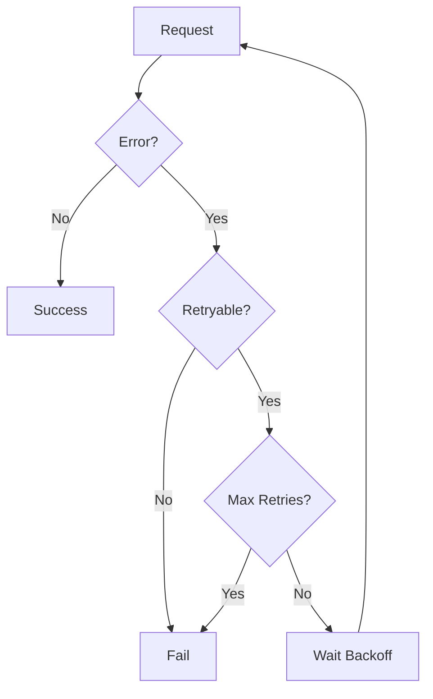
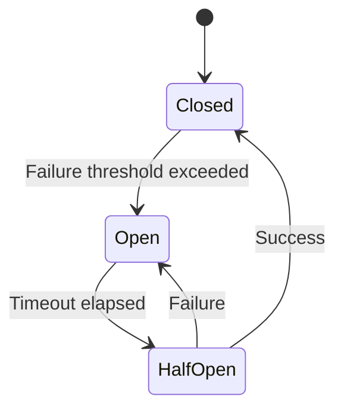
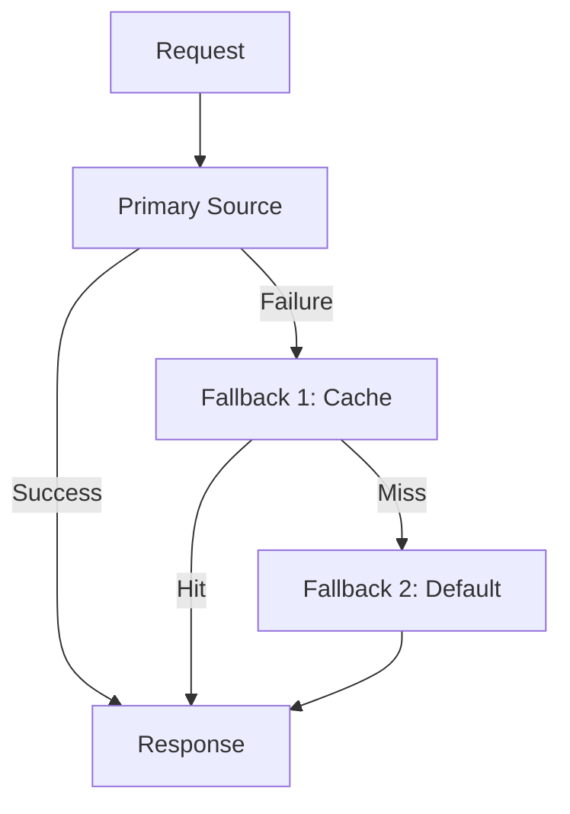
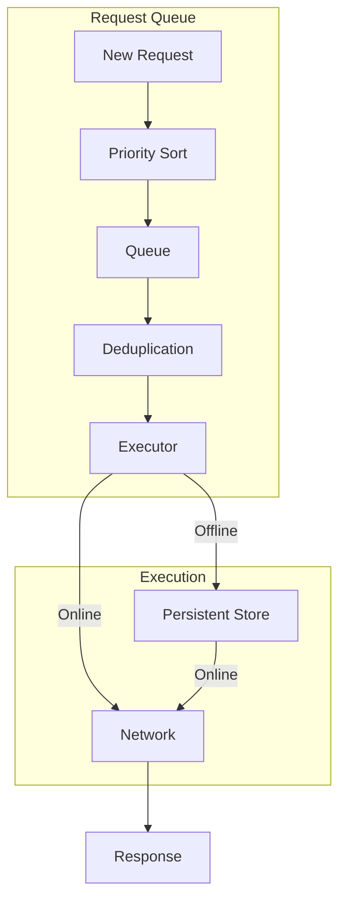

# Network Resilience Patterns for Mobile Apps

## Table of Contents

1. [Introduction](#introduction)
2. [Retry Strategies](#retry-strategies)
3. [Circuit Breaker Pattern](#circuit-breaker-pattern)
4. [Timeout Management](#timeout-management)
5. [Fallback Patterns](#fallback-patterns)
6. [Request Queuing](#request-queuing)
7. [Network Monitoring](#network-monitoring)
8. [Implementation Examples](#implementation-examples)
9. [Testing Resilience](#testing-resilience)

---

## Introduction

Mobile networks are inherently unreliable. Apps must handle intermittent connectivity, high latency, and request failures gracefully. This guide covers patterns for building resilient network layers.

### Network Challenges

```
┌─────────────────────────────────────────────────────────────┐
│                    MOBILE NETWORK CHALLENGES                 │
├─────────────────────────────────────────────────────────────┤
│                                                             │
│  Connectivity:                                              │
│  ├── Intermittent disconnections                           │
│  ├── Network transitions (WiFi → Cellular)                 │
│  ├── Tunnel/elevator dead zones                            │
│  └── Airplane mode                                          │
│                                                             │
│  Performance:                                               │
│  ├── Variable latency (50ms - 5000ms)                      │
│  ├── Bandwidth fluctuations                                │
│  ├── Packet loss                                           │
│  └── Congestion                                             │
│                                                             │
│  Server Issues:                                             │
│  ├── Timeouts                                              │
│  ├── 5xx errors                                            │
│  ├── Rate limiting (429)                                   │
│  └── Maintenance windows                                    │
│                                                             │
└─────────────────────────────────────────────────────────────┘
```

### Resilience Goals

| Goal | Description | Metric |
|------|-------------|--------|
| Availability | App remains usable | % uptime |
| Responsiveness | Quick feedback to user | Response time |
| Recoverability | Automatic recovery | MTTR |
| Graceful degradation | Partial functionality | Feature availability |

---

## Retry Strategies

### Retry Decision Flow



### Exponential Backoff

```swift
// iOS Exponential Backoff
final class RetryPolicy {
    enum Strategy {
        case immediate
        case fixed(delay: TimeInterval)
        case exponential(base: TimeInterval, maxDelay: TimeInterval)
        case exponentialWithJitter(base: TimeInterval, maxDelay: TimeInterval)
    }
    
    let maxRetries: Int
    let strategy: Strategy
    let retryableErrors: Set<Int>
    let retryableStatusCodes: Set<Int>
    
    init(
        maxRetries: Int = 3,
        strategy: Strategy = .exponentialWithJitter(base: 1.0, maxDelay: 30.0),
        retryableErrors: Set<Int> = [NSURLErrorTimedOut, NSURLErrorNetworkConnectionLost],
        retryableStatusCodes: Set<Int> = [408, 429, 500, 502, 503, 504]
    ) {
        self.maxRetries = maxRetries
        self.strategy = strategy
        self.retryableErrors = retryableErrors
        self.retryableStatusCodes = retryableStatusCodes
    }
    
    func shouldRetry(attempt: Int, error: Error?, statusCode: Int?) -> Bool {
        guard attempt < maxRetries else { return false }
        
        if let nsError = error as NSError? {
            return retryableErrors.contains(nsError.code)
        }
        
        if let code = statusCode {
            return retryableStatusCodes.contains(code)
        }
        
        return false
    }
    
    func delay(for attempt: Int) -> TimeInterval {
        switch strategy {
        case .immediate:
            return 0
            
        case .fixed(let delay):
            return delay
            
        case .exponential(let base, let maxDelay):
            let delay = base * pow(2.0, Double(attempt))
            return min(delay, maxDelay)
            
        case .exponentialWithJitter(let base, let maxDelay):
            let delay = base * pow(2.0, Double(attempt))
            let cappedDelay = min(delay, maxDelay)
            let jitter = Double.random(in: 0...0.3) * cappedDelay
            return cappedDelay + jitter
        }
    }
}
```

### Retry Executor

```swift
// iOS Retry Executor
final class RetryExecutor {
    private let policy: RetryPolicy
    
    init(policy: RetryPolicy = RetryPolicy()) {
        self.policy = policy
    }
    
    func execute<T>(
        operation: @escaping () async throws -> T,
        onRetry: ((Int, Error) -> Void)? = nil
    ) async throws -> T {
        var lastError: Error?
        
        for attempt in 0...policy.maxRetries {
            do {
                return try await operation()
            } catch {
                lastError = error
                
                let statusCode = extractStatusCode(from: error)
                
                guard policy.shouldRetry(attempt: attempt, error: error, statusCode: statusCode) else {
                    throw error
                }
                
                onRetry?(attempt, error)
                
                let delay = policy.delay(for: attempt)
                try await Task.sleep(nanoseconds: UInt64(delay * 1_000_000_000))
            }
        }
        
        throw lastError ?? NetworkError.maxRetriesExceeded
    }
    
    private func extractStatusCode(from error: Error) -> Int? {
        if let networkError = error as? NetworkError {
            switch networkError {
            case .httpError(let code, _):
                return code
            default:
                return nil
            }
        }
        return nil
    }
}

enum NetworkError: Error {
    case httpError(statusCode: Int, data: Data?)
    case noConnection
    case timeout
    case maxRetriesExceeded
    case cancelled
}
```

```kotlin
// Android Retry Executor
class RetryExecutor(
    private val maxRetries: Int = 3,
    private val baseDelayMs: Long = 1000,
    private val maxDelayMs: Long = 30000,
    private val retryableStatusCodes: Set<Int> = setOf(408, 429, 500, 502, 503, 504)
) {
    suspend fun <T> execute(
        operation: suspend () -> T,
        onRetry: ((Int, Throwable) -> Unit)? = null
    ): T {
        var lastException: Throwable? = null
        
        repeat(maxRetries + 1) { attempt ->
            try {
                return operation()
            } catch (e: CancellationException) {
                throw e
            } catch (e: Throwable) {
                lastException = e
                
                if (!shouldRetry(attempt, e)) {
                    throw e
                }
                
                onRetry?.invoke(attempt, e)
                
                val delay = calculateDelay(attempt)
                delay(delay)
            }
        }
        
        throw lastException ?: IllegalStateException("Max retries exceeded")
    }
    
    private fun shouldRetry(attempt: Int, error: Throwable): Boolean {
        if (attempt >= maxRetries) return false
        
        return when (error) {
            is SocketTimeoutException -> true
            is ConnectException -> true
            is UnknownHostException -> true
            is HttpException -> error.code() in retryableStatusCodes
            else -> false
        }
    }
    
    private fun calculateDelay(attempt: Int): Long {
        val exponentialDelay = baseDelayMs * 2.0.pow(attempt).toLong()
        val cappedDelay = minOf(exponentialDelay, maxDelayMs)
        val jitter = (Random.nextFloat() * 0.3 * cappedDelay).toLong()
        return cappedDelay + jitter
    }
}
```

---

## Circuit Breaker Pattern

### Circuit Breaker States



### Implementation

```swift
// iOS Circuit Breaker
final class CircuitBreaker {
    enum State {
        case closed
        case open
        case halfOpen
    }
    
    private let failureThreshold: Int
    private let successThreshold: Int
    private let timeout: TimeInterval
    
    private var state: State = .closed
    private var failureCount: Int = 0
    private var successCount: Int = 0
    private var lastFailureTime: Date?
    
    private let queue = DispatchQueue(label: "circuit.breaker")
    
    var onStateChange: ((State) -> Void)?
    
    init(failureThreshold: Int = 5, successThreshold: Int = 2, timeout: TimeInterval = 30) {
        self.failureThreshold = failureThreshold
        self.successThreshold = successThreshold
        self.timeout = timeout
    }
    
    func execute<T>(_ operation: () async throws -> T) async throws -> T {
        guard canExecute() else {
            throw CircuitBreakerError.open
        }
        
        do {
            let result = try await operation()
            recordSuccess()
            return result
        } catch {
            recordFailure()
            throw error
        }
    }
    
    private func canExecute() -> Bool {
        queue.sync {
            switch state {
            case .closed:
                return true
                
            case .open:
                guard let lastFailure = lastFailureTime else { return false }
                
                if Date().timeIntervalSince(lastFailure) >= timeout {
                    transitionTo(.halfOpen)
                    return true
                }
                return false
                
            case .halfOpen:
                return true
            }
        }
    }
    
    private func recordSuccess() {
        queue.sync {
            switch state {
            case .closed:
                failureCount = 0
                
            case .halfOpen:
                successCount += 1
                if successCount >= successThreshold {
                    transitionTo(.closed)
                }
                
            case .open:
                break
            }
        }
    }
    
    private func recordFailure() {
        queue.sync {
            switch state {
            case .closed:
                failureCount += 1
                lastFailureTime = Date()
                
                if failureCount >= failureThreshold {
                    transitionTo(.open)
                }
                
            case .halfOpen:
                transitionTo(.open)
                
            case .open:
                lastFailureTime = Date()
            }
        }
    }
    
    private func transitionTo(_ newState: State) {
        state = newState
        failureCount = 0
        successCount = 0
        
        DispatchQueue.main.async { [weak self] in
            self?.onStateChange?(newState)
        }
    }
    
    func reset() {
        queue.sync {
            transitionTo(.closed)
        }
    }
    
    var currentState: State {
        queue.sync { state }
    }
}

enum CircuitBreakerError: Error {
    case open
}
```

```kotlin
// Android Circuit Breaker
class CircuitBreaker(
    private val failureThreshold: Int = 5,
    private val successThreshold: Int = 2,
    private val timeoutMs: Long = 30_000
) {
    sealed class State {
        object Closed : State()
        object Open : State()
        object HalfOpen : State()
    }
    
    private val mutex = Mutex()
    private var state: State = State.Closed
    private var failureCount = 0
    private var successCount = 0
    private var lastFailureTime: Long = 0
    
    private val _stateFlow = MutableStateFlow<State>(State.Closed)
    val stateFlow: StateFlow<State> = _stateFlow.asStateFlow()
    
    suspend fun <T> execute(operation: suspend () -> T): T {
        if (!canExecute()) {
            throw CircuitBreakerOpenException()
        }
        
        return try {
            val result = operation()
            recordSuccess()
            result
        } catch (e: Exception) {
            recordFailure()
            throw e
        }
    }
    
    private suspend fun canExecute(): Boolean = mutex.withLock {
        when (state) {
            State.Closed -> true
            State.Open -> {
                if (System.currentTimeMillis() - lastFailureTime >= timeoutMs) {
                    transitionTo(State.HalfOpen)
                    true
                } else {
                    false
                }
            }
            State.HalfOpen -> true
        }
    }
    
    private suspend fun recordSuccess() = mutex.withLock {
        when (state) {
            State.Closed -> failureCount = 0
            State.HalfOpen -> {
                successCount++
                if (successCount >= successThreshold) {
                    transitionTo(State.Closed)
                }
            }
            State.Open -> {}
        }
    }
    
    private suspend fun recordFailure() = mutex.withLock {
        when (state) {
            State.Closed -> {
                failureCount++
                lastFailureTime = System.currentTimeMillis()
                if (failureCount >= failureThreshold) {
                    transitionTo(State.Open)
                }
            }
            State.HalfOpen -> transitionTo(State.Open)
            State.Open -> lastFailureTime = System.currentTimeMillis()
        }
    }
    
    private fun transitionTo(newState: State) {
        state = newState
        failureCount = 0
        successCount = 0
        _stateFlow.value = newState
    }
}

class CircuitBreakerOpenException : Exception("Circuit breaker is open")
```

### Circuit Breaker Registry

```swift
// iOS Circuit Breaker Registry
final class CircuitBreakerRegistry {
    static let shared = CircuitBreakerRegistry()
    
    private var breakers: [String: CircuitBreaker] = [:]
    private let queue = DispatchQueue(label: "circuit.registry")
    
    func breaker(for key: String, config: CircuitBreakerConfig = .default) -> CircuitBreaker {
        queue.sync {
            if let existing = breakers[key] {
                return existing
            }
            
            let breaker = CircuitBreaker(
                failureThreshold: config.failureThreshold,
                successThreshold: config.successThreshold,
                timeout: config.timeout
            )
            
            breakers[key] = breaker
            return breaker
        }
    }
    
    func resetAll() {
        queue.sync {
            breakers.values.forEach { $0.reset() }
        }
    }
}

struct CircuitBreakerConfig {
    let failureThreshold: Int
    let successThreshold: Int
    let timeout: TimeInterval
    
    static let `default` = CircuitBreakerConfig(
        failureThreshold: 5,
        successThreshold: 2,
        timeout: 30
    )
    
    static let aggressive = CircuitBreakerConfig(
        failureThreshold: 3,
        successThreshold: 1,
        timeout: 15
    )
    
    static let conservative = CircuitBreakerConfig(
        failureThreshold: 10,
        successThreshold: 3,
        timeout: 60
    )
}
```

---

## Timeout Management

### Timeout Strategy

```
┌─────────────────────────────────────────────────────────────┐
│                    TIMEOUT STRATEGY                          │
├─────────────────────────────────────────────────────────────┤
│                                                             │
│  Connection Timeout:                                        │
│  ├── Time to establish connection                          │
│  ├── Typical: 10-30 seconds                                │
│  └── Detect unreachable hosts quickly                      │
│                                                             │
│  Read Timeout:                                              │
│  ├── Time to receive response                              │
│  ├── Typical: 30-60 seconds                                │
│  └── Based on expected response size                        │
│                                                             │
│  Overall Timeout:                                           │
│  ├── Total request duration                                │
│  ├── Typical: 60-120 seconds                               │
│  └── User-facing deadline                                   │
│                                                             │
│  Adaptive Timeout:                                          │
│  ├── Adjust based on network conditions                    │
│  ├── Shorter on WiFi, longer on cellular                   │
│  └── Consider historical response times                     │
│                                                             │
└─────────────────────────────────────────────────────────────┘
```

### Timeout Manager

```swift
// iOS Timeout Manager
final class TimeoutManager {
    struct TimeoutConfig {
        var connectionTimeout: TimeInterval
        var readTimeout: TimeInterval
        var writeTimeout: TimeInterval
        var overallTimeout: TimeInterval
        
        static let `default` = TimeoutConfig(
            connectionTimeout: 10,
            readTimeout: 30,
            writeTimeout: 30,
            overallTimeout: 60
        )
        
        static let fast = TimeoutConfig(
            connectionTimeout: 5,
            readTimeout: 15,
            writeTimeout: 15,
            overallTimeout: 30
        )
        
        static let slow = TimeoutConfig(
            connectionTimeout: 30,
            readTimeout: 120,
            writeTimeout: 60,
            overallTimeout: 180
        )
    }
    
    private let networkMonitor: NetworkMonitor
    private var baseConfig: TimeoutConfig
    
    init(baseConfig: TimeoutConfig = .default, networkMonitor: NetworkMonitor = .shared) {
        self.baseConfig = baseConfig
        self.networkMonitor = networkMonitor
    }
    
    func configuredSession() -> URLSession {
        let config = adaptiveConfig()
        
        let sessionConfig = URLSessionConfiguration.default
        sessionConfig.timeoutIntervalForRequest = config.readTimeout
        sessionConfig.timeoutIntervalForResource = config.overallTimeout
        
        return URLSession(configuration: sessionConfig)
    }
    
    func adaptiveConfig() -> TimeoutConfig {
        var config = baseConfig
        
        switch networkMonitor.connectionType {
        case .wifi:
            // Use base config
            break
            
        case .cellular:
            config.connectionTimeout *= 1.5
            config.readTimeout *= 1.5
            config.overallTimeout *= 1.5
            
        case .none:
            // Very short timeouts to fail fast
            config.connectionTimeout = 2
            config.readTimeout = 5
            config.overallTimeout = 10
        }
        
        return config
    }
    
    func executeWithTimeout<T>(
        timeout: TimeInterval,
        operation: @escaping () async throws -> T
    ) async throws -> T {
        try await withThrowingTaskGroup(of: T.self) { group in
            group.addTask {
                try await operation()
            }
            
            group.addTask {
                try await Task.sleep(nanoseconds: UInt64(timeout * 1_000_000_000))
                throw TimeoutError.exceeded
            }
            
            guard let result = try await group.next() else {
                throw TimeoutError.exceeded
            }
            
            group.cancelAll()
            return result
        }
    }
}

enum TimeoutError: Error {
    case exceeded
}
```

### Deadline Propagation

```swift
// iOS Deadline Context
struct RequestContext {
    let deadline: Date
    let priority: TaskPriority
    let retryPolicy: RetryPolicy
    let circuitBreaker: CircuitBreaker?
    
    var remainingTime: TimeInterval {
        max(0, deadline.timeIntervalSinceNow)
    }
    
    var isExpired: Bool {
        remainingTime <= 0
    }
    
    static func with(timeout: TimeInterval) -> RequestContext {
        RequestContext(
            deadline: Date().addingTimeInterval(timeout),
            priority: .medium,
            retryPolicy: RetryPolicy(),
            circuitBreaker: nil
        )
    }
}

// Usage in network layer
final class NetworkClient {
    func request<T: Decodable>(
        _ endpoint: Endpoint,
        context: RequestContext
    ) async throws -> T {
        guard !context.isExpired else {
            throw TimeoutError.exceeded
        }
        
        var urlRequest = try endpoint.urlRequest()
        urlRequest.timeoutInterval = context.remainingTime
        
        let (data, response) = try await URLSession.shared.data(for: urlRequest)
        
        guard let httpResponse = response as? HTTPURLResponse else {
            throw NetworkError.invalidResponse
        }
        
        guard 200..<300 ~= httpResponse.statusCode else {
            throw NetworkError.httpError(statusCode: httpResponse.statusCode, data: data)
        }
        
        return try JSONDecoder().decode(T.self, from: data)
    }
}
```

---

## Fallback Patterns

### Fallback Strategy



### Fallback Implementation

```swift
// iOS Fallback Chain
final class FallbackChain<T> {
    private var strategies: [() async throws -> T] = []
    
    func addStrategy(_ strategy: @escaping () async throws -> T) -> FallbackChain {
        strategies.append(strategy)
        return self
    }
    
    func execute() async throws -> T {
        var lastError: Error?
        
        for strategy in strategies {
            do {
                return try await strategy()
            } catch {
                lastError = error
                continue
            }
        }
        
        throw lastError ?? FallbackError.noStrategiesAvailable
    }
}

enum FallbackError: Error {
    case noStrategiesAvailable
    case allStrategiesFailed
}

// Usage Example
final class UserRepository {
    private let apiClient: APIClient
    private let cache: CacheManager<User>
    private let defaultUser: User
    
    func getUser(id: String) async -> User {
        let fallback = FallbackChain<User>()
            .addStrategy { [apiClient] in
                try await apiClient.getUser(id: id)
            }
            .addStrategy { [cache] in
                guard let cached = await cache.get(key: id) else {
                    throw FallbackError.allStrategiesFailed
                }
                return cached
            }
            .addStrategy { [defaultUser] in
                return defaultUser
            }
        
        return (try? await fallback.execute()) ?? defaultUser
    }
}
```

### Graceful Degradation

```swift
// iOS Graceful Degradation
protocol DegradableFeature {
    associatedtype FullResult
    associatedtype DegradedResult
    
    func fetchFull() async throws -> FullResult
    func fetchDegraded() async -> DegradedResult
    func convertToDegraded(_ full: FullResult) -> DegradedResult
}

final class DegradableExecutor<Feature: DegradableFeature> {
    private let feature: Feature
    private let circuitBreaker: CircuitBreaker
    
    init(feature: Feature, circuitBreaker: CircuitBreaker) {
        self.feature = feature
        self.circuitBreaker = circuitBreaker
    }
    
    func execute() async -> Feature.DegradedResult {
        // If circuit is open, immediately return degraded
        guard circuitBreaker.currentState != .open else {
            return await feature.fetchDegraded()
        }
        
        do {
            let full = try await circuitBreaker.execute {
                try await feature.fetchFull()
            }
            return feature.convertToDegraded(full)
        } catch {
            return await feature.fetchDegraded()
        }
    }
}

// Example Implementation
struct HomeScreenFeature: DegradableFeature {
    struct FullContent {
        let featuredItems: [Item]
        let recommendations: [Item]
        let recentlyViewed: [Item]
        let promotions: [Promotion]
    }
    
    struct DegradedContent {
        let items: [Item]
        let message: String?
    }
    
    private let apiClient: APIClient
    private let cache: CacheManager<[Item]>
    
    func fetchFull() async throws -> FullContent {
        async let featured = apiClient.getFeatured()
        async let recommendations = apiClient.getRecommendations()
        async let recent = apiClient.getRecentlyViewed()
        async let promos = apiClient.getPromotions()
        
        return try await FullContent(
            featuredItems: featured,
            recommendations: recommendations,
            recentlyViewed: recent,
            promotions: promos
        )
    }
    
    func fetchDegraded() async -> DegradedContent {
        let cached = await cache.get(key: "home_items") ?? []
        return DegradedContent(
            items: cached,
            message: cached.isEmpty ? "Unable to load content" : nil
        )
    }
    
    func convertToDegraded(_ full: FullContent) -> DegradedContent {
        let items = full.featuredItems + full.recommendations
        return DegradedContent(items: Array(items.prefix(20)), message: nil)
    }
}
```

---

## Request Queuing

### Queue Architecture



### Request Queue Implementation

```swift
// iOS Request Queue
final class RequestQueue {
    enum Priority: Int, Comparable {
        case low = 0
        case normal = 1
        case high = 2
        case critical = 3
        
        static func < (lhs: Priority, rhs: Priority) -> Bool {
            lhs.rawValue < rhs.rawValue
        }
    }
    
    struct QueuedRequest: Identifiable {
        let id: String
        let request: URLRequest
        let priority: Priority
        let createdAt: Date
        let deduplicationKey: String?
        var retryCount: Int = 0
        
        var sortKey: (Priority, Date) {
            (priority, createdAt)
        }
    }
    
    private var queue: [QueuedRequest] = []
    private let maxConcurrent: Int
    private var activeCount: Int = 0
    private let queueLock = NSLock()
    
    private let networkMonitor: NetworkMonitor
    private let persistentStore: PersistentRequestStore
    
    var onRequestComplete: ((String, Result<Data, Error>) -> Void)?
    
    init(
        maxConcurrent: Int = 4,
        networkMonitor: NetworkMonitor = .shared,
        persistentStore: PersistentRequestStore
    ) {
        self.maxConcurrent = maxConcurrent
        self.networkMonitor = networkMonitor
        self.persistentStore = persistentStore
        
        setupNetworkObserver()
        restorePendingRequests()
    }
    
    private func setupNetworkObserver() {
        networkMonitor.onStatusChange = { [weak self] status in
            if status == .connected {
                self?.processQueue()
            }
        }
    }
    
    private func restorePendingRequests() {
        Task {
            let pending = await persistentStore.getPendingRequests()
            queueLock.lock()
            queue.append(contentsOf: pending)
            queueLock.unlock()
            processQueue()
        }
    }
    
    func enqueue(
        request: URLRequest,
        priority: Priority = .normal,
        deduplicationKey: String? = nil
    ) -> String {
        let id = UUID().uuidString
        
        let queuedRequest = QueuedRequest(
            id: id,
            request: request,
            priority: priority,
            createdAt: Date(),
            deduplicationKey: deduplicationKey
        )
        
        queueLock.lock()
        
        // Check for duplicate
        if let key = deduplicationKey,
           queue.contains(where: { $0.deduplicationKey == key }) {
            queueLock.unlock()
            return id
        }
        
        // Insert sorted by priority and time
        let insertIndex = queue.firstIndex { queuedRequest.sortKey > $0.sortKey } ?? queue.endIndex
        queue.insert(queuedRequest, at: insertIndex)
        
        queueLock.unlock()
        
        // Persist for offline
        Task {
            await persistentStore.save(queuedRequest)
        }
        
        processQueue()
        
        return id
    }
    
    func cancel(id: String) {
        queueLock.lock()
        queue.removeAll { $0.id == id }
        queueLock.unlock()
        
        Task {
            await persistentStore.remove(id: id)
        }
    }
    
    private func processQueue() {
        guard networkMonitor.isConnected else { return }
        
        queueLock.lock()
        
        while activeCount < maxConcurrent && !queue.isEmpty {
            let request = queue.removeFirst()
            activeCount += 1
            queueLock.unlock()
            
            executeRequest(request)
            
            queueLock.lock()
        }
        
        queueLock.unlock()
    }
    
    private func executeRequest(_ queuedRequest: QueuedRequest) {
        Task {
            defer {
                queueLock.lock()
                activeCount -= 1
                queueLock.unlock()
                processQueue()
            }
            
            do {
                let (data, _) = try await URLSession.shared.data(for: queuedRequest.request)
                
                await persistentStore.remove(id: queuedRequest.id)
                onRequestComplete?(queuedRequest.id, .success(data))
                
            } catch {
                handleRequestError(queuedRequest, error: error)
            }
        }
    }
    
    private func handleRequestError(_ request: QueuedRequest, error: Error) {
        var updatedRequest = request
        updatedRequest.retryCount += 1
        
        if updatedRequest.retryCount < 3 && isRetryable(error) {
            // Re-queue with backoff
            let delay = pow(2.0, Double(updatedRequest.retryCount))
            
            DispatchQueue.main.asyncAfter(deadline: .now() + delay) { [weak self] in
                self?.queueLock.lock()
                self?.queue.append(updatedRequest)
                self?.queueLock.unlock()
                self?.processQueue()
            }
        } else {
            Task {
                await persistentStore.remove(id: request.id)
            }
            onRequestComplete?(request.id, .failure(error))
        }
    }
    
    private func isRetryable(_ error: Error) -> Bool {
        let nsError = error as NSError
        return nsError.code == NSURLErrorTimedOut ||
               nsError.code == NSURLErrorNetworkConnectionLost
    }
}

// Persistent Store Protocol
protocol PersistentRequestStore {
    func save(_ request: RequestQueue.QueuedRequest) async
    func remove(id: String) async
    func getPendingRequests() async -> [RequestQueue.QueuedRequest]
}
```

---

## Network Monitoring

### Network State

```swift
// iOS Network Monitor
final class NetworkMonitor {
    static let shared = NetworkMonitor()
    
    enum ConnectionType {
        case wifi
        case cellular
        case none
    }
    
    enum ConnectionStatus {
        case connected
        case disconnected
    }
    
    private let monitor: NWPathMonitor
    private let queue = DispatchQueue(label: "network.monitor")
    
    private(set) var isConnected: Bool = false
    private(set) var connectionType: ConnectionType = .none
    
    var onStatusChange: ((ConnectionStatus) -> Void)?
    var onTypeChange: ((ConnectionType) -> Void)?
    
    init() {
        monitor = NWPathMonitor()
        startMonitoring()
    }
    
    private func startMonitoring() {
        monitor.pathUpdateHandler = { [weak self] path in
            let wasConnected = self?.isConnected ?? false
            let oldType = self?.connectionType ?? .none
            
            self?.isConnected = path.status == .satisfied
            
            if path.usesInterfaceType(.wifi) {
                self?.connectionType = .wifi
            } else if path.usesInterfaceType(.cellular) {
                self?.connectionType = .cellular
            } else {
                self?.connectionType = .none
            }
            
            // Notify status change
            if wasConnected != self?.isConnected {
                DispatchQueue.main.async {
                    self?.onStatusChange?(self?.isConnected == true ? .connected : .disconnected)
                }
            }
            
            // Notify type change
            if oldType != self?.connectionType {
                DispatchQueue.main.async {
                    if let type = self?.connectionType {
                        self?.onTypeChange?(type)
                    }
                }
            }
        }
        
        monitor.start(queue: queue)
    }
    
    deinit {
        monitor.cancel()
    }
}
```

```kotlin
// Android Network Monitor
class NetworkMonitor(private val context: Context) {
    sealed class ConnectionType {
        object WiFi : ConnectionType()
        object Cellular : ConnectionType()
        object None : ConnectionType()
    }
    
    private val connectivityManager = context.getSystemService(Context.CONNECTIVITY_SERVICE) as ConnectivityManager
    
    private val _connectionType = MutableStateFlow<ConnectionType>(ConnectionType.None)
    val connectionType: StateFlow<ConnectionType> = _connectionType.asStateFlow()
    
    private val _isConnected = MutableStateFlow(false)
    val isConnected: StateFlow<Boolean> = _isConnected.asStateFlow()
    
    private val networkCallback = object : ConnectivityManager.NetworkCallback() {
        override fun onAvailable(network: Network) {
            updateConnectionType()
            _isConnected.value = true
        }
        
        override fun onLost(network: Network) {
            _connectionType.value = ConnectionType.None
            _isConnected.value = false
        }
        
        override fun onCapabilitiesChanged(network: Network, capabilities: NetworkCapabilities) {
            updateConnectionType()
        }
    }
    
    init {
        val request = NetworkRequest.Builder()
            .addCapability(NetworkCapabilities.NET_CAPABILITY_INTERNET)
            .build()
        
        connectivityManager.registerNetworkCallback(request, networkCallback)
        updateConnectionType()
    }
    
    private fun updateConnectionType() {
        val network = connectivityManager.activeNetwork
        val capabilities = connectivityManager.getNetworkCapabilities(network)
        
        _connectionType.value = when {
            capabilities == null -> ConnectionType.None
            capabilities.hasTransport(NetworkCapabilities.TRANSPORT_WIFI) -> ConnectionType.WiFi
            capabilities.hasTransport(NetworkCapabilities.TRANSPORT_CELLULAR) -> ConnectionType.Cellular
            else -> ConnectionType.None
        }
        
        _isConnected.value = capabilities?.hasCapability(NetworkCapabilities.NET_CAPABILITY_INTERNET) == true
    }
    
    fun unregister() {
        connectivityManager.unregisterNetworkCallback(networkCallback)
    }
}
```

### Network Quality Estimation

```swift
// iOS Network Quality Estimator
final class NetworkQualityEstimator {
    enum Quality {
        case excellent
        case good
        case moderate
        case poor
        case offline
    }
    
    private var latencyHistory: [TimeInterval] = []
    private let historyLimit = 20
    private let networkMonitor: NetworkMonitor
    
    init(networkMonitor: NetworkMonitor = .shared) {
        self.networkMonitor = networkMonitor
    }
    
    func recordLatency(_ latency: TimeInterval) {
        latencyHistory.append(latency)
        if latencyHistory.count > historyLimit {
            latencyHistory.removeFirst()
        }
    }
    
    var currentQuality: Quality {
        guard networkMonitor.isConnected else { return .offline }
        guard !latencyHistory.isEmpty else { return .moderate }
        
        let avgLatency = latencyHistory.reduce(0, +) / Double(latencyHistory.count)
        
        switch avgLatency {
        case ..<100:
            return .excellent
        case 100..<300:
            return .good
        case 300..<1000:
            return .moderate
        default:
            return .poor
        }
    }
    
    func recommendedConfig() -> NetworkConfiguration {
        switch currentQuality {
        case .excellent:
            return NetworkConfiguration(
                timeout: 10,
                maxRetries: 2,
                imageQuality: .high,
                prefetchEnabled: true
            )
        case .good:
            return NetworkConfiguration(
                timeout: 15,
                maxRetries: 3,
                imageQuality: .medium,
                prefetchEnabled: true
            )
        case .moderate:
            return NetworkConfiguration(
                timeout: 30,
                maxRetries: 3,
                imageQuality: .low,
                prefetchEnabled: false
            )
        case .poor:
            return NetworkConfiguration(
                timeout: 60,
                maxRetries: 5,
                imageQuality: .low,
                prefetchEnabled: false
            )
        case .offline:
            return NetworkConfiguration(
                timeout: 5,
                maxRetries: 0,
                imageQuality: .cached,
                prefetchEnabled: false
            )
        }
    }
}

struct NetworkConfiguration {
    let timeout: TimeInterval
    let maxRetries: Int
    let imageQuality: ImageQuality
    let prefetchEnabled: Bool
    
    enum ImageQuality {
        case high, medium, low, cached
    }
}
```

---

## Implementation Examples

### Resilient API Client

```swift
// iOS Resilient API Client
final class ResilientAPIClient {
    private let session: URLSession
    private let retryExecutor: RetryExecutor
    private let circuitBreakerRegistry: CircuitBreakerRegistry
    private let requestQueue: RequestQueue
    private let networkMonitor: NetworkMonitor
    
    init() {
        let config = URLSessionConfiguration.default
        config.timeoutIntervalForRequest = 30
        config.timeoutIntervalForResource = 60
        
        self.session = URLSession(configuration: config)
        self.retryExecutor = RetryExecutor()
        self.circuitBreakerRegistry = .shared
        self.requestQueue = RequestQueue(persistentStore: SQLiteRequestStore())
        self.networkMonitor = .shared
    }
    
    func request<T: Decodable>(
        _ endpoint: Endpoint,
        options: RequestOptions = .default
    ) async throws -> T {
        let circuitBreaker = circuitBreakerRegistry.breaker(
            for: endpoint.baseURL.host ?? "default"
        )
        
        return try await circuitBreaker.execute {
            try await self.retryExecutor.execute(
                operation: {
                    try await self.executeRequest(endpoint)
                },
                onRetry: { attempt, error in
                    print("Retry \(attempt) for \(endpoint.path): \(error)")
                }
            )
        }
    }
    
    private func executeRequest<T: Decodable>(_ endpoint: Endpoint) async throws -> T {
        let urlRequest = try endpoint.urlRequest()
        let (data, response) = try await session.data(for: urlRequest)
        
        guard let httpResponse = response as? HTTPURLResponse else {
            throw NetworkError.invalidResponse
        }
        
        guard 200..<300 ~= httpResponse.statusCode else {
            throw NetworkError.httpError(statusCode: httpResponse.statusCode, data: data)
        }
        
        return try JSONDecoder().decode(T.self, from: data)
    }
    
    func queueRequest(_ request: URLRequest, priority: RequestQueue.Priority = .normal) {
        requestQueue.enqueue(request: request, priority: priority)
    }
}

struct RequestOptions {
    var useCircuitBreaker: Bool
    var useRetry: Bool
    var cachePolicy: CachePolicy
    var priority: RequestQueue.Priority
    
    static let `default` = RequestOptions(
        useCircuitBreaker: true,
        useRetry: true,
        cachePolicy: .cacheFirst,
        priority: .normal
    )
}
```

---

## Testing Resilience

### Mock Network Conditions

```swift
// iOS Network Condition Simulator
final class NetworkConditionSimulator {
    enum Condition {
        case perfect
        case flaky(failureRate: Double)
        case slow(latency: TimeInterval)
        case offline
        case custom(latency: TimeInterval, failureRate: Double, errorCode: Int?)
    }
    
    var condition: Condition = .perfect
    
    func simulatedResponse<T>(for operation: () async throws -> T) async throws -> T {
        switch condition {
        case .perfect:
            return try await operation()
            
        case .flaky(let failureRate):
            if Double.random(in: 0...1) < failureRate {
                throw NSError(domain: NSURLErrorDomain, code: NSURLErrorNetworkConnectionLost)
            }
            return try await operation()
            
        case .slow(let latency):
            try await Task.sleep(nanoseconds: UInt64(latency * 1_000_000_000))
            return try await operation()
            
        case .offline:
            throw NSError(domain: NSURLErrorDomain, code: NSURLErrorNotConnectedToInternet)
            
        case .custom(let latency, let failureRate, let errorCode):
            try await Task.sleep(nanoseconds: UInt64(latency * 1_000_000_000))
            
            if Double.random(in: 0...1) < failureRate {
                let code = errorCode ?? NSURLErrorTimedOut
                throw NSError(domain: NSURLErrorDomain, code: code)
            }
            
            return try await operation()
        }
    }
}
```

### Resilience Tests

```swift
// iOS Resilience Tests
final class ResilienceTests: XCTestCase {
    var sut: ResilientAPIClient!
    var mockSession: MockURLSession!
    
    override func setUp() {
        super.setUp()
        mockSession = MockURLSession()
        sut = ResilientAPIClient(session: mockSession)
    }
    
    func testRetry_SucceedsAfterTransientFailure() async throws {
        // First two requests fail, third succeeds
        mockSession.responses = [
            .failure(NSError(domain: NSURLErrorDomain, code: NSURLErrorTimedOut)),
            .failure(NSError(domain: NSURLErrorDomain, code: NSURLErrorTimedOut)),
            .success(TestModel(id: "1").encoded())
        ]
        
        let result: TestModel = try await sut.request(.test)
        
        XCTAssertEqual(result.id, "1")
        XCTAssertEqual(mockSession.requestCount, 3)
    }
    
    func testCircuitBreaker_OpensAfterFailures() async {
        // Set up to always fail
        mockSession.responses = Array(repeating: 
            .failure(NSError(domain: NSURLErrorDomain, code: NSURLErrorTimedOut)),
            count: 10
        )
        
        // Make requests until circuit opens
        for _ in 0..<5 {
            _ = try? await sut.request(.test) as TestModel
        }
        
        // Next request should fail immediately with circuit open
        do {
            let _: TestModel = try await sut.request(.test)
            XCTFail("Should have thrown")
        } catch let error as CircuitBreakerError {
            XCTAssertEqual(error, .open)
        }
    }
    
    func testFallback_ReturnsCachedOnNetworkFailure() async throws {
        // Pre-populate cache
        let cached = TestModel(id: "cached")
        await sut.cache.set(cached, forKey: "test")
        
        // Network fails
        mockSession.responses = [
            .failure(NSError(domain: NSURLErrorDomain, code: NSURLErrorNotConnectedToInternet))
        ]
        
        let result: TestModel = try await sut.request(.test, options: .init(cachePolicy: .networkFirst))
        
        XCTAssertEqual(result.id, "cached")
    }
    
    func testQueue_PersistsOfflineRequests() async throws {
        // Go offline
        mockSession.isOffline = true
        
        // Queue request
        sut.queueRequest(URLRequest(url: URL(string: "https://api.example.com/test")!))
        
        // Verify persisted
        let pending = await sut.persistentStore.getPendingRequests()
        XCTAssertEqual(pending.count, 1)
    }
}
```

---

## Summary

Building resilient mobile network layers requires:

1. **Retry with backoff** - Handle transient failures automatically
2. **Circuit breakers** - Prevent cascade failures
3. **Timeout management** - Adapt to network conditions
4. **Fallback strategies** - Graceful degradation
5. **Request queuing** - Handle offline scenarios
6. **Network monitoring** - React to connectivity changes

These patterns combine to create robust apps that handle network uncertainty gracefully.

---

## References

- [Resilience4j](https://resilience4j.readme.io/)
- [Circuit Breaker Pattern](https://martinfowler.com/bliki/CircuitBreaker.html)
- [Exponential Backoff](https://en.wikipedia.org/wiki/Exponential_backoff)
- [Network Link Conditioner](https://developer.apple.com/download/more/)
